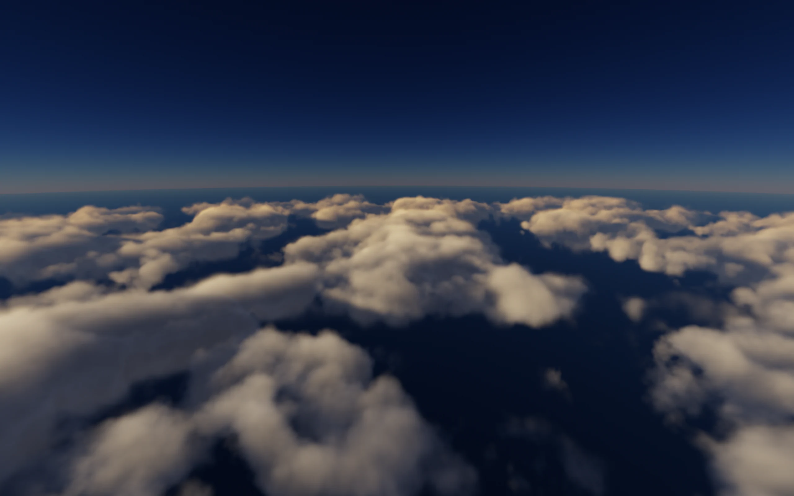
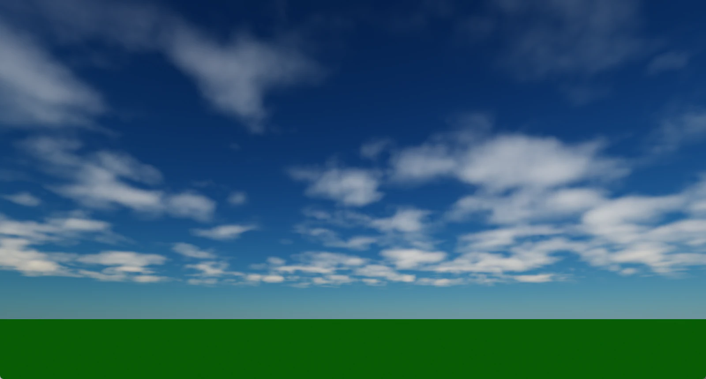
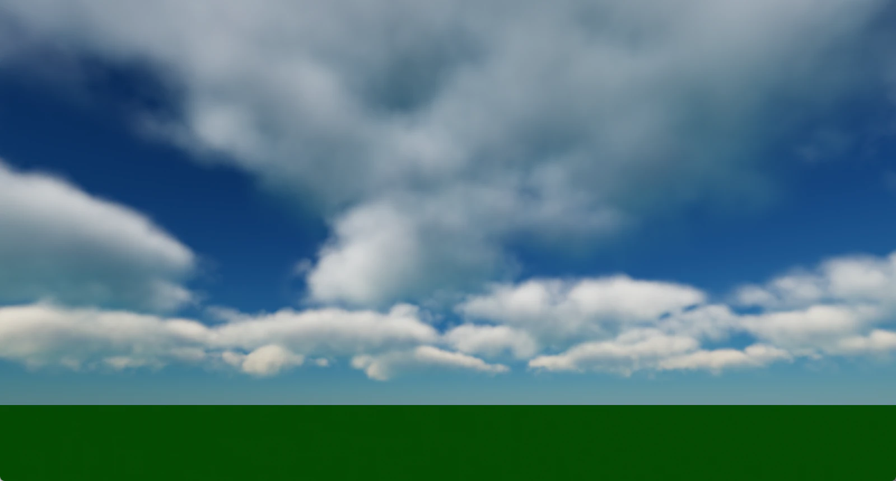
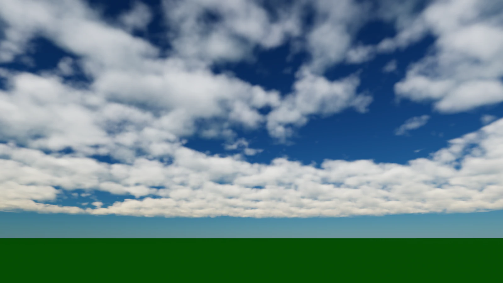
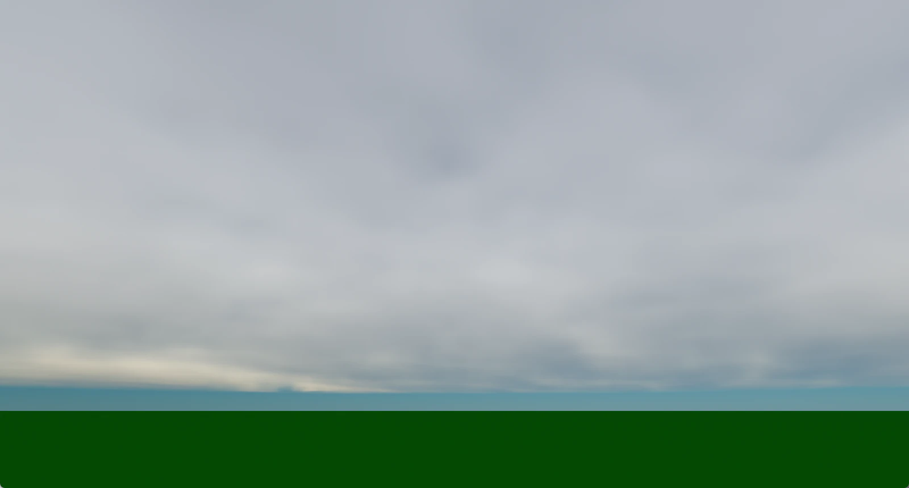
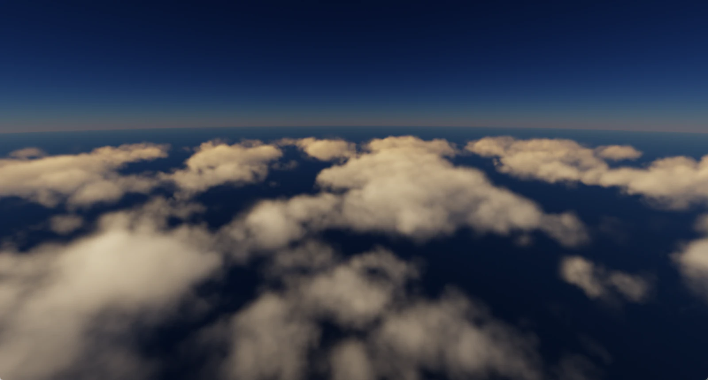
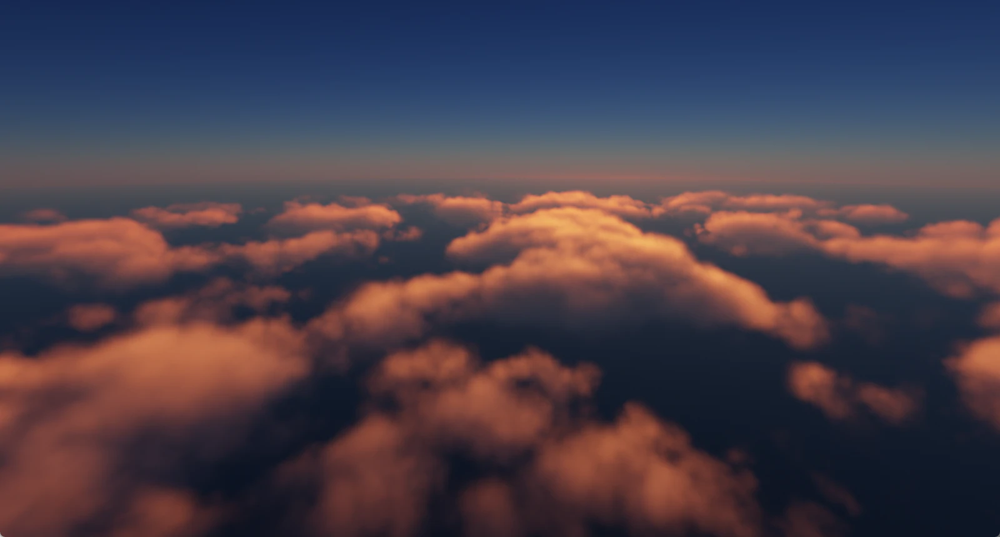
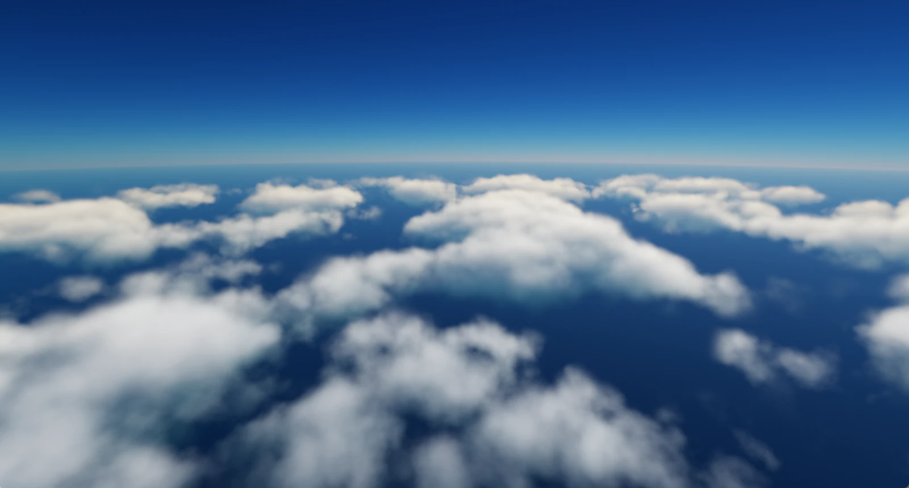
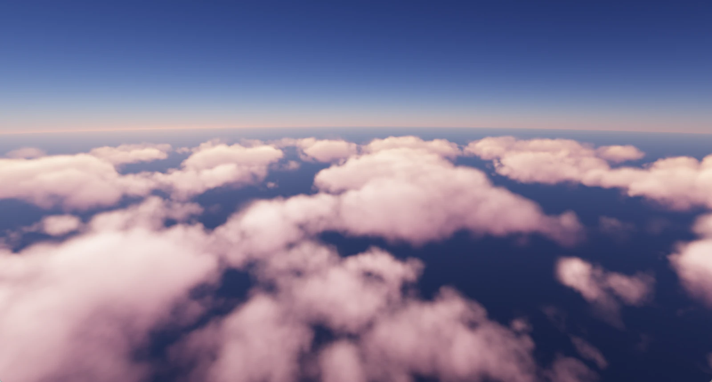

# VolumetricCloud

> DirectX 11과 HLSL 레이마칭으로 최대 50 km까지 이어지는 볼류메트릭 구름층을 그리고, 물리 대기·HDR 조명과 합성하는 실시간 렌더러


**프로젝트 페이지** · [ryuhajin.github.io/projects/volumetric-cloud](https://ryuhajin.github.io/projects/volumetric-cloud/) &nbsp;|&nbsp; **시연 영상** · [YouTube](https://youtu.be/3h6GUrbkmDY)



## 프로젝트 개요

DirectX 11과 HLSL 레이마칭으로 지평선까지 이어지는 km 규모의 구름층을 그리고, 물리 대기·HDR 조명과 합성하는 실시간 렌더러입니다.
4가지 구름 타입과 조명 프리셋을 F1~F4 패널에서 바로 조절하고, JSON으로 저장·복원할 수 있습니다.

| 한눈에 보기 | |
|---|---|
| 분야 | 실시간 렌더링 · 볼류메트릭 레이마칭 · 대기 산란 |
| 핵심 기술 | Beer-Lambert 적분, Perlin-Worley / Worley 3D 노이즈, Dual-lobe Henyey-Greenstein 위상, Deep Shadow Cache, 대기 LUT 6장(Transmittance·Multi-scattering·Sky-View·Sky Irradiance·Aerial Radiance/Transmittance) |
| 렌더 방식 | 풀스크린 삼각형 + 픽셀 셰이더 레이마칭, Compute Shader로 Weather·노이즈·LUT·그림자 생성 |
| 장면 규모 | 10km × 10km 지면, 최대 50km 시선 추적, meter 단위 |
| 성능 | 1920×1080 Full resolution, 12개 장면·카메라 조합 전체 Cloud p95 **4.56ms** (RTX 4080 SUPER) |

## 스크린샷

| | | | |
|---|---|---|---|
|  |  |  |  |
| **Stratus** — 두께 850 m, 얇고 넓게 | **Cumulus** — 두께 2–3.2 km, 뚜렷한 명암 | **Altocumulus** — 양떼처럼 모인 조각 | **Custom** — 직접 조절해 저장 |
|  |  |  |  |
| **Autumn morning** · 태양 12° | **Beach sunset** · 태양 11.5° | **Bright noon** · 태양 17.4° | **Lavender dream** · 태양 10.9° |

## 빌드와 실행

**요구 환경**: Windows 10/11, Visual Studio 2022 (C++ 데스크톱 개발), Windows SDK, CMake 3.20+, DirectX 11 GPU

```powershell
git clone --recursive https://github.com/ryuhajin/VolumetricCloud.git
cd VolumetricCloud
git submodule update --init --recursive   # 이미 clone했다면 Dear ImGui submodule만 받기
cmake -B build -G "Visual Studio 17 2022" -A x64
cmake --build build --config Release
.\build\Release\VolumetricCloud.exe
```

- Debug는 `--config Debug`로 빌드하고 `build\Debug\VolumetricCloud.exe`를 실행합니다.
- 셰이더는 실행 중 컴파일합니다. 소스 `shaders/`를 먼저 읽고, 없으면 실행 파일 옆 `shaders/`를 사용합니다.
- **핫 리로드**: `shaders/`의 `.hlsl`/`.hlsli`를 저장하면 그 파일을 include하는 프로그램만 다시 컴파일합니다. 실패하면 이전 셰이더를 유지하고 F4에 reload report를 표시합니다.
- 기본 빌드는 테스트를 포함하지 않습니다(`VCLOUD_BUILD_TESTS=OFF`). 자세한 내용은 [빌드 안내](doc/BUILDING.md)를 참고하세요.

## 조작

| 입력 | 동작 |
|---|---|
| 마우스 왼쪽 드래그 | 카메라 회전 |
| `W` `A` `S` `D`, 마우스 휠 | 카메라 이동 |
| `Shift` + 이동 | 4배 빠르게 이동 |
| `F1` ~ `F4` | 조절 패널 열기/닫기 |
| `F5` ~ `F8` | 고정 카메라: 지상 건물 앞 / 지상 반대편 / 태양 방향 조감 / 상공 하향 |
| `0` ~ `9` | 디버그 뷰 (아래 표) |

| 패널 | 내용 |
|---|---|
| `F1` Cloud Formation | 형상 슬롯(Stratus/Cumulus/Altocumulus/Custom), Cloud Local, Vertical Profile, 구름 이동 속도, VSync |
| `F2` Weather Map | Base/Detail 노이즈 스케일, 근경 micro detail, Weather Map 생성기 |
| `F3` Lighting Atmosphere Tone | 태양·구름 조명, Rim, 환경광, 대기, 지면·Deep Cache, Tone Mapping |
| `F4` Lighting & Environment | 조명 프리셋 1~4, 구름·캐시·대기 진단 뷰, 카메라·런타임, reload report |
| Performance (좌상단) | FPS, CPU/GPU frame, GPU 구간별 시간 |

| 키 | 디버그 뷰 | 키 | 디버그 뷰 |
|---|---|---|---|
| `0` | Composite (최종 화면) | `5` | Final Density |
| `1` | Raw Noise | `6` | View Optical Depth |
| `2` | Weather Coverage | `7` | Accumulated Direct Lighting |
| `3` | Base Density | `8` | View Transmittance |
| `4` | Detail Noise | `9` | Sun Transmittance |

기본 시작 상태는 Cumulus 형상과 조명 프리셋 3입니다. F1~F4 창은 X 버튼으로 닫은 뒤 같은 키로 다시 열 수 있습니다.

## 프로젝트 구조

```text
VolumetricCloud/
├─ src/          # C++: Win32 창·카메라, Renderer, ImGui 패널(NoiseLab), 상수버퍼·프리셋
├─ shaders/      # HLSL: 구름 레이마칭, 노이즈, 조명·위상, 대기 LUT, Tone Map
├─ presets/      # 형상(types/)·조명(lighting/) JSON 프리셋 원본
├─ doc/          # 설계·파이프라인·튜닝·성능 문서와 변경 기록
└─ third_party/  # Dear ImGui (submodule)
```

## 문서

- 처음이라면 [렌더링 파이프라인](doc/RENDERING_PIPELINE_GUIDE.md) → [상수버퍼 참조](doc/CBUFFER_REFERENCE.md) → [구름·빛 튜닝](doc/CLOUD_LIGHTING_TUNING_GUIDE.md) 순서를 권장합니다.
- [빌드 안내](doc/BUILDING.md) — 일반 앱 빌드와 로컬 검증 분리
- [렌더링 파이프라인 가이드](doc/RENDERING_PIPELINE_GUIDE.md) — 초기화부터 밀도·조명·대기·Tone까지 실제 코드 흐름
- [상수버퍼 참조](doc/CBUFFER_REFERENCE.md) — CPU/HLSL 상수버퍼 필드와 단위
- [구름·빛 튜닝 가이드](doc/CLOUD_LIGHTING_TUNING_GUIDE.md) — F1~F4 파라미터와 증상별 레시피
- [아키텍처](doc/ARCHITECTURE.md) · [레이마칭 수식](doc/RAYMARCHING.md) · [성능 기준](doc/PERFORMANCE.md)
- [폴더 구조](doc/FOLDER_STRUCTURE.md) · [로드맵](doc/ROADMAP.md) · [기여 규칙](doc/CONTRIBUTING.md) · [변경 기록](doc/changes/)

## 참고 자료

- [The Real-time Volumetric Cloudscapes of Horizon Zero Dawn](https://advances.realtimerendering.com/s2015/The%20Real-time%20Volumetric%20Cloudscapes%20of%20Horizon%20-%20Zero%20Dawn%20-%20ARTR.pdf) — Andrew Schneider, SIGGRAPH 2015 Advances
- [Nubis, Evolved](https://advances.realtimerendering.com/s2022/SIGGRAPH2022-Advances-NubisEvolved-NoVideos.pdf) — SIGGRAPH 2022 Advances
- [PBR Book 4ed — Volume Scattering / Transmittance](https://pbr-book.org/4ed/Volume_Scattering/Transmittance)
- [GPU Gems Ch.39 — Volume Rendering Techniques](https://developer.nvidia.com/gpugems/gpugems/part-vi-beyond-triangles/chapter-39-volume-rendering-techniques)
- Sébastien Hillaire, [A Scalable and Production Ready Sky and Atmosphere Rendering Technique](https://blog.selfshadow.com/publications/s2020-shading-course/hillaire/s2020_pbs_hillaire_slides.pdf), EGSR 2020
- [chihirobelmo/volumetric-cloud-for-directx11](https://github.com/chihirobelmo/volumetric-cloud-for-directx11) — 이 프로젝트를 시작하게 된 계기
- [Unreal Engine — Volumetric Cloud Component](https://dev.epicgames.com/documentation/en-us/unreal-engine/volumetric-cloud-component-in-unreal-engine) · [Sky Atmosphere](https://dev.epicgames.com/documentation/en-us/unreal-engine/sky-atmosphere-component-properties-in-unreal-engine)
- 조사 메모는 [구름 조명 리서치](doc/research/stage15-cloud-lighting-research.md)에 정리되어 있습니다.
