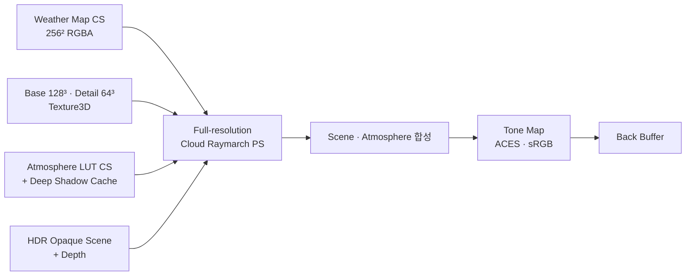

# VolumetricCloud

> DirectX 11과 HLSL 레이마칭으로 수십 km 규모의 볼류메트릭 구름을 형성하고, 물리 대기·HDR 조명과 합성하는 실시간 렌더러


## 프로젝트 개요

레이마칭을 처음부터 학습해 **대규모 볼류메트릭 클라우드**까지 단계적으로 쌓아 올린 Windows 프로젝트입니다.
정점 버퍼 없이 풀스크린 삼각형 하나를 그리고, 픽셀 셰이더가 카메라 광선을 따라 구름 밀도를 적분합니다.
Weather Map과 3D 노이즈로 구름 모양을 만들고, 태양 그림자 캐시·위상 함수·환경광으로 조명합니다.
마지막으로 물리 대기 LUT와 HDR Tone Map으로 지면·하늘과 합성합니다.

학습 단계는 기초 교차·적분(0~8), km 단위 평면 구름층(13), 레이마칭 최적화(9), 그림자 캐시(12), 대기·HDR(14)
순서로 진행했습니다. 최종 단계(15)에서는 실험용 선택지를 걷어 내고 **Full-resolution High 한 경로**만 남겼습니다.

| 한눈에 보기 | |
|---|---|
| 분야 | 실시간 렌더링 · 볼류메트릭 레이마칭 · 대기 산란 |
| 핵심 기술 | Beer-Lambert 적분, 3D Worley fBm 노이즈, Dual-lobe Henyey-Greenstein 위상, Deep Shadow Cache, 대기 LUT(Transmittance·Multi-scattering·Sky-View·Aerial Perspective) |
| 렌더 방식 | 풀스크린 삼각형 + 픽셀 셰이더 레이마칭, Compute Shader로 Weather·노이즈·LUT·그림자 생성 |
| 장면 규모 | 10km × 10km 지면, 최대 50km 시선 추적, meter 단위 |
| 상태 | Stage 15 최종 품질 다듬기 진행 중 (기본 화면 사용자 승인 2026-09-05) |

## 스크린샷

| | |
|---|---|
|  |  |
| **F7** 태양 방향 조감 — 역광 가장자리와 대기 원근 | **F8** 구름층 위 상공 — 층 상단과 원경 소멸 |
|  |  |
| **디버그 뷰** — Weather coverage / Final density / Sun transmittance | **F1~F4 패널** — 형상·노이즈·조명·진단 실시간 조절 |

## 주요 기능

- **대규모 구름층**: meter 단위 PlanarLayer, 10km 진단 장면(지면 + 20층 건물), 최대 50km 시선 추적
- **구름 형상**: 256² GPU Weather Map, Base 128³ / Detail 64³ Texture3D, 근경 전용 micro detail
- **형상 프리셋**: Stratus · Cumulus · Altocumulus · Custom 슬롯과 공통 Vertical Profile 곡선
- **구름 조명**: Balanced512 Deep Shadow Cache, Dual-lobe Henyey-Greenstein 위상, 하늘·지면 환경광과 다중 산란 근사, 가장자리 Rim
- **대기와 HDR**: Rayleigh · Mie · 오존 대기 LUT, HDR 지면 조명, 구름 앞 대기 원근(aerial perspective), ACES Tone Map
- **프리셋 저장**: 형상 4슬롯과 조명 4슬롯을 JSON으로 저장·복원 (`presets/`)
- **개발 도구**: include 의존성 단위 원자적 셰이더 핫 리로드, Weather/Atmosphere/Shadow/Cloud/Tone GPU 구간 프로파일러

## 구현 포인트



- **레이마칭 적분**: 광선과 구름층 교차 구간만 걷고, Beer-Lambert `T = exp(-τ)`로 투과율을 누적합니다. 투과율이 0.01 이하가 되면 조기 종료합니다.
- **빈 공간 건너뛰기**: 빈 표본이 3번 이어지면 2배 coarse step으로 탐색하고, 구름을 만나면 되감아 정밀 적분합니다.
- **거리 step**: 24~50km 원경에서 step을 1×에서 1.25×까지 늘려 비용을 줄입니다.
- **그림자**: 태양 방향 광학 깊이를 Near/Far Deep Cache(512²)에 미리 구워 조회합니다. 캐시 밖은 결정적 8-tap cone으로 대체합니다.
- **대기 합성**: 구름 불투명도로 가중한 대표 거리에서 대기 투과·산란을 조회해 구름 앞 공기층을 입힙니다.

| High 고정 계약 | 값 |
|---|---:|
| 렌더 해상도 | 창과 같은 Full resolution |
| 기본 View step / 최대 step 수 | 100m / 512 |
| View early exit | `T <= 0.01` |
| 빈 공간 탐색 | 빈 표본 3개, 2× coarse, 최대 200m |
| Light fallback | cone 8 taps, 2° |

위 값은 UI로 바뀌지 않습니다. CPU 기준은 [`src/HighCloudQuality.h`](src/HighCloudQuality.h), GPU 기준은 [`shaders/HighCloudQuality.hlsli`](shaders/HighCloudQuality.hlsli)입니다.

### 성능

| 조건 | 결과 |
|---|---|
| RTX 4080 SUPER · 1920×1080 · Release · VSync/UI Off | 12개 장면·카메라 조합, 1,440 GPU 표본 |
| 전체 p95 | Cloud **4.56ms** / Frame **5.09ms** |
| 가장 무거운 조합 | Cloud 6.95ms / Frame 7.50ms |
| 예산 | 조합별 Cloud p95 ≤ 10ms, Frame p95 ≤ 16.67ms |

측정 조건과 이력은 [성능 기준](doc/PERFORMANCE.md)에 있습니다.

## 빌드와 실행

**요구 환경**: Windows 10/11, Visual Studio 2022 (C++ 데스크톱 개발), Windows SDK, CMake 3.20+, DirectX 11 GPU

```powershell
git clone --recursive https://github.com/ryuhajin/VolumetricCloud.git
cd VolumetricCloud
git submodule update --init --recursive   # 이미 clone했다면 Dear ImGui submodule만 받기
cmake -B build -G "Visual Studio 17 2022" -A x64
cmake --build build --config Release
.\build\Release\VolumetricCloud.exe
```

- Debug는 `--config Debug`로 빌드하고 `build\Debug\VolumetricCloud.exe`를 실행합니다.
- 셰이더는 실행 중 컴파일합니다. 소스 `shaders/`를 먼저 읽고, 없으면 실행 파일 옆 `shaders/`를 사용합니다.
- **핫 리로드**: `shaders/`의 `.hlsl`/`.hlsli`를 저장하면 그 파일을 include하는 프로그램만 다시 컴파일합니다. 실패하면 이전 셰이더를 유지하고 F4에 reload report를 표시합니다.
- 기본 빌드는 테스트를 포함하지 않습니다(`VCLOUD_BUILD_TESTS=OFF`). 자세한 내용은 [빌드 안내](doc/BUILDING.md)를 참고하세요.

## 조작

| 입력 | 동작 |
|---|---|
| 마우스 왼쪽 드래그 | 카메라 회전 |
| `W` `A` `S` `D`, 마우스 휠 | 카메라 이동 |
| `Shift` + 이동 | 4배 빠르게 이동 |
| `F1` ~ `F4` | 조절 패널 열기/닫기 |
| `F5` ~ `F8` | 고정 카메라: 지상 건물 앞 / 지상 반대편 / 태양 방향 조감 / 상공 하향 |
| `0` ~ `9` | 디버그 뷰 (아래 표) |

| 패널 | 내용 |
|---|---|
| `F1` Cloud Formation | 형상 슬롯(Stratus/Cumulus/Altocumulus/Custom), Cloud Local, Vertical Profile, 구름 이동 속도, VSync |
| `F2` Weather Map | Base/Detail 노이즈 스케일, 근경 micro detail, Weather Map 생성기 |
| `F3` Lighting Atmosphere Tone | 태양·구름 조명, Rim, 환경광, 대기, 지면·Deep Cache, Tone Mapping |
| `F4` Lighting & Environment | 조명 프리셋 1~4, 구름·캐시·대기 진단 뷰, 카메라·런타임, reload report |
| Performance (좌상단) | FPS, CPU/GPU frame, GPU 구간별 시간 |

| 키 | 디버그 뷰 | 키 | 디버그 뷰 |
|---|---|---|---|
| `0` | Composite (최종 화면) | `5` | Final Density |
| `1` | Raw Noise | `6` | View Optical Depth |
| `2` | Weather Coverage | `7` | Accumulated Direct Lighting |
| `3` | Base Density | `8` | View Transmittance |
| `4` | Detail Noise | `9` | Sun Transmittance |

기본 시작 상태는 Cumulus 형상과 조명 프리셋 3입니다. F1~F4 창은 X 버튼으로 닫은 뒤 같은 키로 다시 열 수 있습니다.

## 프로젝트 구조

```text
VolumetricCloud/
├─ src/          # C++: Win32 창·카메라, Renderer, ImGui 패널(NoiseLab), 상수버퍼·프리셋
├─ shaders/      # HLSL: 구름 레이마칭, 노이즈, 조명·위상, 대기 LUT, Tone Map
├─ presets/      # 형상(types/)·조명(lighting/) JSON 프리셋 원본
├─ doc/          # 설계·파이프라인·튜닝·성능 문서와 변경 기록
└─ third_party/  # Dear ImGui (submodule)
```

## 문서

- 처음이라면 [렌더링 파이프라인](doc/RENDERING_PIPELINE_GUIDE.md) → [상수버퍼 참조](doc/CBUFFER_REFERENCE.md) → [구름·빛 튜닝](doc/CLOUD_LIGHTING_TUNING_GUIDE.md) 순서를 권장합니다.
- [빌드 안내](doc/BUILDING.md) — 일반 앱 빌드와 로컬 검증 분리
- [렌더링 파이프라인 가이드](doc/RENDERING_PIPELINE_GUIDE.md) — 초기화부터 밀도·조명·대기·Tone까지 실제 코드 흐름
- [상수버퍼 참조](doc/CBUFFER_REFERENCE.md) — CPU/HLSL 상수버퍼 필드와 단위
- [구름·빛 튜닝 가이드](doc/CLOUD_LIGHTING_TUNING_GUIDE.md) — F1~F4 파라미터와 증상별 레시피
- [아키텍처](doc/ARCHITECTURE.md) · [레이마칭 수식](doc/RAYMARCHING.md) · [성능 기준](doc/PERFORMANCE.md)
- [폴더 구조](doc/FOLDER_STRUCTURE.md) · [로드맵](doc/ROADMAP.md) · [기여 규칙](doc/CONTRIBUTING.md) · [변경 기록](doc/changes/)

## 참고 자료

- [The Real-time Volumetric Cloudscapes of Horizon Zero Dawn](https://advances.realtimerendering.com/s2015/The%20Real-time%20Volumetric%20Cloudscapes%20of%20Horizon%20-%20Zero%20Dawn%20-%20ARTR.pdf) — Andrew Schneider, SIGGRAPH 2015 Advances
- [Nubis, Evolved](https://advances.realtimerendering.com/s2022/SIGGRAPH2022-Advances-NubisEvolved-NoVideos.pdf) — SIGGRAPH 2022 Advances
- [PBR Book 4ed — Volume Scattering / Transmittance](https://pbr-book.org/4ed/Volume_Scattering/Transmittance)
- [GPU Gems Ch.39 — Volume Rendering Techniques](https://developer.nvidia.com/gpugems/gpugems/part-vi-beyond-triangles/chapter-39-volume-rendering-techniques)
- [Unreal Engine — Volumetric Cloud Component](https://dev.epicgames.com/documentation/en-us/unreal-engine/volumetric-cloud-component-in-unreal-engine) · [Sky Atmosphere](https://dev.epicgames.com/documentation/en-us/unreal-engine/sky-atmosphere-component-properties-in-unreal-engine)
- 조사 메모는 [구름 조명 리서치](doc/research/stage15-cloud-lighting-research.md)에 정리되어 있습니다.

## 관련 프로젝트

- [sdf-playground](https://github.com/ryuhajin/sdf-playground) — HLSL로 SDF 함수를 카드 단위로 실험하는 coverflow 셰이더 앱
- [WaterShader](https://github.com/ryuhajin/WaterShader) — Sine wave·normal map·Fresnel 반사로 만든 스타일라이즈드 수면 셰이더
