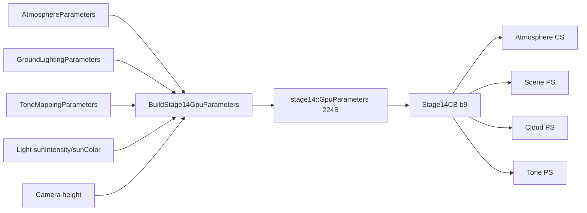

# 상수버퍼(cbuffer) 참조

이 문서는 현재 Stage 15 런타임의 `b0~b10` ABI를 CPU 생산자부터 HLSL 소비자까지 연결한다. 필드 순서나 크기를 바꾸려면 C++ 구조체, HLSL 선언, reflection contract, [ARCHITECTURE.md](ARCHITECTURE.md)의 표를 같은 변경에서 수정해야 한다.

## 읽는 법

필드 상태는 다음 표기를 사용한다.

| 상태 | 의미 |
|---|---|
| 직접 사용 | 해당 cbuffer 필드를 HLSL이 현재 렌더 경로에서 직접 읽는다. |
| 재패킹 | CPU 원본은 다른 GPU 버퍼에도 복사되어 그 경로에서 효과가 난다. |
| 파생값 | 카메라·해상도·cascade 등에서 매 frame 계산한다. |
| 고정 High | cbuffer가 아니라 CPU/HLSL 고정 상수 파일이 소유한다. |
| 미리보기 전용 | F1/F2 Noise Lab preview에서만 사용한다. |
| 호환 유지 | ABI와 과거 설정 호환을 위해 남지만 현재 Physical LUT 경로에는 효과가 없다. 튜닝하지 않는다. |

HLSL cbuffer는 16바이트 레지스터 단위로 packing된다. C++ 구조체의 `alignas(16)`, 필드 순서, padding을 임의로 바꾸면 같은 이름이라도 GPU가 다른 값을 읽을 수 있다.

## 마스터 표

| 슬롯 | CPU 생산자 / HLSL | 크기 | 주요 소비 패스 | 갱신 시점 | UI·프리셋 |
|---:|---|---:|---|---|---|
| b0 | `Renderer::CameraCB` / `cbCamera` | 224B | Atmosphere CS, Deep Shadow CS, Cloud PS | camera/time/size를 매 frame 업로드 | 카메라, F5~F8 |
| b0 | `Renderer::SceneCB` / `cbScene` | 64B | Opaque Scene VS | Opaque 직전에 view-projection 업로드 | 카메라 |
| b1 | `CloudParameters` / `CloudCB` | 80B | Deep Shadow, Cloud, NoiseLab | 매 frame sanitize 후 업로드 | F1/F2, 타입·콘셉트·Custom |
| b2 | `NoiseLabParameters` / `NoiseLabCB` | 32B | NoiseLab preview PS | preview draw마다 축/출력/time 업로드 | F1 Preview |
| b3 | `LightParameters` / `LightCB` | 64B | Cloud PS | 매 frame sanitize 후 업로드 | F3, scene concept |
| b4 | `EnvironmentParameters` / `EnvironmentCB` | 80B | Cloud PS | 매 frame sanitize 후 업로드 | F3, scene concept |
| b5 | `CloudDomainParameters` / `CloudDomainCB` | 32B | Deep Shadow, Cloud | 매 frame sanitize 후 업로드 | F1, formation preset |
| b6 | `NoiseVolumeParameters` / `NoiseVolumeCB` | 96B | Noise generation, Deep Shadow, Cloud, NoiseLab | 매 frame 샘플 계약 업로드; 생성 CS에도 사용 | F2, formation world size |
| b7 | `CloudShapeParameters` / `CloudShapeCB` | 48B | Deep Shadow, Cloud, NoiseLab | 매 frame sanitize 후 업로드 | F1, formation preset |
| b8 | `Stage12ShadowParameters` / `ShadowCB` | 160B | Deep Shadow, Scene, Cloud | 카메라/태양 basis·center 파생 후 매 frame, cascade dispatch마다 일부 갱신 | F3 strength/floor, F4 진단 |
| b9 | `stage14::GpuParameters` / `Stage14CB` | 224B | Atmosphere CS, Scene PS, Cloud PS, Tone PS | `EnsureAtmosphereLuts`에서 매 frame 재패킹 | F3/F4, scene concept |
| b10 | `WeatherColumnParameters` / `WeatherColumnCB` | 32B | Deep Shadow, Cloud, NoiseLab | Weather column과 타입 선택에서 매 frame 재패킹 | F1/F2, formation preset |

`b0`은 동시에 두 구조체를 바인딩하는 것이 아니다. D3D11 슬롯을 패스별로 재사용한다. Opaque Scene에서는 64B `SceneCB`, Cloud/Deep Shadow/Atmosphere에서는 224B `CameraCB`가 같은 b0에 바인딩된다.

## b0 — CameraCB / SceneCB

CPU 선언은 `src/Renderer.h`, HLSL 선언은 `shaders/VolumetricClouds.hlsl`, `shaders/CloudDeepShadow.hlsl`, `shaders/Stage14AtmosphereLut.hlsl`, `shaders/DiagnosticScene.hlsl`에 있다.

### CameraCB, 224B

| 필드 | 단위 | 상태 | 역할 |
|---|---|---|---|
| `invViewProj` | 행렬 | 파생값 | 화면 UV+device depth를 월드 위치로 복원 |
| `invProjection` | 행렬 | 파생값 | translation 없는 view ray 복원 |
| `invViewRotation` | 행렬 | 파생값 | view 방향을 월드 방향으로 회전 |
| `cameraPos` | m | 파생값 | ray origin, LUT 카메라 높이·cache center 기준 |
| `time` | s | 파생값 | Weather/Base/Detail 공통 advection |
| `renderSize` | pixel | 파생값 | 전체 해상도 계약과 LUT/aerial 계산 |
| `nearPlane`, `farPlane` | m | 파생값 | depth 복원과 하늘/추적 외부 한계 |

일반 실행에서 `time`은 `NoiseLab::EffectiveTime()`이며 실제 frame delta를 누적한다. 사용자가 absolute time을 scrub하는 UI는 없다.

### SceneCB, 64B

| 필드 | 단위 | 상태 | 역할 |
|---|---|---|---|
| `viewProj` | 행렬 | 직접 사용 | Diagnostic Scene 정점을 clip space로 변환 |

## b1 — CloudCB, 80B

CPU `src/CloudParameters.h` ↔ HLSL `shaders/CloudParameters.hlsli`.

| 필드 | 단위 | 상태 | 현재 역할 / 소유권 |
|---|---|---|---|
| `cloudBoundsMin.xyz` | m | 직접 사용/파생 | XZ는 10km scene footprint mirror, Y는 Planar bottom mirror |
| `densityMultiplier` | 무차원 | 직접 사용 | Base density 배율. F1/formation 저장 |
| `cloudBoundsMax.xyz` | m | 직접 사용/파생 | XZ scene footprint mirror, Y는 Planar top mirror |
| `extinctionCoefficient` | 1/m | 직접 사용 | View/Light Beer-Lambert 소멸 계수. F1/formation 저장 |
| `debugMode` | enum int | 직접 사용 | Cloud PS 중간 출력 선택. F4/숫자 키, 저장 안 함 |
| `coverage` | 0~1 | 직접 사용 | Base noise 통과 비율. F1/formation 저장 |
| `windSpeed` | m/s | 직접 사용 | Weather/Base/Detail 공통 이동 속도. F1/formation 저장 |
| `noiseOffset` | cycle | 직접 사용 | Base 수동 좌표 offset. UI 없음, Custom 저장 대상 아님 |
| `windDirection.xyz` | 방향 | 직접 사용 | 세션 전역 Motion을 XZ 정규화, Y=0으로 매 프레임 패킹 |
| `detailErosionStrength` | 0~1 | 직접 사용 | Base 경계에서 Detail로 깎는 강도. F1/formation 저장 |
| `detailNoiseOffset` | cycle | 직접 사용 | Base와 Detail 패턴 분리용 고정 offset. UI/Custom 없음 |
| `weatherMapWorldSize` | m | 직접 사용 | Weather 한 반복의 XZ 크기. formation 저장, 현재 F1/F2 slider 없음 |
| `weatherMapOffset.xy` | cycle | 직접 사용 | Weather 수동 UV offset. 현재 UI/Custom 없음 |

`cloudBoundsMin/Max`라는 이름은 과거 ABI를 유지하지만 활성 교차는 b5의 PlanarLayer다. Y는 NoiseLab/높이 계산을 위해 b5와 동기화된 mirror이며 XZ AABB 교차에 쓰지 않는다.

## b2 — NoiseLabCB, 32B

CPU `src/NoiseLab.h` ↔ HLSL `shaders/NoiseLab.hlsl`. **미리보기 전용**이며 최종 Cloud PS에는 바인딩하지 않는다.

| 필드 | 단위 | 상태 | 역할 |
|---|---|---|---|
| `normalizedSlicePosition.xyz` | 0~1 | 미리보기 전용 | XY/XZ/YZ slice의 고정 축 위치 |
| `outputMode` | enum uint | 미리보기 전용 | density sample의 표시 필드 선택 |
| `sliceAxis` | enum uint | 미리보기 전용 | 0=XY, 1=XZ, 2=YZ |
| `effectiveTime` | s | 미리보기 전용 | 최종 구름과 같은 advection 시간 |
| `padding[2]` | - | 예약 | 32B 정렬 |

## b3 — LightCB, 64B

CPU `src/LightParameters.h` ↔ HLSL `shaders/LightParameters.hlsli`.

| 필드 | 단위 | 상태 | 현재 역할 / 소유권 |
|---|---|---|---|
| `directionToSun` | 단위 방향 | 직접 사용 + 재패킹 | Cloud phase/cache basis에 b3 직접 사용, atmosphere용으로 b9에도 방향 재계산 |
| `sunIntensity` | 배율 | 재패킹 | b3 선언은 유지하지만 실제 Physical 경로 효과는 b9 `solarIrradianceAndMultiplier.w` |
| `sunColor` | linear RGB | 재패킹 | 실제 효과는 b9 `sunTintAndGroundBounce.xyz` |
| `singleScatteringAlbedo` | 0~1 | 직접 사용 | 소멸 중 산란되는 비율 `ω=σs/σt` |
| `phaseEnabled` | bool float | 직접 사용 | 0이면 등방성 factor 1, 1이면 dual-lobe 사용 |
| `forwardScatteringG` | 0~0.95 | 직접 사용 | 태양을 보는 전방 HG lobe |
| `backwardScatteringG` | -0.95~0 | 직접 사용 | 태양 반대 후방 HG lobe. UI 없음 |
| `phaseBlend` | 0~1 | 직접 사용 | 0=후방, 1=전방 혼합. UI 없음 |
| `phaseIntensity` | 0~1 | 직접 사용 | 등방성 1에서 dual-lobe 결과로 이동하는 양 |
| `edgeInfluence` | 0~1 | 직접 사용 | phase를 태양 노출 외곽에 한정하는 정도 |
| `edgeOpticalDepthScale` | 0.25~8 | 직접 사용 | 외곽 폭을 조절하는 태양 T 지수. UI 없음 |
| `shadowExponent` | 0.5~4 | 직접 사용 | 직접광 shadow 대비. UI 없음 |

`sunIntensity`와 `sunColor`를 수정했는데 b3를 읽는 검색 결과가 없는 것은 정상이다. `Renderer::BuildStage14GpuParameters`가 b9로 옮겨 Cloud/Scene/Atmosphere의 공통 incident light를 만든다.

## b4 — EnvironmentCB, 80B

CPU `src/EnvironmentParameters.h` ↔ HLSL `shaders/EnvironmentParameters.hlsli`.

| 필드 그룹 | 상태 | 역할 |
|---|---|---|
| `skyColor`, `skyStrength` | 호환 유지 | 과거 분석적 하늘광. 현재 Physical LUT 경로에서 읽지 않음 |
| `groundColor`, `groundStrength` | 호환 유지 | 과거 분석적 지면광. 현재 b9 ground albedo/irradiance 경로에서 읽지 않음 |
| `ambientOcclusionStrength` | 직접 사용 | local density 기반 sky/ground fill 차폐 |
| `ambientHeightInfluence` | 직접 사용 | 높이에 따른 sky weight |
| `multipleScatteringEnabled`, `multipleScatteringOctaves` | 직접 사용 | 0~4회 저비용 다중 산란 근사 |
| `multipleScatteringAttenuation` | 직접 사용 | octave별 에너지 감소 |
| `multipleScatteringExtinctionFactor` | 직접 사용 | octave별 optical-depth 비율 |
| `multipleScatteringPhaseFactor` | 직접 사용 | octave별 phase 방향성 비율 |
| `physicalSkyFillScale` | 직접 사용 | Sky Irradiance LUT 기반 구름 하늘 fill, F3 |
| `ambientShadowCoupling` | 직접 사용 | 태양 차폐를 ambient visibility에 섞는 비율. UI 없음 |
| `ambientShadowExponent` | 직접 사용 | ambient의 `Tsun` 곡선. UI 없음 |
| `multipleScatteringInteriorBlend` | 직접 사용 | 다중 산란 에너지를 내부로 옮기는 비율, F3 |
| `physicalGroundFillScale` | 직접 사용 | ground irradiance 기반 구름 하부 fill, F3 |

호환 유지 필드는 제거하지 않지만 현재 장면을 조절하기 위해 수정해서는 안 된다.

## b5 — CloudDomainCB, 32B

CPU `src/CloudDomainParameters.h` ↔ HLSL `shaders/CloudDomainParameters.hlsli`.

| 필드 | 단위 | 상태 | 역할 |
|---|---|---|---|
| `cloudBottomAltitude` | m | 직접 사용 | PlanarLayer 바닥, F1/formation |
| `cloudLayerThickness` | m | 직접 사용 | 전역 layer 두께, F1/formation |
| `maxViewTraceDistance` | m | 직접 사용 | View ray 최대 추적 거리, 기본 50km |
| `viewTraceFadeStartDistance` | m | 직접 사용 | 끝 절단을 감추는 density fade 시작, 기본 40km |
| `maxLightTraceDistance` | m | 직접 사용 | fallback light ray 외부 한계, 기본 20km |
| `cloudLightingReferenceAltitudeMeters` | m | 파생값 | Physical LUT incident light를 한 ray당 한 번 읽는 대표 고도 |
| padding 2개 | - | 예약 | 32B 정렬 |

`cloudLightingReferenceAltitudeMeters`는 formation의 유효 local shape 범위에서 계산된다. 직접 튜닝하지 않는다.

## b6 — NoiseVolumeCB, 96B

CPU `src/Stage13NoiseVolumeMath.h` ↔ HLSL `shaders/NoiseVolumeParameters.hlsli`.

| 필드 | 단위 | 상태 | 역할 |
|---|---|---|---|
| `baseResolution`, `detailResolution` | texel/axis | 직접 사용/생성 계약 | 각각 128³, 32³. 현재 UI에서 변경 불가 |
| `seed` | uint | 생성 계약 | Base/Detail 절차 생성 seed. 현재 UI 없음 |
| `baseWorldSizeMeters` | m/cycle | 직접 사용 | Base XZ 반복 크기, F2/formation 저장 |
| `baseVerticalWorldSizeMeters` | m/cycle | 직접 사용 | Base Y 반복 크기, F2/formation 저장 |
| `detailWorldSizeMeters` | m/cycle | 직접 사용 | Detail XYZ 반복 크기, F2/formation 저장 |
| `baseFrequencies`, `detailFrequencies` | cycle | 생성 계약 | Texture3D RGBA 대역. UI 없음 |
| `baseWeights`, `detailWeights` | 무차원 | 직접 사용 | RGBA 조합 weight. UI 없음 |
| padding | - | 예약 | ABI 정렬 |

world size를 바꾸면 같은 Texture3D를 더 크거나 작게 월드에 매핑한다. `Regenerate Base and Detail`은 seed/frequency shader로 **내용**을 다시 만들지만 world size slider 변경 자체는 재생성을 요구하지 않는다.

## b7 — CloudShapeCB, 48B

CPU `src/CloudShapeParameters.h` ↔ HLSL `shaders/CloudShapeParameters.hlsli`.

| 필드 그룹 | 단위 | 상태 | 역할 |
|---|---|---|---|
| Stratus bottom/top fade | 0~1 | 직접 사용 | 층운 local height profile |
| Mixed bottom/top fade | 0~1 | 직접 사용 | 타입 중간 구간 envelope |
| Cumulus bottom/top fade | 0~1 | 직접 사용 | 적운 기저/상단 profile |
| Cumulus upper-mass 3개 | 0~1 | 직접 사용 | 둥근 상부 질량과 footprint 변화 |
| `footprintCoverageInfluence` | 0~1 | 직접 사용 | 높이별 footprint가 coverage에 주는 영향 |
| padding | - | 예약 | ABI 정렬 |

F1은 profile 중 footprint만 직접 노출한다. 두께와 lift는 Weather 소유 b10으로 이동했다.

## b8 — ShadowCB, 160B

CPU `src/Stage12ShadowParameters.h` ↔ HLSL `shaders/Stage12ShadowParameters.hlsli`.

| 필드 그룹 | 상태 | 역할 |
|---|---|---|
| Near/Far resolution | 고정 High | 둘 다 512 |
| `surfaceShadowEnabled`, `cacheReady` | 직접/파생 | 지표 그림자 사용 여부와 cache 유효 상태 |
| `lightRight/Up/Forward` | 파생값 | `directionToSun`에서 만든 태양 공간 basis |
| Near/Far width | 고정 High | 24km / 128km |
| cloud bottom/top | 파생값 | b5 PlanarLayer에서 복사 |
| Near/Far center | 파생값 | 카메라 XZ 중심을 texel 크기에 snap |
| `maximumOpticalDepth` | 고정 High | 9.21034037, 약 `T=0.0001` |
| slice count | 고정 High | Near 80 + Far 40 |
| `dispatchCascade` | 파생값 | compute dispatch 중 0=Near, 1=Far |
| cascade blend/fade | 고정 High | Near core 0.80, blend 0.95, Far fade 0.90~1.00 |
| `surfaceShadowStrength` | 0~1 직접 사용 | F3 지면/건물 그림자 강도 |
| `surfaceAmbientFloor` | 0~1 직접 사용 | 완전 차폐에서도 남길 지면 ambient 하한 |
| `minimumSunY` | 고정 High | `sin(3°)`, 더 낮으면 cache 비활성/fallback |
| debug exposure/slices | 진단 | F4 cache texture 표시 |

Near/Far texture에는 transmittance가 아니라 optical depth가 저장된다. lookup 뒤 `exp(-τ)`로 T를 복원한다.

## b9 — Stage14CB, 224B

CPU 원본은 `AtmosphereParameters`, `GroundLightingParameters`, `ToneMappingParameters`, 일부 `LightParameters`로 분리되어 있다. `src/Renderer.cpp::BuildStage14GpuParameters`가 매 frame `stage14::GpuParameters`로 포장하고, HLSL `shaders/Stage14Atmosphere.hlsli`가 읽는다.

| b9 `float4/uint4` | x | y | z | w | 출처/상태 |
|---|---|---|---|---|---|
| `planetRadiiDensityHeights` | bottom radius km | top radius km | Rayleigh height km | Mie height km | Atmosphere 직접 |
| `rayleighScatteringAndScale` | Rayleigh R/km | G/km | B/km | scale | Atmosphere 직접 |
| `mieScatteringExtinctionGAbsorption` | scattering/km | extinction/km | Mie g | absorption scale | Atmosphere 직접 |
| `ozoneAbsorptionAndScale` | ozone R/km | G/km | B/km | scale | Atmosphere 직접 |
| `ozoneLayerTurbidityAerialDistance` | center km | half width km | turbidity | 128km 고정 | Atmosphere + 파생/고정 |
| `solarIrradianceAndMultiplier` | solar R | G | B | `Light.sunIntensity` | Atmosphere + Light 재패킹 |
| `sunDirectionAndCameraHeight` | sun X | Y | Z | camera Y×0.001 | 각도/카메라 파생 |
| `sunTintAndGroundBounce` | `Light.sunColor.r` | g | b | ground bounce | Light 재패킹 + Ground |
| `groundAlbedoAndDebugExposure` | ground R | G | B | atmosphere debug exposure | Ground + F4 진단 |
| `toneAndTime` | exposure EV | white balance K | time-of-day 호환값 | sun elevation deg | Tone + 호환/진단 |
| `renderFlags` | 0 예약 | tone mode | atmosphere debug view | debug channel | Tone/F4 |
| `transmittanceMultiSize` | 256 | 64 | 32 | 32 | LUT 크기 고정 |
| `skyViewIrradianceSize` | 192 | 108 | 64 | 16 | LUT 크기 고정 |
| `aerialDebugGeneration` | aerial size 32 | debug slice | max generation low32 | 0 | LUT 고정/진단 파생 |

중요한 재패킹 관계:

텍스트 흐름: `분리된 CPU 설정 + camera 파생값 → BuildStage14GpuParameters → Stage14CB(b9) → LUT/Scene/Cloud/Tone`

`toneAndTime.z`와 CPU의 time-of-day 관련 필드는 schema/Stage 14 호환을 위해 남아 있다. 현재 일반 UI는 absolute time 재생/스크럽을 노출하지 않으며 태양은 F3 azimuth/elevation으로 조절한다.

## b10 — WeatherColumnCB, 32B

CPU `WeatherMapDefinition.column + CloudTypeSelection`을 매 프레임
`WeatherColumnParameters`로 resolve해 Cloud/Deep Shadow/NoiseLab에 공통 바인딩한다.

| 필드 | 단위 | 역할 |
|---|---|---|
| Stratus/Cumulus min/max thickness | m | Weather A와 유효 타입으로 local thickness 계산 |
| `maximumBaseLiftMeters` | m | 약한 column의 지역별 바닥 상승 한계 |
| `fixedType` | 0~1 | Fixed Stratus/Mixed/Cumulus의 0/0.5/1 |
| `regionalInfluence` | 0~1 | Fixed=0, RegionalBlend=1 |
| padding | - | 32B ABI 정렬 |

유효 타입은 `lerp(fixedType, storedRegionalG, regionalInfluence)`다. 저장된 G는
Fixed 모드에서도 바뀌지 않는다. b5 domain thickness는 이 최대 두께와 base lift,
추가 200m headroom을 담는 외곽 공간이며 부족하면 apply를 거부한다.

## cbuffer가 아닌 High 계약

다음 값은 UI나 preset이 아니라 `src/HighCloudQuality.h`와 `shaders/HighCloudQuality.hlsli`가 소유한다.

| 항목 | 값 |
|---|---:|
| View 기본 step | 100m |
| 최대 View step | 512 |
| early exit | `T <= 0.01` |
| empty skip | Base `<=0.0001` 3회 뒤 2×, 최대 200m |
| distance step | 24~50km에서 1.0×~1.25× |
| cone fallback | 8 taps, 2°, far fraction 0.77, bias 1m |

이 값을 조절 가능하게 만들려면 단순 cbuffer 필드 추가가 아니라 CPU/HLSL High 계약, reflection, 테스트, 성능 기준을 함께 재설계해야 한다.

## 변경 전 체크리스트

- C++ `sizeof`와 `offsetof`가 기대값을 유지하는가?
- HLSL 필드 순서와 scalar/vector 타입이 C++과 같은가?
- `CreateConstantBuffers`의 크기와 패스별 `*SetConstantBuffers` 슬롯이 같은가?
- Cloud PS reflection의 이름·register·size 계약이 같은가?
- b0 재사용 시 해당 패스가 올바른 64B/224B 버퍼를 바인딩하는가?
- b3 값을 바꿀 때 b9 재패킹 여부를 확인했는가?
- 호환 유지 필드를 실제 효과가 있는 값으로 오해하지 않았는가?
- [ARCHITECTURE.md](ARCHITECTURE.md)와 [CLOUD_LIGHTING_TUNING_GUIDE.md](CLOUD_LIGHTING_TUNING_GUIDE.md)를 함께 갱신했는가?
