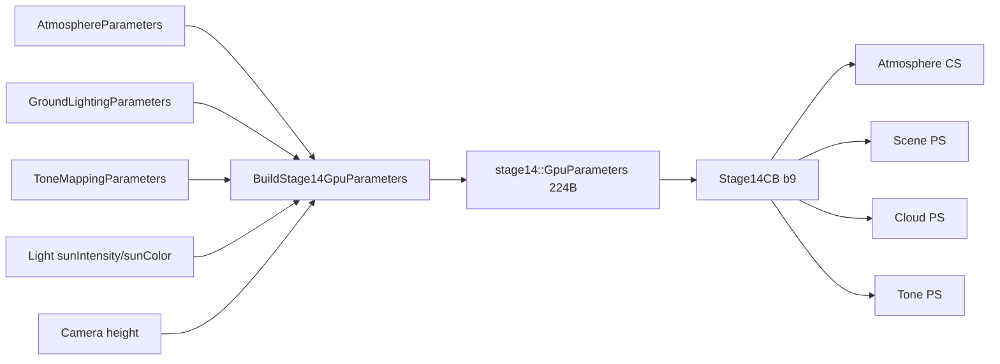

# 상수버퍼(cbuffer) 참조

이 문서는 현재 Stage 15 런타임의 `b0~b10` ABI를 CPU 생산자부터 HLSL 소비자까지 연결한다. 필드 순서나 크기를 바꾸려면 C++ 구조체, HLSL 선언, reflection contract, [ARCHITECTURE.md](ARCHITECTURE.md)의 표를 같은 변경에서 수정해야 한다.

## 읽는 법

필드 상태는 다음 표기를 사용한다.

| 상태 | 의미 |
|---|---|
| 직접 사용 | 해당 cbuffer 필드를 HLSL이 현재 렌더 경로에서 직접 읽는다. |
| 재패킹 | CPU 원본은 다른 GPU 버퍼에도 복사되어 그 경로에서 효과가 난다. |
| 파생값 | 카메라·해상도·cascade 등에서 매 frame 계산한다. |
| 고정 High | cbuffer가 아니라 CPU/HLSL 고정 상수 파일이 소유한다. |
| 미리보기 전용 | F1/F2 Noise Lab preview에서만 사용한다. |
| 호환 유지 | ABI와 과거 설정 호환을 위해 남지만 현재 Physical LUT 경로에는 효과가 없다. 튜닝하지 않는다. |

HLSL cbuffer는 16바이트 레지스터 단위로 packing된다. C++ 구조체의 `alignas(16)`, 필드 순서, padding을 임의로 바꾸면 같은 이름이라도 GPU가 다른 값을 읽을 수 있다.

## 마스터 표

| 슬롯 | CPU 생산자 / HLSL | 크기 | 주요 소비 패스 | 갱신 시점 | UI·프리셋 |
|---:|---|---:|---|---|---|
| b0 | `Renderer::CameraCB` / `cbCamera` | 224B | Atmosphere CS, Deep Shadow CS, Cloud PS | camera/time/size를 매 frame 업로드 | 카메라, F5~F8 |
| b0 | `Renderer::SceneCB` / `cbScene` | 64B | Opaque Scene VS | Opaque 직전에 view-projection 업로드 | 카메라 |
| b0 | `WeatherMapComputeParameters` / `WeatherMapBuildCB` | 160B | Weather Map CS | generator 변경/초기화/핫 리로드 때 생성 | F2, formation preset |
| b1 | `CloudParameters` / `CloudCB` | 80B | Deep Shadow, Cloud, NoiseLab | 매 frame sanitize 후 업로드 | F1/F2, 타입·콘셉트·Custom |
| b2 | `NoiseLabParameters` / `NoiseLabCB` | 32B | NoiseLab preview PS | preview draw마다 축/출력/time 업로드 | F1 Preview |
| b3 | `LightParameters` / `LightCB` | 80B | Cloud PS | 매 frame sanitize 후 업로드 | F3, scene concept |
| b4 | `EnvironmentParameters` / `EnvironmentCB` | 48B | Cloud PS | 매 frame sanitize 후 업로드 | F3, scene concept |
| b5 | `CloudDomainParameters` / `CloudDomainCB` | 32B | Deep Shadow, Cloud | 매 frame sanitize 후 업로드 | F1, formation preset |
| b6 | `NoiseVolumeParameters` / `NoiseVolumeCB` | 96B | Noise generation, Deep Shadow, Cloud, NoiseLab | 매 frame 샘플 계약 업로드; 생성 CS에도 사용 | F2, formation world size |
| b7 | `CloudShapeParameters` / `CloudShapeCB` | 48B | Deep Shadow, Cloud, NoiseLab | 매 frame sanitize 후 업로드 | F1, formation preset |
| b8 | `Stage12ShadowParameters` / `ShadowCB` | 160B | Deep Shadow, Scene, Cloud | 카메라/태양 basis·center 파생 후 매 frame, cascade dispatch마다 일부 갱신 | F3 strength/floor, F4 진단 |
| b9 | `stage14::GpuParameters` / `Stage14CB` | 224B | Atmosphere CS, Scene PS, Cloud PS, Tone PS | `EnsureAtmosphereLuts`에서 매 frame 재패킹 | F3/F4, scene concept |
| b10 | `WeatherColumnParameters` / `WeatherColumnCB` | 32B | Deep Shadow, Cloud, NoiseLab | Weather column과 타입 선택에서 매 frame 재패킹 | F1/F2, formation preset |

`b0`은 D3D11 슬롯을 패스별로 재사용한다. Opaque Scene에서는 64B `SceneCB`, Cloud/Deep Shadow/Atmosphere에서는 224B `CameraCB`, Weather 생성에서는 160B `WeatherMapBuildCB`를 바인딩한다.

## b0 — CameraCB / SceneCB

CPU 선언은 `src/Renderer.h`, HLSL 선언은 `shaders/VolumetricClouds.hlsl`, `shaders/CloudDeepShadow.hlsl`, `shaders/Stage14AtmosphereLut.hlsl`, `shaders/DiagnosticScene.hlsl`에 있다.

### CameraCB, 224B

| 필드 | 단위 | 상태 | 역할 |
|---|---|---|---|
| `invViewProj` | 행렬 | 파생값 | 화면 UV+device depth를 월드 위치로 복원 |
| `invProjection` | 행렬 | 파생값 | translation 없는 view ray 복원 |
| `invViewRotation` | 행렬 | 파생값 | view 방향을 월드 방향으로 회전 |
| `cameraPos` | m | 파생값 | ray origin, LUT 카메라 높이·cache center 기준 |
| `time` | s | 파생값 | Weather/Base/Detail 공통 advection |
| `renderSize` | pixel | 파생값 | 전체 해상도 계약과 LUT/aerial 계산 |
| `nearPlane`, `farPlane` | m | 파생값 | depth 복원과 하늘/추적 외부 한계 |

일반 실행에서 `time`은 `NoiseLab::EffectiveTime()`이며 실제 frame delta를 누적한다. 사용자가 absolute time을 scrub하는 UI는 없다.

### SceneCB, 64B

| 필드 | 단위 | 상태 | 역할 |
|---|---|---|---|
| `viewProj` | 행렬 | 직접 사용 | Diagnostic Scene 정점을 clip space로 변환 |

## b1 — CloudCB, 80B

Stage 15 방향광 01에서 `debugMode=60`은 화면 기여 가중 원본 태양 투과율이다.
기존 24(숫자 9, 레이 구간 중점 태양 T)와 별개이며 새 cbuffer 필드는 없다.
`Tview*(1-Tstep)` 가중치는 albedo/phase/fill을 포함하지 않는다. 02는 b7 offset 40을 사용한다.
Custom schema 4/snapshot schema 43이며 b8의 폐기 기능 공간은 padding이다.

CPU `src/CloudParameters.h` ↔ HLSL `shaders/CloudParameters.hlsli`.

| 필드 | 단위 | 상태 | 현재 역할 / 소유권 |
|---|---|---|---|
| `cloudBoundsMin.xyz` | m | 직접 사용/파생 | XZ는 10km scene footprint mirror, Y는 Planar bottom mirror |
| `densityMultiplier` | 무차원 | 직접 사용 | Base density 배율. F1/formation 저장 |
| `cloudBoundsMax.xyz` | m | 직접 사용/파생 | XZ scene footprint mirror, Y는 Planar top mirror |
| `extinctionCoefficient` | 1/m | 직접 사용 | View/Light Beer-Lambert 소멸 계수. F1/formation 저장 |
| `debugMode` | enum int | 직접 사용 | Cloud PS 중간 출력 선택. F4/숫자 키, 저장 안 함 |
| `coverage` | 0~1 | 직접 사용 | Base noise 통과 비율. F1/formation 저장 |
| `windSpeed` | m/s | 재패킹/직접 사용 | 세션 전역 Motion → Weather/Base/Detail 공통 이동 속도. F1, Custom 저장 안 함 |
| `noiseOffset` | cycle | 직접 사용 | Base 수동 좌표 offset. UI 없음, Custom 저장 대상 아님 |
| `windDirection.xyz` | 방향 | 직접 사용 | 세션 전역 Motion을 XZ 정규화, Y=0으로 매 프레임 패킹 |
| `detailErosionStrength` | 0~1 | 직접 사용 | Base 경계에서 Detail로 깎는 강도. F1/formation 저장 |
| `detailNoiseOffset` | cycle | 직접 사용 | Base와 Detail 패턴 분리용 고정 offset. UI/Custom 없음 |
| `weatherMapWorldSize` | m | 직접 사용 | Weather 한 반복의 XZ 크기. formation 저장, 현재 F1/F2 slider 없음 |
| `weatherMapOffset.xy` | cycle | 직접 사용 | Weather 수동 UV offset. 현재 UI/Custom 없음 |

`cloudBoundsMin/Max`라는 이름은 과거 ABI를 유지하지만 활성 교차는 b5의 PlanarLayer다. Y는 NoiseLab/높이 계산을 위해 b5와 동기화된 mirror이며 XZ AABB 교차에 쓰지 않는다.

## b2 — NoiseLabCB, 32B

CPU `src/NoiseLab.h` ↔ HLSL `shaders/NoiseLab.hlsl`. **미리보기 전용**이며 최종 Cloud PS에는 바인딩하지 않는다.

| 필드 | 단위 | 상태 | 역할 |
|---|---|---|---|
| `normalizedSlicePosition.xyz` | 0~1 | 미리보기 전용 | XY/XZ/YZ slice의 고정 축 위치 |
| `outputMode` | enum uint | 미리보기 전용 | density sample의 표시 필드 선택 |
| `sliceAxis` | enum uint | 미리보기 전용 | 0=XY, 1=XZ, 2=YZ |
| `effectiveTime` | s | 미리보기 전용 | 최종 구름과 같은 advection 시간 |
| `microPreviewExtentMeters` | m | 미리보기 전용(E19 시험) | offset24. F2 미세 비교 미리보기(output105~107)의 한 변 월드 길이. UI 500~8000m, 기본2000 |
| `padding` | - | 예약 | offset28, 32B 정렬 |

## b3 — LightCB, 80B

CPU `src/LightParameters.h` ↔ HLSL `shaders/LightParameters.hlsli`.

| 필드 | 단위 | 상태 | 현재 역할 / 소유권 |
|---|---|---|---|
| `directionToSun` | 단위 방향 | 직접 사용 + 재패킹 | Cloud phase/cache basis에 b3 직접 사용, atmosphere용으로 b9에도 방향 재계산 |
| `sunIntensity` | 배율 | 재패킹 | b3 선언은 유지하지만 실제 Physical 경로 효과는 b9 `solarIrradianceAndMultiplier.w` |
| `sunColor` | linear RGB | 재패킹 | 실제 효과는 b9 `sunTintAndGroundBounce.xyz` |
| `singleScatteringAlbedo` | 0~1 | 직접 사용 | 소멸 중 산란되는 비율 `ω=σs/σt` |
| `phaseEnabled` | bool float | 직접 사용 | 0이면 등방성 factor 1, 1이면 dual-lobe 사용 |
| `forwardScatteringG` | 0~0.95 | 직접 사용 | 태양을 보는 전방 HG lobe |
| `backwardScatteringG` | -0.95~0 | 직접 사용 | 태양 반대 후방 HG lobe. UI 없음 |
| `phaseBlend` | 0~1 | 직접 사용 | 0=후방, 1=전방 혼합. UI 없음 |
| `phaseIntensity` | 0~1 | 직접 사용 | 등방성 1에서 dual-lobe 결과로 이동하는 양 |
| `edgeInfluence` | 0~1 | 직접 사용 | phase를 태양 노출 외곽에 한정하는 정도 |
| `edgeOpticalDepthScale` | 0.25~8 | 직접 사용 | 외곽 폭을 조절하는 태양 T 지수, F3 |
| `shadowExponent` | 0.5~4 | 직접 사용 | 직접광 shadow 대비, F3 |
| `rimIntensity` | 0~4 | 직접 사용 | offset64 float, F3 림 실제 배율, 승인 기본2 |
| `rimDepthScale` | 0.5~2 | 직접 사용 | offset68 float, F3 림 외곽 지수 배율, 기본1 |
| `rimPadding` | - | 예약 | offset72 float2, 0 유지 |

`sunIntensity`와 `sunColor`를 수정했는데 b3를 읽는 검색 결과가 없는 것은 정상이다. `Renderer::BuildStage14GpuParameters`가 b9로 옮겨 Cloud/Scene/Atmosphere의 공통 incident light를 만든다.

## b4 — EnvironmentCB, 48B

CPU `src/EnvironmentParameters.h` ↔ HLSL `shaders/EnvironmentParameters.hlsli`.

| 필드 그룹 | 상태 | 역할 |
|---|---|---|
| `ambientOcclusionStrength` | 직접 사용 | local density 기반 sky/ground fill 차폐 |
| `ambientHeightInfluence` | 직접 사용 | 높이에 따른 sky weight |
| `multipleScatteringEnabled`, `multipleScatteringOctaves` | 직접 사용 | 0~4회 저비용 다중 산란 근사 |
| `multipleScatteringAttenuation` | 직접 사용 | octave별 에너지 감소 |
| `multipleScatteringExtinctionFactor` | 직접 사용 | octave별 optical-depth 비율 |
| `multipleScatteringPhaseFactor` | 직접 사용 | octave별 phase 방향성 비율 |
| `physicalSkyFillScale` | 직접 사용 | Sky Irradiance LUT 기반 구름 하늘 fill, F3 |
| `ambientShadowCoupling` | 직접 사용 | 태양 차폐를 지면 반사광 visibility에 섞는 비율. Sky에는 미적용. UI 없음 |
| `ambientShadowExponent` | 직접 사용 | ambient의 `Tsun` 곡선. UI 없음 |
| `multipleScatteringInteriorBlend` | 직접 사용 | 다중 산란 에너지를 내부로 옮기는 비율, F3 |
| `physicalGroundFillScale` | 직접 사용 | ground irradiance 기반 구름 하부 fill, F3 |

06에서 미사용 분석적 색/강도 32B를 제거했다. 역사적인 수학 자료는 tests/LegacyEnvironmentParameters.h와 tests/LegacyStage8AmbientMath.h만 사용한다.

## b5 — CloudDomainCB, 32B

CPU `src/CloudDomainParameters.h` ↔ HLSL `shaders/CloudDomainParameters.hlsli`.

| 필드 | 단위 | 상태 | 역할 |
|---|---|---|---|
| `cloudBottomAltitude` | m | 직접 사용 | PlanarLayer 바닥, F1/formation |
| `cloudLayerThickness` | m | 직접 사용 | 전역 layer 두께, F1/formation |
| `maxViewTraceDistance` | m | 직접 사용 | View ray 최대 추적 거리, 기본 50km |
| `viewTraceFadeStartDistance` | m | 직접 사용 | 끝 절단을 감추는 density fade 시작, 기본 40km |
| `maxLightTraceDistance` | m | 직접 사용 | fallback light ray 외부 한계, 기본 20km |
| `cloudLightingReferenceAltitudeMeters` | m | 파생값 | Physical LUT incident light를 한 ray당 한 번 읽는 대표 고도 |
| padding 2개 | - | 예약 | 32B 정렬 |

`cloudLightingReferenceAltitudeMeters`는 formation의 유효 local shape 범위에서 계산된다. 직접 튜닝하지 않는다.

## b6 — NoiseVolumeCB, 96B

CPU `src/Stage13NoiseVolumeMath.h` ↔ HLSL `shaders/NoiseVolumeParameters.hlsli`.

| 필드 | 단위 | 상태 | 역할 |
|---|---|---|---|
| `baseResolution`, `detailResolution` | texel/axis | 직접 사용/생성 계약 | 각각 128³, 64³. 현재 UI에서 변경 불가 |
| `seed` | uint | 생성 계약 | Base/Detail 절차 생성 seed. 현재 UI 없음 |
| `baseWorldSizeMeters` | m/cycle | 직접 사용 | Base XZ 반복 크기, F2/formation 저장 |
| `baseVerticalWorldSizeMeters` | m/cycle | 직접 사용 | Base Y 반복 크기, F2/formation 저장 |
| `detailWorldSizeMeters` | m/cycle | 직접 사용 | Detail XYZ 반복 크기, F2/formation 저장 |
| `baseFrequencies`, `detailFrequencies` | cycle | 생성 계약 | Texture3D RGBA 대역. UI 없음 |
| `baseWeights`, `detailWeights` | 무차원 | 직접 사용 | RGBA 조합 weight. UI 없음 |
| `nearMicroTileMeters` | m/cycle | 직접 사용 | offset12(옛 `paddingUint0` 칸). F2 "Near micro tile" [200,2000], 기본570. 근경 미세 Detail 무늬 크기와 사라지는 거리(1080p/FOV60 중앙 약 tile×14.6~29.3m). `CloudFormationSettings.nearMicroTileMeters`가 소유하고 타입별 Save Preset에 저장. 생성 CS는 읽지 않아 변경해도 재생성 없음 |

world size를 바꾸면 같은 Texture3D를 더 크거나 작게 월드에 매핑한다. `Regenerate Base and Detail`은 seed/frequency shader로 **내용**을 다시 만들지만 world size slider 변경 자체는 재생성을 요구하지 않는다.

## b7 — CloudShapeCB, 48B

CPU `src/CloudShapeParameters.h` ↔ HLSL `shaders/CloudShapeParameters.hlsli`.
공통 Vertical Profile은 타입 보간 없이 모든 표본에 적용된다. F1은 높이를0~100%로 표시하고 저장/GPU는0~1 비율을 쓴다.

| 필드 | offset | 범위/역할 |
|---|---:|---|
| bottomFadeEnd | 0 | .01~.99, 바닥 밀도 상승 끝 |
| topFadeStart | 4 | bottomFadeEnd~.99, 상단 소멸 시작 |
| lowerDensityScale | 8 | 0~1, 상부 대비 하부 밀도 |
| upperTransitionStart | 12 | 0~.99, 밀도 증가 시작 높이 |
| upperTransitionEnd | 16 | start+.01~1, 밀도 증가 끝 높이 |
| nearMicroStrength | 20 | [0,2], 기본0=끔. 근경 미세 섭동 세기(Detail 표준편차 대비 배수). F2, 타입별 저장 |
| nearMicroMean | 24 | [.30,.60], 기본.456036(구운 64³ texel 평균). 미세 값에서 빼는 중심; 낮추면 근경이 더 깎인다 |
| nearMicroWarp | 28 | [0,1], 기본.15. 미세 좌표 domain warp 표준편차(tile 단위), 0=비틀지 않음 |
| nearMicroWarpFrequency | 32 | [.05,1], 기본.2 cycle/tile. warp 무늬 주파수 |
| footprintCoverageInfluence | 36 | 0~1, F1 Height-based narrowing |
| densityShaping | 40 | 0~1, View/Light 공통 밀도 곡선 |
| cloudShapeReserved44 | 44 | 예약, 항상0. 2026-09-24 detailCoreProtection 제거 |

`profile=smoothstep(0,bottom,h)*(1-smoothstep(top,1,h))*lerp(lower,1,smoothstep(start,end,h))`.
Renderer reflection은 활성 필드 offset/크기도 검사한다. DensityShaping GPU probe는 공통 profile도 CPU와 대조한다.
2026-09-24: 옛 padding0/2/3/4(20~32)를 근경 미세 Detail 4값으로 사용한다(크기 48B 유지). 미세 텍스처(t14)가 없으면 Renderer가 업로드 사본의 strength만 0으로 올린다.
근경 미세 식: `detail' = saturate(detail + strength·w·(avg(T(p),T(Rp·.731+o)) − mean)·(.056369/.107505)·√2)`, `p=바람 위치/tile(+warp)`,
`w=1−smoothstep(tile/64, tile/32, t·pixelAngle)`. T는 전용 Worley 64³ R8, R은 고정 직교 회전이다.

## b8 — ShadowCB, 160B

CPU `src/Stage12ShadowParameters.h` ↔ HLSL `shaders/Stage12ShadowParameters.hlsli`.

| 필드 그룹 | 상태 | 역할 |
|---|---|---|
| Near/Far resolution | 고정 High | 둘 다 512 |
| `paddingEnabled`, `cacheReady` | 예약/파생 | offset8은 uint 0, cacheReady는 cache 유효 상태. 실제 표면 대비는 strength/floor가 제어 |
| `lightRight/Up/Forward` | 파생값 | `directionToSun`에서 만든 태양 공간 basis |
| Near/Far width | 고정 기준 폭 | 수평 기준 24km / 128km. right 폭=W, up 폭은 아래 식으로 파생 |
| cloud bottom/top | 파생값 | b5 PlanarLayer에서 복사 |
| Near/Far center | 파생값 | 카메라 XZ/층 중간 중심을 right W/512, up Wup/512 크기에 각각 snap |
| `maximumOpticalDepth` | 고정 High | 9.21034037, 약 `T=0.0001` |
| slice count | 고정 High | Near 80 + Far 79 (06 사용자 승인, R32 배열 159MiB) |
| `dispatchCascade` | 파생값 | compute dispatch 중 0=Near, 1=Far |
| cascade blend/fade | 고정 High | Near core 0.80, blend 0.95, Far fade 0.90~1.00 |
| `surfaceShadowStrength` | 0~1 직접 사용 | F3 지면/건물 그림자 강도 |
| `surfaceAmbientFloor` | 0~1 직접 사용 | 완전 차폐에서도 남길 지면 ambient 하한 |
| `minimumSunY` | 고정 High | `sin(3°)`, 더 낮으면 cache 비활성/fallback |
| debug exposure/slices | 진단 | F4 cache texture 표시 |

Near/Far texture에는 transmittance가 아니라 optical depth가 저장된다. lookup 뒤 `exp(-τ)`로 T를 복원한다.

05-B 검증 후보는 `Wup = W*sin(고도) + 층두께*cos(고도)`로 태양 평면의 세로 폭을 구한다.
CPU `ProjectedUpWidth`와 HLSL `Stage12CacheUpWidth`가 같은 식을 사용한다.
생성·조회·snap을 함께 바꾸며 b8의 크기/offset/필드 수와 512²×80/40 자원은 유지한다.
저장 높이 사이의 빛 적분은 `ceil(높이간격 / sunY / 250m)`개 중점 구간으로 나눈다.
250m는 셰이더 알고리즘 상수이며 UI/CB/Custom 저장 필드가 아니다. 최종 화면 승인은 아직 없다.

## b9 — Stage14CB, 224B

CPU 원본은 `AtmosphereParameters`, `GroundLightingParameters`, `ToneMappingParameters`, 일부 `LightParameters`로 분리되어 있다. `src/Renderer.cpp::BuildStage14GpuParameters`가 매 frame `stage14::GpuParameters`로 포장하고, HLSL `shaders/Stage14Atmosphere.hlsli`가 읽는다.

| b9 `float4/uint4` | x | y | z | w | 출처/상태 |
|---|---|---|---|---|---|
| `planetRadiiDensityHeights` | bottom radius km | top radius km | Rayleigh height km | Mie height km | Atmosphere 직접 |
| `rayleighScatteringAndScale` | Rayleigh R/km | G/km | B/km | scale | Atmosphere 직접 |
| `mieScatteringExtinctionGAbsorption` | scattering/km | extinction/km | Mie g | absorption scale | Atmosphere 직접 |
| `ozoneAbsorptionAndScale` | ozone R/km | G/km | B/km | scale | Atmosphere 직접 |
| `ozoneLayerTurbidityAerialDistance` | center km | half width km | turbidity | 128km 고정 | Atmosphere + 파생/고정 |
| `solarIrradianceAndMultiplier` | solar R | G | B | `Light.sunIntensity` | Atmosphere + Light 재패킹 |
| `sunDirectionAndCameraHeight` | sun X | Y | Z | camera Y×0.001 | 각도/카메라 파생 |
| `sunTintAndGroundBounce` | `Light.sunColor.r` | g | b | ground bounce | Light 재패킹 + Ground |
| `groundAlbedoAndDebugExposure` | ground R | G | B | atmosphere debug exposure | Ground + F4 진단 |
| `toneAndTime` | exposure EV | white balance K | time-of-day 호환값 | sun elevation deg | Tone + 호환/진단 |
| `renderFlags` | Cloud air 진단 0/91/92 | tone mode | atmosphere debug view | debug channel | Tone/F4 |
| `transmittanceMultiSize` | 256 | 64 | 32 | 32 | LUT 크기 고정 |
| `skyViewIrradianceSize` | 192 | 108 | 64 | 16 | LUT 크기 고정 |
| `aerialDebugGeneration` | aerial size 32 | debug slice | max generation low32 | 0 | LUT 고정/진단 파생 |

중요한 재패킹 관계:

텍스트 흐름: `분리된 CPU 설정 + camera 파생값 → BuildStage14GpuParameters → Stage14CB(b9) → LUT/Scene/Cloud/Tone`

`toneAndTime.z`와 CPU의 time-of-day 관련 필드는 schema/Stage 14 호환을 위해 남아 있다. 현재 일반 UI는 absolute time 재생/스크럽을 노출하지 않으며 태양은 F3 azimuth/elevation으로 조절한다.

## b10 — WeatherColumnCB, 32B

CPU `WeatherMapDefinition.column + CloudTypeSelection`에서 resolve한다.

| 필드 | offset | 단위/역할 |
|---|---:|---|
| minimumThicknessMeters | 0 | m, Weather A=0 두께 |
| maximumThicknessMeters | 4 | m, Weather A=1 두께 |
| paddingThickness0/1 | 8/12 | CPU0, 예약 |
| maximumBaseLiftMeters | 16 | m, 지역 바닥 상승 한계 |
| fixedType | 20 | 0/.5/1, Stratus/Mixed/Cumulus의 footprint와 lift 특성 |
| paddingSelection/padding0 | 24/28 | CPU0, 예약 |

`thickness=lerp(min,max,A)`. 타입에 따른 두께 보간과 Regional 영향은 제거했다.
외곽 domain은 `max thickness + max lift + 200m`를 담아야 한다. 실제 상단은 local bottom+thickness다.

## Weather 생성 b0 보충

CPU `WeatherMapComputeParameters`와 HLSL `WeatherMapBuildCB`는 160B다.
`channels[4]`는 R/예약/B/A 순서의 32B 원소(seed/macro/detail/weight/bias/contrast/패딩)이며,
그 뒤 threshold/softness/density link/thickness link, preset/width/height/패딩을 담는다.
seed는 uint 전체 범위, macro 1~8, detail 2~16, weight 0~1, bias -0.5~0.5,
contrast 0.25~3, threshold 0~1, softness 0.02~0.8, link 0~1이다.
출력은 256² RGBA8이며 generator가 바뀔 때만 재생성한다.

## 범위 주석 읽기

코드의 `[강제 범위]`는 해당 sanitize/validation 경로의 입력 계약이다.
예를 들어 Weather world size는 일반 sanitize에서 1,000~1,000,000m지만
Formation 저장/적용 경로에서는 3,000~160,000m다. `[권장 범위]`는 기존 UI/내장
프리셋의 비교 출발점이며 어떤 조합에서도 좋은 화면을 보장하는 범위가 아니다.
구조체 초기값은 `ApplySceneConcept`가 적용한 최종 Urban 값과 다를 수 있다.

## cbuffer가 아닌 High 계약

다음 값은 UI나 preset이 아니라 `src/HighCloudQuality.h`와 `shaders/HighCloudQuality.hlsli`가 소유한다.

| 항목 | 값 |
|---|---:|
| View 기본 step | 100m |
| 최대 View step | 512 |
| early exit | `T <= 0.01` |
| empty skip | Base `<=0.0001` 3회 뒤 2×, 최대 200m |
| distance step | 24~50km에서 1.0×~1.25× |
| cone fallback | 8 taps, 2°, far fraction 0.77, bias 1m |

이 값을 조절 가능하게 만들려면 단순 cbuffer 필드 추가가 아니라 CPU/HLSL High 계약, reflection, 테스트, 성능 기준을 함께 재설계해야 한다.

## 변경 전 체크리스트

- C++ `sizeof`와 `offsetof`가 기대값을 유지하는가?
- HLSL 필드 순서와 scalar/vector 타입이 C++과 같은가?
- `CreateConstantBuffers`의 크기와 패스별 `*SetConstantBuffers` 슬롯이 같은가?
- Cloud PS reflection의 이름·register·size 계약이 같은가?
- b0 재사용 시 해당 패스가 올바른 64B/224B 버퍼를 바인딩하는가?
- b3 값을 바꿀 때 b9 재패킹 여부를 확인했는가?
- 호환 유지 필드를 실제 효과가 있는 값으로 오해하지 않았는가?
- [ARCHITECTURE.md](ARCHITECTURE.md)와 [CLOUD_LIGHTING_TUNING_GUIDE.md](CLOUD_LIGHTING_TUNING_GUIDE.md)를 함께 갱신했는가?

### 방향광 개선 02: 공통 밀도 곡선

b7 `densityShaping`은 float offset 40, 크기 4B, 범위 0~1이며 F1/Formation이 소유한다.
b7 총 48B, offset 44는 densityTransitionWidth(기본1)이다. CPU offsetof와 활성 셰이더 reflection을 검사한다.
`F(q,s)=lerp(q,smoothstep(0,0.4,q),s)`; s=0은 raw q를 그대로 반환한다.
View는 기존 Detail 침식 후, Light는 기존 Base 조립 후 적용한다. 침식 문턱은 raw Base로 유지한다.
매 프레임 b7 업로드와 기존 Shadow 적분 경로를 사용하며 새 texture/step은 없다.
Custom schema 3은 densityShaping을 저장, schema 1/2는 0으로 읽는다.
Snapshot schema 42는 Formation.shape.densityShaping과 lighting의 rimIntensity/rimDepthScale/rimPhaseCap을 기록한다. 폐기된 Near Detail 필드는 없다.

## 방향광 03 — Base 중간 옥타브 실험

02 사용자 승인: Urban 및 Stratus/Cumulus/Mixed 내장 Density shaping=.70. Meadow/Snow=0 유지.
03은 밀도 .70을 고정하고 Base R의 2/3번째 옥타브 진폭만 k=1/1.25/1.50배로 바꾼다.
[.5,.25*k,.125*k,.0625]를 합으로 정규화한다. 첫/넷째 진폭, seed, 주파수, 타일,
Base GBA Worley, Detail, Weather/profile과 High step/skip/cone 상수는 유지한다.

| CPU / HLSL 필드 | 슬롯·크기·offset | 범위·소유권 | 반영 |
|---|---|---|---|
| `NoiseVolumeParameters::baseMidOctaveExtra` / `baseMidOctaveExtra` | b6 총96B, offset28, float4B | extra=0/.25/.5; F2 세션 실험 | 생성 시 k=1+extra |

기존 padding0를 사용하며 offset12의 uint padding은 유지한다. CPU sanitize는 비정상 입력을0으로,
나머지는 후보에 양자화한다. CPU offsetof/HLSL reflection으로 packing을 검사한다.
`F2 → Base mid octaves (03 test)` 선택 시 기존 Base/Detail 재생성 경로로 새 텍스처를 만들고
성공할 때 교체한다. 실패하면 이전 extra와 텍스처를 유지한다. 재생성 직후 첫 프레임은 성능 표본에서 제외한다.
Type/Concept 선택은 세션 후보를 유지한다. Custom에는 저장하지 않고 snapshot42의 noiseVolumes에
baseMidOctaveExtra를 기록한다. 현재 사용자 승인 기본1.50배이며06에서 일반 후보 선택을 읽기 전용 표시로 정리했다. 과거1/1.25 비교는 테스트 실행기에서만 한다.

`--base-octave-test`/CTest BaseOctaves는 72조건(세 후보×Urban/세 Type×세 고도×Detail Off/On)의
HDR finite/진단 범위를 검사한다. 생성 RGBA8 R은 CPU 기준과 1/255+1e-5 이내 비교한다.
GBA와 Detail의 비트 동일성, Weather 해시 유지, 1.00배로 복원 시 원래 Base 해시를 검사한다.
`--high-performance-test --base-octaves-125` 또는 `--base-octaves-150`은 기존 12 case를 직렬 측정한다.
밀도 인자가 없으면 승인된 Concept 기본값(Urban .70, Meadow/Snow 0)을 사용한다.
00 baseline 검증은 실행기에서 강도0을 명시적으로 복원하며 원본을 다시 촬영하지 않는다.

### 04 — 폐기된 Near Detail 그림자

06-A에서 사용자 요청으로 UI·설정·거리 가중치·Detail 조회·전용 테스트를 제거했다. Near/Far/cone는 모두 Base 그림자 밀도를 사용한다. 실험 원인·결과는 [방향광 변경 기록](changes/stage15-directional-cloud-lighting.md)에 보존한다. ShadowCB 160B의 offset152/156은 uint padding이며 0으로 초기화한다. 미사용 surfaceShadowEnabled도 offset8의 uint padding으로 바꿨다. 실제 지면 그림자 strength/floor는 유지한다.

## 05 직접광·간접광·림 비교 — 2026-09-15

F3에 기존 필드 Shadow exponent(b3 offset60), Edge optical depth scale(b3 offset56),
Multiple attenuation(b4 offset16)을 노출했다. 기존 CPU/HLSL sanitize 범위는 각각 .5~4, .25~8,0~1이다.
06 현재 ABI는 LightCB80B/EnvironmentCB48B이며 ShadowCB160B다. 기존 Phase intensity/Sky fill/Ground fill을 함께 비교한다.
Reset approved Urban lighting은 위 여섯 명암 값과 Rim intensity/depth를 Urban 기준으로 복원한다. Type과 태양각·형상·노출·화이트밸런스는 유지한다.
단, 기존 F3 편집 처리와 동일하게 UI preset 표시는 Custom이 된다. Concept 재선택은 전체 장면 조명을 복원한다.
snapshot42 lighting 객체는 shadowExponent/edgeOpticalDepthScale/phaseIntensity/phaseCap/multipleAttenuation을 추가 기록한다.
Custom Formation schema3은 조명을 저장하지 않는다.

일반 Phase 상한은2.5다. `VCLOUD_TEST_PHASE_CAP`은05 검사에서만4/8을 컴파일하는 상수 override이며
UI 옵션이나 승인된 런타임 기본값이 아니다. 기존 shader manifest/include closure는 해당 소스 변경을 감지한다.
01 진단/밀도 불변 회귀를 유지하고05는 고정 물리 입력에서 성분/최종HDR 평균·대비를 보고한다.
`ctest --test-dir build -C Release -R LightingTuning --output-on-failure`로 실행한다.
4 Formation×3고도×3방위각×11독립후보=396조건. 방위각 -108.5/-18.5/71.5도, 시간71초, F5, Base 그림자/Base1.50/밀도.70.
가시 구름은 View 불투명도>.1인 픽셀을4픽셀 간격으로 집계한다. Phase diagnostic의2.5 색을 세어
실제 가시 표본 포화를 발견한 조건에만 Phase.40/상한4,8을 추가 비교한다. HDR finite·D3D오류 검사는 필수다.
수치 대비 상승이 미학적 개선이나 림 품질 승인을 뜻하지는 않는다.

### 05-C 태양 고도 전환 후보 (80/40 유지)

기존 cacheReady/valid는sin(3도)에서켜진다. 자원생성조건/최소고도는유지하고사용비율을별도로계산한다.
`w=smoothstep(sin(3도),sin(5도),sunY)`.
CloudLighting은cache가유효하고w<1일때만기존cone을함께읽어
`tau=lerp(coneTau,cacheTau,w)`, `T=exp(-tau)`로반환한다.
이전의3도즉시분기를연속으로연결하며View밀도/High cone8tap 상수는변경하지않는다.
3도미만cone/5도이상cache 경로는기존과같다. Near/Far공간혼합은기존T혼합이다.
지면은3도미만의중립T=1에서cache T로같은w로fade한다. 구름하부명암과지면그림자는별개다.

Stage12ShadowParameters.hlsli의helper는추가CB필드없이기존b8 sunY/minimumSunY를쓴다.
b8=160B,offset/schema/512²/80·40 유지. snapshot42 deepCache에sunTransitionDegrees[3,5]와
cloudTransitionBlend=optical-depth를추가기록한다. F3의Deep Cache 아래전환구간을읽기전용으로표시한다.
수치/화면확인중인후보이며전환구간의추가GPU비용과잔여탁함을검증해야한다.

## 06 현재 림/상수버퍼 계약 (2026-09-15)

LightCB(b3)는 80B다. 기존 offset0~60은 보존하고 rimIntensity(float, offset64), rimDepthScale(float, offset68), float2 padding(72)을 추가했다. 범위는 각각 [0,4], [.5,2], 비정상 입력 기본 강도2/깊이1이며 padding은0이다. EnvironmentCB(b4)는 48B로 축소했다.

| EnvironmentCB 필드 | byte offset |
|---|---:|
| ambientOcclusionStrength / ambientHeightInfluence | 0 / 4 |
| multipleScatteringEnabled / multipleScatteringOctaves | 8 / 12 |
| multipleScatteringAttenuation / multipleScatteringExtinctionFactor | 16 / 20 |
| multipleScatteringPhaseFactor / physicalSkyFillScale | 24 / 28 |
| ambientShadowCoupling / ambientShadowExponent | 32 / 36 |
| multipleScatteringInteriorBlend / physicalGroundFillScale | 40 / 44 |

ShadowCB(b8)는160B. offset8/152/156은 uint padding0이며 다른 offset은 유지한다. CPU static_assert와 실제 HLSL reflection을 함께 검사한다. Snapshot42 lighting은 rimIntensity/rimDepthScale/rimPhaseCap을 저장한다. Formation Custom3 및 schema1/2 읽기는 유지하며 조명은 Formation 파일에 넣지 않는다.

Concept은 해당 조명 기본값(현재 Rim2/1)을 적용하고 Type은 기존 조명과 림을 보존한다. 일반 phase는2.5, 원본 HG는16 상한. 림 전용 상한만2.5/4/8 비교 가능하며 현재 기본은2.5다. 아래/앞선03~05 기록은 당시 실험 설명이고 현재 일반 실행의 조작 계약은 본 절과 06 사용자 체크리스트를 우선한다.

### 06 사용자 승인 캐시 규격 — 2026-09-16

현재 일반 Deep Cache는Near512²×80/Far512²×79,R32_FLOAT 배열159MiB다. 이전05의80/40 기록은과거규격이다. C++초기값·sanitize·자원생성·HLSL slice입력·디버그최대index78이일치한다. ShadowCB160B/offset/바인딩은불변이며선형tau보간과3~5도전환을유지한다.159/79는검증전용이다.
2026-09-16 하늘광 차폐 분리: EnvironmentCB48B/모든 offset은 유지한다. ambientShadowCoupling/ambientShadowExponent는 이제 구름의 지면 반사광 가시성에만 사용하며 하늘광에는 적용하지 않는다. Sky는 기존 LUT RGB×fill×height×local AO다. Direct/Rim/Multiple·LUT 생성은 그대로다. F4 Ground Ambient Visibility가 남은 지면 가시성 의미를 표시한다. 실제 변경과 수식은 stage15-cloud-rim-lighting 변경 기록 참조.

2026-09-18: F2 Weather map scale은기존CloudCB필드를사용하며UI범위3000~64000m. NoiseLabCB크기는32B그대로이고내부전용output100~104는RGB불투명/각RGBA채널표시다.

2026-09-18: 현재 계약은 Custom4/snapshot43. 아래 과거 schema3/42 기록은 당시 단계 이력이다. Weather G는 생성/조회하지 않고 UNORM128 예약값이며 R/B/A만 활성이다.

2026-09-18 슬롯 프리셋: CPU 저장 소유권만 분리하고 모든 CB 크기/필드/슬롯을 유지한다. F4 저장은 padding·directionToSun·캐시 위치 등 파생값을 제외한다. snapshot44, formation schema4, lighting schema1.

## 2026-09-18 구름 거리 대기 진단 (01)
CloudDebugMode90=Cloud without aerial perspective,91=Air T at cloud depth,92=Air L at cloud depth. 기존82/83 등 폐기 번호는 보존한다. 일반0은 기존 경로이며90도 동일 구름 조명과 Tone을 적용하되 구름 앞 airL/airT만 제외한다. 하늘/지면의 기존 대기는 유지한다.
Stage14CB224B renderFlags offset160의 x(uint)는 기존예약0에서0/91/92로 사용한다. 일반 및90에서는0이며, y/z/w와 다른 offset은 유지한다. CPU GpuParameters와 HLSL을 함께 갱신했다.91/92는 Cloud HDR RGB에 실제 대표 거리의 airT/airL, alpha에 유효 구름 불투명도 여부(1-Tcloud>1e-6)를 쓴다. Tone은 이 두 모드에서 기존 ValidateAndExposeDebug를 사용하고 EV/WB/ACES를 우회한다. 무기여 픽셀은 화면 회색. 구름 대표 깊이는 불투명도 기여 가중 평균이고 첫 표면 깊이가 아니다. 화면 지표와 별개로 rgba16f는 선형 원자료다.

2026-09-18: NoiseVolumeCB(b6) detailResolution의 일반 고정값은 사용자 승인64로 변경됐다.96B ABI는 동일하며32는 비교 실행기에서만 사용한다. Stage14CB(b9)의 기존 Mie 높이는 F3 UI에서0.5~4km로 편집하며 필드·224B ABI는 변경하지 않는다.

2026-09-19: b9 renderFlags.x(160)는0/91~95로확장.93길이m/94평균밀도/95첫거리m. HDR alpha는점유여부. Tone고정선형표시,ABI유지.

2026-09-21: b7 offset44는 float `detailCoreProtection` [0,1], 기본0으로 변경. CPU CloudShapeParameters/HLSL CloudShapeCB 총48B와 나머지 offset은 유지한다. 기존 densityTransitionWidth의 UI/수식/출력은 제거했고 옛JSON필드는 무시한다. Formation4 선택필드 detailCoreProtection(누락0), snapshot44 동일필드 기록. View Detail 침식에만 Eold*(1−protection*core)를 적용하며 Base 태양 차폐는 유지한다.0.65는 과거35%후보이다.

2026-09-22: 사용자 승인으로 구름 합성 및91/92 Air T/L은 대표거리2배에서 조회한다. Cloud Depth 자체는 실제거리이며, 90대기제외/하늘/지면은 유지한다. CB크기/번호는 그대로다.

2026-09-24: Detail core protection 제거. 저장된 모든 타입 값이 0(Custom은 키 없음=0)이라 일반 화면에 영향이 없었다. b7 offset44는 예약 `cloudShapeReserved44`(CPU `reserved44`, 항상0)로 바꾸고 48B/나머지 offset은 유지한다. F1 슬라이더, JSON 쓰기·범위 검사, snapshot 필드, DetailCoreSliderSmoke를 제거했다. 옛 JSON의 `detailCoreProtection` 키는 값과 무관하게 무시하며 원본 프리셋 파일은 자동 수정하지 않는다(다음 Save Preset에서 빠진다). 일반 침식식은 `(1-p*core)` 항 없이 `e=D*s*(1-smoothstep(.45,.90,S))`이다. 과거 .65 비교는 시험 정의 `VCLOUD_TEST_DETAIL_CORE_MODE`로만 재현한다.
