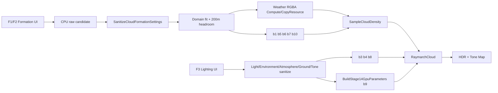

# 구름·빛 튜닝 가이드

## 2026-09-18 F1/F4 독립 슬롯 프리셋

일반 시작값은 **Cumulus + F4 3번 + High**다. F1은 Stratus/Cumulus/Altocumulus/Custom 형상, F4는 1(가을 아침)/2(해변 노을)/3(밝은 한낮)/4(분홍·라벤더) 조명·환경을 선택한다. 기존 Urban/Meadow/Snow scene은 역사적 테스트 호출에만 남긴다.

양쪽 `Save Preset`은 현재 선택 슬롯에 저장한다. 수정해도 선택 슬롯은 유지한다. 재선택은 저장값(없으면 내장값)을 읽으며 저장하지 않은 편집을 버린다. F1/F2의 formation 편집은 F1에, F3 조명·대기·지면·톤 편집은 F4에 저장한다. Built-in/Saved/Modified와 실제 파일 경로를 표시한다. 잘못된 JSON은 현재 값/선택을 보존하고 오류를 표시한다. 초기 로드 실패는 내장 시작값으로 남는다.

저장 루트는 소스 shaders 기준 `captures/noise-lab`이다. 구름 schema4 파일은 `types/stratus.json`, `types/cumulus.json`, `types/mixed.json`(표시명 Altocumulus), `custom-cloud.json`이다. schema1~3 이관을 유지한다. 조명 schema1은 `lighting/1.json`~`4.json`이며 slot 번호와 이름이 있는 숫자 필드(예: `tone.exposureEv`)를 기록한다. 임시 파일 flush 후 원자 교체하며 실패 시 기존 파일을 유지한다.

조명은 Light/Environment의 비패딩 설정, Atmosphere의 물리 계수·태양 각도, Ground 반사율·bounce, Tone 모드·EV·WB, 표면 그림자 strength/floor를 소유한다. 카메라·바람·재생 시각·진단·고정 품질·캐시 파생값은 제외한다. 적용 시 태양 재생을 끄고 각도를 적용하며 진단 선택은 보존한다. Deep Cache 512·80/79와 CB ABI는 유지한다. F4는 Weather/formation을 변경하지 않는다.

Custom은 첫 일반 실행에서 기존 파일을 `.before-snow.bak`으로 보존하고 기존 SnowOvercast 형상을 복사한다. 완료 표식 `snowDefaultInitialized:1`을 Custom 본문과 원자적으로 저장한다. 이후 저장에도 표식을 유지하므로 재실행 시 사용자 편집이 사라지지 않는다. 파일이 없을 때의 Custom 기본값도 Snow다. 테스트는 임시 루트를 사용하고 일반 초기화를 호출하지 않는다.

형상 후보: Stratus local thickness450~850m/base XZ22000m, Cumulus2000~3200m/base XZ12000m, Altocumulus650~1150m/base XZ4200m·고도3000m. 세 타입 density shaping .70, Base octave1.50 및 High 적분은 유지한다. Custom은 Snow 원본이다. 형상 알고리즘은 변경하지 않는다. 최종 시각적 채택은 사용자 대기다.

snapshot44는 formationSlot/formationSource와 lightingSlot/lightingSource를 별도로 기록한다. UI에는 과거 scene 이름을 노출하지 않는다.

2026-09-16: 06 상한/강도 튜닝에 앞서 경계 원인 진단을 진행했다. `Tsun`과 `Rim depth scale`은 태양 경로의 광학적 두께에 관한 값이며 화면 실루엣·픽셀 폭 판정이 아니다. Urban/F5/71초의 두 ROI에서는 캐시/스텝 정밀도보다 View/Shadow 밀도 표현 차이가 컸고, 전체 View tau도 최대 약.884였다. 승인값은 유지한다. 상세 결과와 적용 한계는 `doc/changes/stage15-cloud-rim-lighting.md`의 06-B 진단 기록을 따른다.

이 문서는 실행 중 F1~F4와 코드 값을 이용해 구름 종류, 밀도, 태양광, 그림자, 대기를 의도적으로 설정하는 실전 참조다. 기본 상태는 `Urban Fair Weather + High`이며 High 품질 수치는 UI에서 바뀌지 않는다.

## 가장 먼저 지킬 조절 순서

한 번에 모든 값을 움직이면 원인을 잃기 쉽다. 다음 순서로 한 묶음씩 확정한다.

1. F1 `Domain bottom/thickness`와 타입별 물리 두께
2. Weather support(`threshold/softness`, R 채널)와 global `Coverage`
3. `Density`와 `Extinction / m`
4. `Detail erosion`, Base/Detail world size, 타입별 shape
5. 태양 azimuth/elevation과 phase
6. Deep Cache 그림자와 sky/ground/interior fill
7. 대기 계수와 exposure/white balance

각 단계에서 `0` Composite와 관련 숫자/F4 진단을 번갈아 본다. Density만 보고 미학을 판단하거나 Composite만 보고 밀도 문제를 조명으로 고치지 않는다.

## 값이 적용되는 경로

텍스트 흐름: `UI → CPU sanitize/검증 → cbuffer/texture → HLSL density·lighting → HDR/Tone`

F1/F2 편집은 현재 runtime 값에 임시로 쓴 뒤 raw 후보를 캡처하고, 이전 정상값을 복구한 상태에서 sanitize된 후보를 **원자 적용**한다. 반면 Custom JSON load는 범위 밖 값을 clamp해서 받아들이지 않고 strict validation 단계에서 파일 전체를 거부한다.

## F1 — Cloud Formation

### 프리셋·상태 조작

| UI | CPU 동작 | GPU/HLSL 결과 | 저장/비용 | 검증 |
|---|---|---|---|---|
| Stratus/Cumulus/Mixed | `ApplyCloudType(TypeFormationTarget)` | formation만 b1/b5/b6/b7/b10+Weather에 적용 | 조명/대기와 세션 Motion 유지, generator key가 바뀔 때만 Weather 생성 | F5/F6, `2` Weather, `3` Base, `5` Final |
| Custom | `LoadCustomFormation` | schema 4 formation 전체 복원 | schema 1 type 이관·legacy wind 무시, 실패 시 기존 상태 유지 | 저장 전후 F3/Motion 유지 |
| Save Custom | `SaveCustomFormation` | GPU 변경 없음 | `captures/noise-lab/custom-cloud.json` 원자 교체 | 다른 concept 뒤 Custom load |
| VSync | `m_vsyncEnabled` | cbuffer 없음, `Present` 인수만 변경 | Custom 저장 안 함 | Performance 창, F1 상태 문구 |
| Preview field/XY·XZ·YZ | `NoiseLabParameters.outputMode/sliceAxis` | b2 `NoiseLabCB`, preview PS만 | 최종 구름/Custom 영향 없음 | 세 slice와 최종 숫자 view 비교 |

### Formation slider 연결표

| UI 이름 | CPU → GPU/HLSL | 단위 | UI 범위 → canonical | 값을 올리면 | 재생성·성능 / Custom | 추천 진단 |
|---|---|---:|---|---|---|---|
| Coverage | `CloudFormationSettings.coverage` → b1 `coverage` → `RemapCoverage` | 0~1 | `0~1 → 0~1` | 더 많은 Base noise가 통과해 면적·연결성이 증가 | Weather upload와 다음 cache 반영; 저장 O | `2`,`3`,`5` |
| Density | `densityMultiplier` → b1 → Base density | 배율 | `0~4 → 0~5` | 구름 물질량과 산란/흡광이 함께 증가 | Weather upload; ray당 샘플 수는 같지만 조기 종료가 빨라질 수 있음; O | `5`,`6`,`8` |
| Extinction / m | `extinctionPerMeter` → b1 `extinctionCoefficient` | 1/m | `5e-5~1e-3 → 1e-6~1e-2` | 같은 밀도에서 더 불투명하고 그림자 진해짐 | Weather upload; 적분 수식 변화; O | `6`,`8`,`9` |
| Detail erosion | `detailErosion` → b1 | 0~1 | `0~1 → 0~1` | 외곽이 더 깎여 복잡하고 작은 틈이 증가 | Texture3D 재생성 없음, Detail fetch는 이미 High 전 거리 사용; O | `4`,`5` |
| F2 Coverage threshold (R) | `weather.generator.coverageThreshold` → GPU Weather R | 0~1 | `0~1 → 0~1` | R support 영역이 줄어 구름 분포가 성김 | 256² Weather compute 1회; O | F2 RGBA, `2` |
| F2 Coverage softness (R) | `weather.generator.coverageSoftness` → GPU Weather R | 0~1 | `0.001~0.5 → 0.02~0.8` | support 경계가 넓고 부드러워짐 | **0.02 미만 UI 입력은 0.02로 clamp**; Weather compute; O | F2 RGBA, `2` |
| Cloud min thickness | b10 minimumThicknessMeters | m | 1~현재max | A=0의 두께 | domain 적합성 검사; O | F5/F7 |
| Cloud max thickness | b10 maximumThicknessMeters | m | 현재min~6000 | A=1의 두께 | max+lift+200m 영역 필요; O | F5/F7 |
| Base lift | b10 `maximumBaseLiftMeters` | m | `0~1000 → 0~2000` | 약한 column 기저가 상승 | texture 재생성 없음, domain-fit 가능; O | Local Base Offset |
| Height-based narrowing | b7 `footprintCoverageInfluence` | 0~1 | `0~1 → 0~1` | 높이에 따른 수평 footprint 변화가 coverage에 더 반영 | Weather upload; O | `2`,`3`,`5` |
| Domain bottom | b5 `cloudBottomAltitude` | m | `0~10000 → -100000~100000` | 구름층 전체 고도 상승 | layer 교차/대기 입사/Deep Cache 기준 변경; O | F6/F7, Cloud Depth |
| Domain thickness | b5 `cloudLayerThickness` | m | `500~10000 → 1~100000` + fit | 가능한 수직 공간 증가, 실제 local thickness가 같으면 모양 자체는 그대로 | 200m top headroom 검사; O | F7/F8, Cloud Depth |
| Cloud movement speed | F1 세션 Motion → b1 `windSpeed` | m/s | `0~400 → 0~1000` | Weather/Base/Detail과 그림자가 더 빨리 함께 이동 | noise/Weather 재생성·Custom 저장 없음, cache는 매 frame 갱신 | 0, 100, 400 비교 |

`Density`와 `Extinction`은 모두 불투명도를 높이지만 의미가 다르다. Density는 실제 구름 물질량 및 여러 조명 항에 들어가고, extinction은 meter당 광학 상호작용 강도를 바꾼다. 먼저 Density로 형태를 잡고 Extinction으로 광학 두께를 맞춘다.

## F2 — Weather Map과 Texture3D

### Texture3D와 바람

| UI 이름 | CPU → GPU/HLSL | 단위 | 범위 | 값을 올리면 | 재생성·저장 | 진단 |
|---|---|---:|---|---|---|---|
| Regenerate Base and Detail | `Renderer::RegenerateNoiseVolumes` | - | 버튼 | 현재 seed/frequency shader로 128³/32³ 내용을 다시 생성 | GPU compute·hash 갱신, Custom 값 아님 | F2 hash, `1`,`3`,`4` |
| Base world size | `NoiseVolumeParameters.baseWorldSizeMeters` → b6 | m/cycle | `1000~64000 → 1~200000` | 덩어리가 월드에서 더 커지고 반복 주기가 길어짐 | Texture3D 내용 재생성 없음; Custom O | `1`,`3` |
| Base vertical size | `baseVerticalWorldSizeMeters` → b6 | m/cycle | `1000~64000 → 1~200000` | Y 방향 noise 변화가 느려져 큰 수직 질량 | 재생성 없음; O | F1 slice, F7 |
| Detail world size | `detailWorldSizeMeters` → b6 | m/cycle | `250~8000 → 1~100000` | 침식 무늬가 커지고 거칠게 보임 | 재생성 없음; O | `4`,`5` |
| Wind direction XYZ | F1 세션 Motion → b1 `windDirection` | 방향 | 각 `-1~1`; sanitize 후 XZ 정규화·Y=0 | 속도는 그대로, 이동 방향만 회전 | Weather/noise 재생성·Custom 저장 없음 | speed 100m/s, F2 RGBA와 그림자 |

### Weather RGBA 생성 채널

Coverage, Cloud type(G), Density, Thickness 네 channel tree에는 같은 여섯 컨트롤이 있다.

| UI 필드 | CPU 필드 | UI 범위 → 실제 sanitize | 변화 | 비용/저장 |
|---|---|---|---|---|
| Seed | `PeriodicChannelSettings.seed` | uint 전체 | 패턴을 완전히 바꿈 | Weather 256² 재생성, Custom O |
| Macro period | `macroPeriod` | `1~64 → 1~8` | 큰 덩어리 반복 수 증가 | **9 이상은 8로 clamp** |
| Detail period | `detailPeriod` | `1~128 → 2~16` | 작은 Weather 변화 빈도 증가 | **1은 2, 17 이상은 16** |
| Detail weight | `detailWeight` | `0~1 → 0~1` | 작은 스케일이 channel에 더 강하게 섞임 | Weather 재생성 |
| Bias | `bias` | `-1~1 → -0.5~0.5` | channel 전체를 어둡게/밝게 이동 | **UI 양끝은 ±0.5로 clamp** |
| Contrast | `contrast` | `0.1~4 → 0.25~3` | 0.5 주변 분리 증가, 중간값 감소 | **UI 바깥 canonical은 clamp** |

추가 연결값:

| UI | CPU/HLSL 의미 | 범위 | 올리면 |
|---|---|---|---|
| Density coverage link | `densityCoverageInfluence` | 0~1 | Weather R이 B density를 더 강하게 보정 |
| Thickness coverage link | `thicknessCoverageInfluence` | 0~1 | Weather R이 A local thickness를 더 강하게 보정 |

G는 예약 중립값이다. F2는 R/B/A 생성기와 RBA 합성 및 개별 흑백만 표시한다. 타입은 고정Stratus/Mixed/Cumulus다.

## F3 — Lighting, Atmosphere, Tone

### 태양과 구름 조명

| UI 이름 | CPU → 최종 GPU/HLSL | 단위/범위 | 올리거나 바꾸면 | LUT/cache·저장 | 진단 |
|---|---|---|---|---|---|
| Sun azimuth | `Atmosphere.sunAzimuthDegrees` → b3 direction + b9 sun direction | deg `-180~180` | 태양이 수평으로 회전, 밝은 면/지면 그림자 방향 변화 | Sky View+Aerial LUT 갱신, cache 매 frame; Custom X | `7`,`9`, Near/Far Cache·Surface Transmittance |
| Sun altitude | 내부 `sunElevationDegrees` 호환 경로 | deg UI `0~90`, atmosphere canonical `-6~90`, direction 생성은 `0~90` | 높을수록 짧은 대기 경로와 위쪽 조명 | Sky/Aerial LUT 갱신; 3° 미만은 cache fallback 조건 | Atmosphere view·Surface Transmittance |
| Sun intensity | `Light.sunIntensity` → b9 `.solar...w` | `0~8`, sanitize 상한 없음 | 직접 태양과 물리 incident radiance 증가 | LUT hash에는 없음; b9 직접 효과, cache optical depth 불변; Custom X | `7`, HDR Before Tone |
| Sun color | `Light.sunColor` → b9 sun tint | nonnegative linear RGB | 구름/지면 태양광 tint 변경 | LUT 재생성 없음; Custom X | `7`, HDR Before Tone |
| Forward scattering | b3 `forwardScatteringG` → HG | `0~0.95` | 태양 근처 lobe가 더 좁고 강해짐 | cache/LUT 재생성 없음; Custom X | `9`, F4 Composite |
| Phase intensity | b3 | `0~1` | 등방성 1에서 dual-lobe 결과로 더 이동 | 재생성 없음; X | `7`,`9` |
| Edge influence | b3 | `0~1` | phase boost가 태양 노출 외곽에 집중 | 재생성 없음; X | F4 Composite, 코드 진단 Silver Lining 57 |

### 환경광·대기·지면·톤

| UI 이름 | CPU → GPU/HLSL | 범위 | 올리면 | LUT/cache·저장 | 진단 |
|---|---|---|---|---|---|
| Sky fill | Environment b4 `physicalSkyFillScale` | 0~2 | 구름 상부/전반의 Physical sky fill 증가 | LUT 재생성 없음; Custom X | F4 Composite, 코드 진단 Sky 53 |
| Ground fill | b4 `physicalGroundFillScale` | 0~2 | 구름 하부의 ground incident 증가 | LUT 재생성 없음; X | 코드 진단 Ground 54 |
| Interior scattering | b4 `multipleScatteringInteriorBlend` | 0~1 | 다중 산란을 태양 노출 면보다 내부에 배치 | LUT 재생성 없음; X | 코드 진단 Multiple 55 |
| Turbidity | Atmosphere → b9 | 0.25~4 | Mie 성분/연무가 강해지고 원경이 뿌옇게 됨 | Transmittance부터 모든 LUT 갱신; X | F4 LUT, F6 |
| Rayleigh scale | Atmosphere → b9 | 0.25~4 | 분자 산란과 푸른 하늘/원경 영향 증가 | 모든 LUT 갱신; X | Transmittance/Sky View |
| Ozone scale | Atmosphere → b9 | 0~4 | 오존 흡수 색 균형 변화 | 모든 LUT 갱신; X | Transmittance/Sky View |
| Ground albedo | Ground → b9 | RGB 0~1 | 지면 자체와 구름 하부 반사색 변화 | Multi부터 sky/aerial LUT 갱신; X | F5/F7, Ground component |
| Ground bounce | Ground → b9 `.sunTint...w` | 0~2 | 지면 irradiance가 구름 하부에 더 강하게 반사 | LUT 재생성 없음; X | F7, Ground component |
| Surface shadow | b8 `surfaceShadowStrength` | 0~1 | 지면/건물 구름 그림자 대비 증가 | cache는 매 frame 생성; X | Surface Transmittance |
| Ambient floor | b8 `surfaceAmbientFloor` | 0~1 | 깊은 지표 그림자도 더 밝게 유지 | cache optical depth는 동일; X | Surface Transmittance+Composite |
| Exposure EV | Tone → b9 `toneAndTime.x` | -8~8 | 1 EV마다 표시 전 HDR 배율 2배 | LUT/cache 없음; X | HDR Before Tone과 Composite 비교 |
| White balance | Tone → b9 `.y` | 3500~10000K | 낮으면 따뜻하게, 높으면 차갑게 보정 | LUT/cache 없음; X | HDR Before Tone과 Composite 비교 |

F3의 어떤 값도 Custom formation에 저장되지 않는다. 콘셉트 버튼은 F3 값을 다시 덮어쓰므로 수동 조명 튜닝은 원하는 F4 concept를 먼저 선택한 뒤 시작한다.

## F4, 숫자 키, 카메라

### F4 조작

| UI | 연결 | 용도/영향 |
|---|---|---|
| Urban/Meadow/Snow | `ApplySceneConcept` | formation+조명+대기+지면+surface shadow를 한 번에 적용 |
| Cloud view | b1 `debugMode` | Composite, Density/View T, Depth, 조명 성분/가시성/Visible Sun T, 중점 Sun T/Phase, Near/Far Cache와 표면 진단 |
| Atmosphere view | b9 `renderFlags.z` | LUT/air/HDR 진단. 렌더 설정 자체는 바꾸지 않음 |
| LUT previews | t8~t13 SRV | 실제 여섯 LUT의 thumbnail |
| Move speed | CPU camera speed | 1~5000m/s logarithmic. 구름 파라미터가 아님 |
| UI zoom | `developer-ui.json` schema 1 | 개발 UI 배율만 원자 저장 |
| Shader generation/report | Shader Manifest runtime | hot reload 성공/실패와 영향 프로그램 확인 |
| Export schema 43 snapshot | 현재 상태 export | Custom schema 4와 다른 진단 snapshot이며 preset load 대상이 아님 |

### 숫자 키 0~9

| 키 | CloudDebugMode | 정상 판정 |
|---:|---|---|
| 0 | Composite | 최종 장면 |
| 1 | Raw Noise | 반복 경계 없이 연속인 Base 조합 |
| 2 | Weather Coverage | 큰 분포가 F2 R preview와 일치 |
| 3 | Base Density | Detail 전 큰 덩어리와 local profile |
| 4 | Detail Noise | 고주파 Texture3D 패턴 |
| 5 | Final Density | Base에서 경계가 침식된 최종 형태 |
| 6 | View Optical Depth | 두꺼운 경로가 밝고 빈 공간이 검음 |
| 7 | Accumulated Direct | 태양 노출 면의 직접광 |
| 8 | Transmittance | 빈 하늘 1(흰색), 두꺼운 구름 0 쪽 |
| 9 | Sun T (segment midpoint) | 레이 구간 중점 한 표본의 태양 T. 빈 곳일 수 있어 실제 보이는 구름의 차폐와 다를 수 있음 |

F4 combo는 Cloud Depth, Near/Far Cache, Cache Cascade, Surface Transmittance 외에
Direct/Sky/Ground/Multiple/Silver Lining, Shaped Sun Visibility, Ambient Visibility,
Visible Sun T (opacity weighted), 중점 Sun T와 Phase Factor를 제공한다.

### 방향광 01: 조명 분리 출력 읽기

`F4 → Cloud view`에서 선택한다. Direct/Sky/Ground/Multiple은 보이는 레이 전체에
누적한 구름 조명만 출력하며 대기·지면·하늘 배경 합성을 제외한다.
각 RGB에 `L/(1+L)`을 적용한 뒤 현재 Tone 설정을 거치므로 화면 픽셀을 더해 Composite를
재구성하면 안 된다. Silver Lining은 Direct 안의 양의 phase 추가분이며 독립 광원이 아니다.

`Visible Sun T`는 표본별 원본 태양 T를 `Tview*(1-Tstep)`로 가중한 값이다.
밝으면 햇빛이 잘 통과하고 어두우면 차폐가 강하다. 단, 구름 기여가 없는 곳도 0으로
표시하므로 `Transmittance`(View T, 밝으면 구름이 희박하거나 없음)와 함께 읽는다.
`Shaped Sun Visibility`는 shadow exponent 이후, `Ambient Visibility`는 AO와 태양 차폐
결합 이후 값이며 기존 산란 interaction 가중 평균을 유지한다. 원본 Sun T와 같은 값이 아니다.
가시성 출력도 Tone을 거치므로 화면 밝기 0.5를 실제 T=0.5로 읽지 않는다.

Urban/F5, F1 Cloud movement speed=0, F3 Sun azimuth=-108.5°에서 Sun altitude=18/45/70°를
비교한다. 숫자 0은 Composite 복귀다. `Phase intensity=0`이면 적용 phase가 중립 1이 되어
Silver Lining이 검정이지만 Visible Sun T의 차폐는 유지되어야 한다.
F1의 세 Type으로 바꾸면 Urban 조명은 유지된다. F4 Concept 버튼은 조명도 초기화하므로
Type 비교 중에 다시 누르지 않는다. 01에서는 스크린샷을 저장할 필요가 없다.

### F5~F8

| 키 | 카메라 | 무엇을 검증하는가 |
|---:|---|---|
| F5 | Hero/Depth | 기본 구도, 구름-건물 depth, silver lining |
| F6 | Ground Horizon | 50km fade, aerial perspective, cache cascade |
| F7 | Inside Layer | local profile, 내부 fill, 과도한 extinction |
| F8 | Above Layer | Weather footprint, 반복/seam, cloud type 분포 |

## 내장 타입 기본값

`src/CloudFormationPresetStore.cpp::ResolveBuiltInCloudFormation(CloudFormationType)`의 핵심 값이다.

| 타입 | Coverage / Density / Extinction | Erosion | Weather G | 물리 두께 | Lift / Footprint | Domain |
|---|---|---:|---|---|---|---|
| Stratus | 0.40 / 1.20 / 0.00042 | 0.12 | 고정 Stratus | 1500~2300m | 0m / 0.20 | 1500~4000m |
| Cumulus | 0.45 / 1.25 / 0.00038 | 0.18 | 고정 Cumulus | 2000~3200m | 300m / 0.50 | 1800~5500m |
| Mixed | 0.68 / 1.15 / 0.00035 | 0.18 | 생성 Weather Map | Stratus 1500~2500m, Cumulus 3000~4600m | 200m / 0.40 | 1500~6500m |

세 타입 모두 Weather world 64km, Base 12km×12km, Detail 2km, wind `(0.9701425,0,0.2425356)`, speed 12m/s, View 50km/fade 40km, Light 20km를 공통 시작값으로 사용한다.

## 내장 장면 콘셉트 기본값과 적용 범위

| 콘셉트 | Formation 핵심 | 태양/phase | Environment | Ground / shadow |
|---|---|---|---|---|
| Urban Fair Weather | Cumulus source, coverage 0.38, density 1.10, extinction 0.00036, erosion 0.24, thickness 2000~3200m | az -60°, el 18°, intensity 1.0, forward g .75, edge .85, edge depth 2.0, shadow exp 1.35 | sky/ground .85, interior .55 | Concrete, bounce 1.0, surface .55 |
| Meadow Broken Clouds | Weather G, coverage .64, density 1.20, extinction .00039, erosion .20, domain 1500~6500m | intensity .95, forward .75, edge .70, edge depth 1.8, shadow exp 1.30 | sky/ground .95, interior .60 | Grass, bounce 1.0, surface .65 |
| Snow Overcast | Stratus source, coverage .90, density 1.25, extinction .00046, erosion .10, thickness 1500~2300m | intensity .75, forward .75, edge .35, edge depth 1.4, shadow exp 1.15 | sky/ground 1.10, interior .80 | Snow, bounce 1.5, surface .40 |

공통으로 Earth Clear atmosphere, SilverLining phase의 backward g `-0.15`, blend `0.90`, phase intensity `0.20`, single-scattering albedo `1.0`, surface ambient floor `0.35`에서 시작한다. Scene concept는 tone mapping 값을 바꾸지 않는다.

## UI에 없는 코드 전용 조절값

| CPU 필드 | canonical | 화면 영향 | 권장 수정 위치/주의 |
|---|---:|---|---|
| `LightParameters::singleScatteringAlbedo` | 0~1 | 낮추면 흡수 비중이 늘고 모든 구름 산란이 어두워짐 | `Stage15Parameters.h` descriptor 또는 초기값. 에너지 기준값이라 신중히 변경 |
| `backwardScatteringG` | -0.95~0 | 태양 반대 방향 후방 lobe 폭/강도 | phase preset에서 조절 |
| `phaseBlend` | 0~1 | 전방 대 후방 lobe 비율 | Silver lining은 0.90 |
| `edgeOpticalDepthScale` | 0.25~8 | 외곽광 폭, 높을수록 좁은 노출 영역 | concept별 현재 1.4~2.0 |
| `shadowExponent` | 0.5~4 | 직접 태양 T 대비 | 값을 과도하게 올리면 내부가 급격히 검어짐 |
| `ambientOcclusionStrength` | 0~16 | local density 기반 fill 차폐 | `EnvironmentParameters`/preset |
| `ambientShadowCoupling` | 0~1 | 태양 차폐를 ambient에도 연결 | PortfolioHero 0.55 |
| `ambientShadowExponent` | 0.1~8 | ambient 차폐 곡선 | PortfolioHero 0.50 |
| multiple-scattering octave/attenuation/extinction/phase | 0~4 / 0~1 | 내부 에너지 근사와 비용 | b4, 현재 UI는 interior blend만 노출 |
| View/Light 최대 거리, Weather world size | formation canonical | 원경 fade, light 범위, 큰 분포 반복 | `CloudFormationSettings`/preset, Custom 저장 O |
| profile fade/upper mass | 0~1 | 바닥·상단 부드러움, Cumulus 상부 질량 | `CloudShapeParameters`와 built-in resolver |

High step, 최대 512회, empty skip, distance step, cone 8-tap은 코드 전용 **튜닝값**이 아니라 고정 품질 계약이다. [CBUFFER_REFERENCE.md](CBUFFER_REFERENCE.md)의 High 항목을 참고한다.

## 증상별 레시피

### 구름이 안 보인다

1. `5` Final Density가 검은지 확인한다.
2. F2 Weather R와 `2`가 검으면 threshold를 내리거나 softness/coverage channel bias를 올린다.
3. Weather는 있는데 Base가 없으면 global Coverage를 올리고 Base world size를 확인한다.
4. Base는 있는데 Final만 없으면 Detail erosion을 0으로 내려 본다.
5. Density가 있는데 Composite만 없으면 Extinction, Sun intensity, Sky fill을 확인한다.
6. F6/F7에서 domain bottom/thickness와 카메라 위치가 맞는지 확인한다.

### 구름이 판처럼 보인다

1. Stratus가 아닌데도 판이면 Cumulus thickness와 Base lift를 올린다.
2. `3` Base에서 이미 평평하면 타입 profile/footprint 문제다. Detail로 고치지 않는다.
3. Weather softness가 너무 크고 threshold가 너무 낮아 전체 support가 연결됐는지 본다.
4. Base vertical size가 지나치게 커서 Y 변화가 사라졌는지 확인한다.
5. Domain top 자체가 잘린다면 local max thickness+lift+200m fit을 다시 맞춘다.

### 너무 불투명하다

1. `8` Transmittance와 `6` Optical Depth로 확인한다.
2. Extinction을 먼저 조금 낮춘다.
3. 형태 자체가 과밀하면 Density, 그 다음 Coverage를 낮춘다.
4. `T<=0.01` early exit가 넓게 발생할 정도의 값은 내부 디테일도 가린다.

### 내부가 검다

1. Sky fill과 Ground fill을 올리고 F7에서 비교한다.
2. Interior scattering을 올린다.
3. Surface shadow는 지면용이므로 구름 내부를 고치는 값이 아니다.
4. 코드에서 `ambientShadowCoupling`, `shadowExponent`, albedo가 과한지 확인한다.
5. Extinction/Density가 지나치면 fill을 올리기 전에 광학 두께를 정상화한다.

### 은빛 테두리가 약하다

1. 태양을 화면 가까이에 두도록 azimuth/elevation 또는 F5 시점을 맞춘다.
2. Forward scattering을 올리고 F4 Visible Sun T에서 보이는 구름의 차폐를 본다.
   `9`는 구간 중점 한 곳의 보조 진단이며 외곽광 전체의 판단 기준으로 쓰지 않는다.
3. Phase intensity와 Edge influence를 소폭 올린다.
4. 코드 전용 `edgeOpticalDepthScale`은 높을수록 더 좁은 테두리를 만든다.
5. Sun intensity/Exposure로 전체를 태우지 말고 HDR Before Tone에서 테두리 기여를 먼저 확인한다.

### 그림자가 뭉개지거나 seam이 보인다

1. F4 Near Cache, Far Cache, Cache Cascade, Surface Transmittance 순으로 본다.
2. 태양 elevation이 3° 미만인지 확인한다. 이때 cone fallback은 정상이다.
3. 카메라 이동 때 Near/Far center snap과 24km/128km 범위를 확인한다.
4. Surface shadow strength는 대비만 바꾸며 cache 해상도나 seam을 고치지 않는다.
5. Weather/Base는 움직이는데 그림자만 정지하면 effective time/b0 전달을 확인한다.

### 장면이 과노출된다

1. F4 HDR Before Tone과 Composite를 비교한다.
2. HDR부터 과하면 Sun intensity, sky/ground fill, ground bounce를 낮춘다.
3. HDR은 정상인데 출력만 밝으면 Exposure EV를 낮춘다.
4. White balance는 밝기 해결용이 아니라 색온도용이다.
5. ACES가 highlight를 압축해도 입력 에너지 오류를 숨기도록 사용하지 않는다.

## Custom에 저장되는 것과 저장되지 않는 것

| 저장됨 — formation schema 4 | 저장되지 않음 |
|---|---|
| coverage, density, extinction, detail erosion | High 품질·step·cache 규격 |
| Weather 4개 channel과 threshold/softness/link, 타입 선택 | 태양, phase, 환경광 |
| 타입별 thickness/lift와 profile/upper mass/footprint | 대기, 지면, surface shadow |
| Planar bottom/thickness, View/Light 거리 | exposure, white balance |
| Weather/Base/Detail world size | 카메라, move speed, VSync |
| Base/Detail noise 제작 파라미터 | motion 방향/속도, debug view, LUT preview, shader report |

Custom load가 실패하면 status 문구를 확인한다. 범위 밖 값, 잘못된 enum, 0-length wind, 필드 누락, schema 불일치, domain headroom 실패는 일부 clamp 적용이 아니라 전체 거부가 정상이다.

## 한 장면을 직접 만드는 최소 절차

1. F4에서 가장 가까운 concept를 선택한다.
2. F1에서 Stratus/Cumulus/Mixed 중 출발 type을 고른다.
3. F8과 `2`,`3`,`5`로 coverage와 큰 형태를 맞춘다.
4. F7에서 thickness/lift/profile 절단과 내부 밀도를 맞춘다.
5. F5/F6에서 extinction과 50km fade를 맞춘다.
6. F3에서 태양 방향, phase, fill, surface shadow를 맞춘다.
7. HDR Before Tone을 기준으로 대기와 에너지를 맞춘 뒤 exposure/WB를 마지막에 조절한다.
8. F1 `Save Custom`으로 formation만 저장하고, 원하는 F3 값은 `Stage15Parameters.h`의 새/기존 scene descriptor 코드로 명시한다.

전체 패스의 위치는 [RENDERING_PIPELINE_GUIDE.md](RENDERING_PIPELINE_GUIDE.md), 버퍼별 필드는 [CBUFFER_REFERENCE.md](CBUFFER_REFERENCE.md)를 참고한다.

## 방향광 개선 02: Density shaping 비교

F1의 Weather softness 아래 `Density shaping`에서 Ctrl+클릭으로 0 / 0.35 / 0.70을 입력한다.
밀도 배율과 coverage를 고정하고 중간 밀도만 곡선으로 조정한다. View의 Detail 침식이 끝난 값과
Shadow의 Base 값에 같은 단조 함수를 쓴다. 강도 0은 기존 화면이다. 큰 배치와 주파수는 바꾸지 않는다.
Type/Concept 선택은 Formation 전체를 적용한다. 02 승인 후 Urban/세 Type 강도=.70, Meadow/Snow=0이다.
Type만 선택할 때 Urban 조명은 유지한다. 후보는 각 Type에서 다시 입력한다. Custom 저장/로드는 강도를 보존한다.

Urban/F5, F1 movement speed=0, F3 태양 재생 Off, 방위각 -108.5°, 고도 18/45/70°로 비교한다.
숫자 0 Composite에서 햇빛을 받는 부분과 내부가 구분되는지 보고 F4 Cloud view의 Visible Sun T에서
흰 내부가 부분적으로 회색이 되는지 확인한다. 검은 하늘은 기여 없는 픽셀이다.
Direct와 번갈아 실루엣을 대조한다. 필요하면 F1 Detail erosion을 0으로 잠깐 비교하고 기존값을 복원한다.
하늘 틈이 과하게 메워지거나 경계가 단단한 고체처럼 보이면 후보를 기각한다.
가장 약한 만족 후보를 선택하되 Mixed는 이미 차폐가 강하므로 별도로 판정한다.
스크린샷 저장은 필수가 아니며 이 단계는 사용자 판정 전 기본값을 확정하지 않는다.

### 03 사용자 비교 순서 (02 승인 이후)

1. 새 Release 실행 → F4 Urban → F5 → F1 movement speed=0. Density shaping=.70 확인.
2. F2 맨 위 **Base mid octaves (03 test)**: 1.00x→1.25x→1.50x→1.00x.
   자동 재생성 뒤 Base hash만 변하고 Detail hash는 같아야 한다. Custom에 저장되는 값은 아니다.
3. F3 방위각 -108.5°, 고도18/45/70만 바꾸고 숫자0 Composite / F4 Direct를 비교한다.
   큰 덩어리 위의 돌출부·골이 늘어 빛 받는 면과 그늘이 더 읽히는지 본다.
   큰 연결이 깨지거나 작은 얼룩이 전체를 덮으면 기각한다. Visible Sun T는 보조로 본다.
4. F1 Detail erosion=0으로 잠시 비교 후 원래 값(Urban .24, Stratus .12, Cumulus/Mixed .18)을 복원한다.
   Detail Off에서도 Base 굴곡 차이가 있어야 한다. 1.00x 복귀 시 승인된 02 모습이어야 한다.
5. F1 세 Type을 전환하고 동일 비교. 밀도 .70과 Urban 조명, F2 후보가 유지되는지 본다.
6. 1.25/1.50 중 큰 모양을 유지하며 효과가 있는 후보를 보고한다. 차이가 없거나 악화되면 둘 다 기각한다.
   실버 링이 부족한 것은 미해결로 기록하며 이 단계에서 림을 추가하지 않는다. 스크린샷 저장은 선택이다.

### 04 — 폐기된 Near Detail 그림자

06-A에서 사용자 요청으로 UI·설정·거리 가중치·Detail 조회·전용 테스트를 제거했다. Near/Far/cone는 모두 Base 그림자 밀도를 사용한다. 실험 원인·결과는 [06 림 변경 기록](changes/stage15-cloud-rim-lighting.md)에 보존한다. ShadowCB 160B의 offset152/156은 uint padding이며 0으로 초기화한다. 미사용 surfaceShadowEnabled도 offset8의 uint padding으로 바꿨다. 실제 지면 그림자 strength/floor는 유지한다.

## 05 직접광·간접광·림 비교 — 2026-09-15

F3에 기존 필드 Shadow exponent(b3 offset60), Edge optical depth scale(b3 offset56),
Multiple attenuation(b4 offset16)을 노출했다. 기존 CPU/HLSL sanitize 범위는 각각 .5~4, .25~8,0~1이다.
06 현재 ABI는 LightCB80B/EnvironmentCB48B이며 ShadowCB160B다. 기존 Phase intensity/Sky fill/Ground fill을 함께 비교한다.
Reset approved Urban lighting은 위 여섯 명암 값과 Rim intensity/depth를 Urban 기준으로 복원한다. Type과 태양각·형상·노출·화이트밸런스는 유지한다.
단, 기존 F3 편집 처리와 동일하게 UI preset 표시는 Custom이 된다. Concept 재선택은 전체 장면 조명을 복원한다.
snapshot42 lighting 객체는 shadowExponent/edgeOpticalDepthScale/phaseIntensity/phaseCap/multipleAttenuation을 추가 기록한다.
Custom Formation schema3은 조명을 저장하지 않는다.

일반 Phase 상한은2.5다. `VCLOUD_TEST_PHASE_CAP`은05 검사에서만4/8을 컴파일하는 상수 override이며
UI 옵션이나 승인된 런타임 기본값이 아니다. 기존 shader manifest/include closure는 해당 소스 변경을 감지한다.
01 진단/밀도 불변 회귀를 유지하고05는 고정 물리 입력에서 성분/최종HDR 평균·대비를 보고한다.
`ctest --test-dir build -C Release -R LightingTuning --output-on-failure`로 실행한다.
4 Formation×3고도×3방위각×11독립후보=396조건. 방위각 -108.5/-18.5/71.5도, 시간71초, F5, Base 그림자/Base1.50/밀도.70.
가시 구름은 View 불투명도>.1인 픽셀을4픽셀 간격으로 집계한다. Phase diagnostic의2.5 색을 세어
실제 가시 표본 포화를 발견한 조건에만 Phase.40/상한4,8을 추가 비교한다. HDR finite·D3D오류 검사는 필수다.
수치 대비 상승이 미학적 개선이나 림 품질 승인을 뜻하지는 않는다.

### 05 사용자 비교 순서 / 승인 대기

준비: F1 Urban, F5 카메라, F1 Cloud movement speed=0m/s, Density shaping=.70,
F2 Base mid octaves=1.50, Near/Far Base 그림자. 노출/화이트밸런스는 유지한다.
F3 Sun azimuth=-108.5°, Sun altitude=18°에서 시작한다. 작은 글씨 값은 Ctrl+클릭으로 정확히 입력할 수 있다.
**각 항목을 시작하기 전에 F3 Reset approved Urban lighting를 누른다. 후보는 누적하지 않는다.**

- [ ] F3 Shadow exponent 1.35→1.62. F4 Direct에서 원래 차폐된 곳이 더 어두워지고 Visible Sun T는 그대로여야 한다. Composite에서 내부가 검게 뭉치면 기각한다.
- [ ] F3 Sky fill .85→.6375→.425. F4 Sky와 Composite를 본다. 하늘 입사광이 채우던 곳의 밝기가 줄어야 한다. 원래 기여가 거의 없으면 차이가 작을 수 있으며, 이를 그대로 보고한다. 배경 하늘까지 바뀌면 실패다.
- [ ] F3 Ground fill .85→.6375→.425. F4 Ground와 Composite를 본다. 구름 하부의 지면 반사광 기여를 확인한다. Direct/밀도 모양이 변하면 실패다.
- [ ] F3 Multiple attenuation .15→.1125→.075. F4 Multiple과 Composite를 본다. 고차 산란 에너지가 줄면서 직접광의 차폐가 더 읽히는지 확인한다. Interior scattering은 이번 비교 중 바꾸지 않는다. 내부가 검게 막히면 기각한다.
- [ ] F3 Phase intensity .20→.30→.40. 태양을 향하는 역광 구도에서 F4 Silver와 Composite를 본다. 태양과 시선이 가까워질 때 얇은 경계가 밝아져야 한다. 모든 방향의 모든 윤곽이 빛나거나 넓게 하얗게 뭉치면 기각한다. 테스트 전용 상한4/8은 현재 F3 조절값이 아니다.
- [ ] F3 Edge optical depth scale 2→2.5. F4 Silver/Composite에서 밝은 외곽이 얇게 제한되는지 본다. 이 값은 경계의 기하학적 두께가 아니라 태양 투과율의 지수다. 필요한 림까지 사라지면 기각한다.
- [ ] 각 후보를 고도18/45/70°, 방위각 -108.5/-18.5/71.5°에서 비교한다. 각 비교쌍에서는 각도와 카메라를 고정한다. 고도/방위에 따라 밝고 어두운 위치가 달라지는지 확인한다.
- [ ] Urban 조명을 유지한 Stratus→Cumulus→Mixed에서도 비교한다. Type을 바꾼 뒤 F3 여섯 조명값이 유지되어야 한다. Density shaping .70도 유지한다.
- [ ] 채택할 값을 항목별로 보고한다. 개선이 없으면 기준값을 유지한다. 각 항목의 개별 결과를 확인한 뒤 조합을 별도로 재검증한다. 아직 조합이나 최종05 화면 승인으로 처리하지 않는다.

현재 세로줄 현상은 기존 미해결 항목이며, 이번 조명 비교로 원인이 규명됐다고 해석하지 않는다.

### 05-B 과거 비교

159/79 및 Near Detail의 일반 조작은 폐기했다.05 최종 명암과80/40,3~5도 전환은 사용자 승인값이다. 과거 후보 결과는 방향광 변경 기록에 보존한다. 현재06 조작은 아래 절을 따른다.

### 05-C 저고도 전환 후보 (2026-09-15)

일반 규격은 Near80/Far40을 유지한다. F3의 `Sun shadow transition: 3-5 deg (05-C)`는 읽기 전용 안내다. 3도 아래 cone, 3~5도 광학 깊이 혼합, 5도 이상 cache를 사용한다. 먼저 F5/Urban 방위 -108.5도에서 고도 2.5→3→3.5→4→5→5.5를 왕복하고 F4 Direct/Composite의 갑작스러운 꺾임과 새로운 띠를 확인한다. 상세 Type/하부 성분 비교와 실패 기준은 `doc/changes/stage15-directional-cloud-lighting.md`의 05-C 체크리스트를 따른다. 05 명암값과 전환은 사용자 승인했고 현재06 림 비교 중이다. 하부 분석은 보류한다.

## 06 사용자 비교 — 가장자리 조명 (화면 승인 대기)

준비: F4 Concept Urban → F5 → F1 movement speed0, F3 태양 재생 Off. Density.70/Base1.50/Shadow1.35/Sky·Ground.85/Multiple.15/Phase.20/Edge2, 노출0EV/WB6500을 고정한다. F3의 Cloud Rim 아래 두 슬라이더가 이번 조작이다. 기존 수치의 단위를1 기준으로 환산하지 않았다.

- [ ] 일반 Release(림 상한2.5), Rim intensity1/depth1에서 기존 승인 화면과 큰 모양·명암이 유지되는지 확인한다. Near detail shadows는 표시되지 않는 것이 정상이다.
- [ ] 동일 구도에서 --rim-review-cap-4 실행과 비교한다. 처음에는 intensity1/depth1. F3 상한 표시4를 확인한다. 역광에서 얇고 태양에 노출된 부분만 더 밝아져야 한다. 상한8도 비교할 수 있으나 Phase.20에서 원본HG16 때문에 최대 적용값4라 추가 증가가 없다.
- [ ] 상한 후보를 먼저 판정한 뒤 F3 Rim intensity1→2→4를 한 번에 하나씩 비교한다. Direct/Silver는 증가할 수 있지만 F4 Sky/Ground/Multiple/Visible Sun T와 밀도는 유지되어야 한다.0은 림 항만 끈다. 넓은 백색화·내부 그림자 소실은 기각한다.
- [ ] 강도를 선택한 뒤 Rim depth scale1→.5→2를 비교한다.2는 높은 태양 투과율 쪽으로 집중, .5는 범위를 넓힌다. 화면 외곽선의 픽셀 폭을 지정하는 값은 아니다. 태양 반대편까지 동일하게 발광하면 기각한다.
- [ ] F3 고도18/45/70, 순광·측광·역광을 확인한다. F5 역광 비교 방위는 화면/태양 방향을 일치시키고, 같은 상태에서 방위를90도/180도 돌려 측광/순광을 확인한다. 림이 없는 각도도 정상이며 모든 윤곽 발광이 목표가 아니다.
- [ ] Urban 조명에서 F1 Stratus→Cumulus→Mixed를 전환한다. F3 림 두 값과 기존 조명이 유지되고 내부 어두운 부분·중간톤·밝은 경계가 자연스럽게 이어져야 한다. Concept 재선택은 해당 기본 Rim1/1을 복원한다.
- [ ] 고도2.5→3→3.5→4→5→5.5도 왕복 및 F7 근거리에서 새 줄무늬/꺾임 여부를 본다. 캐시80/40과 전환3~5도는 유지한다. 하부의 기존 평탄화는 별도 보류 항목이다.
- [ ] 가장 약한 유효 후보의 상한/강도/깊이 값을 보고하고 화면을 승인한다. 승인 전에는 기본값을 교체하거나07을 완료 처리하지 않는다. 촬영은 필수가 아니다.

06 사용자 승인: Rim intensity 기본2, Rim depth1, cap2.5. Concept 공통 초기값2/Type 전환 보존. LightCB80B offset64/68 유지. 림은 공유HG의 양의 증가분이며 Sun T 기반 외곽 가중치를 사용한다. 화면 윤곽 검출은 아니다.

2026-09-16 하늘광 차폐 분리: EnvironmentCB48B/모든 offset은 유지한다. ambientShadowCoupling/ambientShadowExponent는 이제 구름의 지면 반사광 가시성에만 사용하며 하늘광에는 적용하지 않는다. Sky는 기존 LUT RGB×fill×height×local AO다. Direct/Rim/Multiple·LUT 생성은 그대로다. F4 Ground Ambient Visibility가 남은 지면 가시성 의미를 표시한다. 실제 변경과 수식은 stage15-cloud-rim-lighting 변경 기록 참조.

### 06 Detail 강도 분리 진단

현재 View에는 침식 후 밀도, 태양 캐시/cone에는 Base 밀도를 사용한다. Detail은 raw Base의 boundary=1-smoothstep(.45,.90,Base)를 곱해 깎고 그 뒤 shaping을 적용한다. 강도를 올리면 밀도량과 광학 두께가 줄어들며 새로운 조밀한 덩어리가 생기지 않는다. 06 Urban/F5 비교에서 .24→.5→1은 파임 보강보다 소실이 커졌다. 테스트 전용 Detail 그림자 경로를 일반 정책으로 채택한 것은 아니다. 수치는 stage15-cloud-rim-lighting 변경 기록 참조.

## 2026-09-17 F1·F2 UI 정리와 범위 정합

문제: Cumulus 두께가 활성 타입에서 영향이 없거나 domain 적용이 거부되는 경우 미사용처럼 보였다. 실제 HLSL Weather는 타입에 따라 두 범위를 보간하고 Base lift를 local bottom에 반영한다. Domain height는 추적 영역 높이이므로 영역 안의 구름 두께와 별개다. F2 UI는 Macro1~64/Detail1~128/Bias-1~1을 허용했지만 canonical은1~8/2~16/-.5~.5여서 조작 후 되돌아갔다.

변경: Cloud Local은 실제 typeSelection에 따라 한 쌍 또는Thin-form/Thick-form 두 쌍을 표시한다. 각 ImGui ID는 타입 전환에도 안정적이다. Max base lift/Footprint influence는 Local,Domain bottom altitude/height는Ray Domain으로 분리했다. F1 상시 설명문은 제거하고 상태/실패/Preview는 유지했다.

두께 제약: thinMin=[1,min(thinMax,thickMin)],thinMax=[thinMin,thickMax],thickMin=[thinMin,thickMax],thickMax=[max(thinMax,thickMin),6000]. 숨겨진 값을 보존하기 위한 상호 제약이며 단일 타입에서도 숨겨진 값이 상한/하한에 영향을 줄 수 있다. Domain height 하한은 기존EvaluateFit의 활성최대두께+최대lift+200m. 다른 형상 편집이 영역을 넘으면 기존원자적 거부를 유지하며 자동확장하지 않는다.

공유 FormationParameterRanges는 기존허용값을UI/검증/sanitize에 연결한다. Density0~5,Extinction1e-6~.01,Softness.02~.8,Base size1~200000m,Detail size1~100000m,Domain bottom±100000m,height최소적합값~100000m,lift0~2000m,구름속도0~1000m. 큰양수거리와Extinction은로그슬라이더. Weather채널Macro1~8/Detail2~16/weight0~1/Bias-.5~.5/Contrast.25~3. 직접입력AlwaysClamp,정수는임시int로편집하고unsigned에명시변환한다. 풍향정규화는유지한다.

ABI/Custom schema/렌더수식/승인기본값 변경없음. 숨김/표시만으로 설정을 쓰지 않는다. 범위밖Custom파일 거부는 그대로다. F3/F4와07통합검증은범위밖.

사용자 확인 대기: F1 Urban/Stratus/Cumulus/Mixed 전환 후실제타입에맞는항목만보이는지확인. Cloud Local 두께를현재domain안에서바꾸면구름높이가변해야하며,영역을넘으면오류표시와기존값유지가정상이다. Ray Domain bottom은구름기준고도도변경하며height증가만으로로컬두께가커지지않는것이정상. F2 각채널Macro8/Detail16/Bias±.5/Contrast.25·3에서끝점과표시값이일치해야한다. Ctrl+클릭범위밖입력은허용끝값으로제한되어야한다. Custom저장/재로드에서숨겨진두께도유지되어야한다.

### 2026-09-17 Domain UI 조작 범위 축소 / lift 의미 확인

사용자 요청으로 F1 Domain bottom altitude 슬라이더 하한을0m,Domain height 상한을10000m로 제한했다. height하한은활성최대두께+최대lift+200m를유지한다. 기존canonical도메인상한은100000m였으며1000000m가아니다. 저장호환을위해canonical/Custom허용범위는유지하고UI조작범위만의도적으로축소한다. 기존범위밖Custom을불러온뒤UI를여는것만으로값을덮어쓰지않는다. 편집할때새UI범위로제한된다.

Max base lift 실제상한은2000m,300m는내장프리셋값이다. 따라서lift상한은유지한다. HLSL lift=min(maxLift*lerp(.15,1,type)*(1-WeatherA)^1.5,localThickness*.25). 독립적인구름별난수가아니라두께채널에연결된지역별양수상승이다. 범위증가는위아래진동이아니라전체상승과지역차를함께키운다. 덩어리별랜덤상하이동은이번수정범위가아니다.

Domain height는구름local두께가아니라ray교차영역이다. 최대시선거리,512회반복,누적투과율early exit,empty-space skipping,scene depth종료가별도로작동한다. 따라서높이와GPU비용은선형관계가아니다. Shadow cache의고정높이slice간격에도영향을줄수있어영역을불필요하게늘리는것은품질개선이아니다.

사용자확인: F1 Ray Domain에서bottom음수직접입력이0으로제한되고height끝값이10000인지확인한다. lift의300/2000을비교할때그값은실제상승량이아니라상승한계이며타입과WeatherA에따라더작게적용되는것이정상이다. 화면승인은사용자확인대기다.

추가 확인과 실제 UI 수정: canonical lift상한2000m와별개로domain적합성은 lift<=domainHeight-activeMaxThickness-200m를요구한다. 사용자가관찰한300m제한은현재영역여유일수있으며300m하드코딩은아니다. Max base lift UI상한을clamp(domainHeight-activeMaxThickness-200,0,2000)으로동기화했다. 더큰lift가필요하면먼저Domain height를늘린다. 기존설정을여는것만으로보정하지않고적용거부정책도유지한다.

### 2026-09-17 F2 Texture3D world size 하한

사용자 요청으로 Base world size/Base vertical size의 UI 하한을3000m,Detail world size는300m로 변경했다. 기존 UI 상한200000m/100000m와 로그조작은 유지한다. 저장/CPU허용범위와기본값은유지하여과거Custom을읽을수있으며UI를여는것만으로값을보정하지않는다.

의미: 세항목은Weather Map이아닌Base/Detail Texture3D의UV전체0~1한주기를월드에펼치는길이다. Base world size는XZ,Base vertical size는Y,Detail world size는XYZ공통이다. uvw=frac(world/size+offset)이며Base Y는domain bottom을뺀높이를쓴다. size3000m이면UV0.1차이는300m다. 텍스처내부에여러noise대역이있으므로한구름덩어리크기와size는같지않다. Weather의XZ UV는별도의Weather world size를사용한다.

확인: F2세슬라이더왼쪽끝과직접입력하한을확인한다. 값을키우면무늬가늘어나고작게하면촘촘해진다. Texture3D해상도나Noise내용을재생성하는설정이아니다. 사용자화면확인대기.

## 2026-09-18 F2 Weather scale와 채널 미리보기

요청: Weather world size를3000~64000m로노출하고크기관련항목을분류하며RGBA를분리해이해할수있게한다. 기존F2원본Image는A(두께잠재값)를투명도로소비하여빈영역의검정을RGB0으로오인할수있었다.

변경: Base / Detail Noise Scale, Weather Map, Weather Generator로분류. Weather map scale은기존CloudCB weatherMapWorldSize를수정하고기존Formation원자적캡처/적용/Custom저장경로를사용한다. Formation하한17600→3000m로낮춰UI요청이거부되지않게했고상한160000m와기존파일호환은유지한다. UI상한은64000m. CB크기/schema/기본64000은변경없음. scale은샘플좌표의월드매핑을바꾸며새레이나밀도조회는추가하지않는다.

Density coverage link와Thickness coverage link를Weather Map으로이동했다. B=lerp(독립densityNoise,R,densityLink), A=lerp(독립thicknessNoise,smoothstep(.05,.95,R),thicknessLink).0이면독립noise,1이면Coverage를따른다. 값변경은Weather생성결과를바꾸는설정이다. G아래깨지는혼합언어안내문을제거했다.

GPU미리보기: 기존NoiseLab PS에F2전용output100(RGB),101~104(RGBA흑백)를추가했다. 원본Weather UV전체를샘플하고출력alpha를항상1로둔다.512² RGBA8타깃5장(약5MiB)을UI가소유하며F2열림시에만추가5draw한다. CPUreadback은없고SRV/RTV를분리하며종료때해제한다. F1출력선택값은로컬복사본으로유지한다. 최종렌더와성능측정UI-Off경로에는추가draw가없다.

채널의미: R은coverage/support재료이지최종구름불투명도가아니다. G는지역타입0층운~1적운이며Fixed모드에서는저장되지만최종타입에는쓰지않는다. B는최종밀도에곱할0.5~1.5배의재료(0~1저장). A는local두께min~max를보간하고lift에도사용되는잠재값이며투명도가아니다. 빈영역에는(거의0,.5,.5,0)을저장하므로검정이RGBA모두0을뜻하지않는다.

사용자확인: F2 Weather map scale에서3000/64000을비교하면배치의월드반복크기가바뀌되원본텍스처그림은같을수있다. 두link의0/1에서각각B/A미리보기가R분포를따르는지확인한다. R/G/B/A는검정0~흰색1이고A가낮아도RGB미리보기는투명해지지않아야한다. 흑백G는Fixed상태에서도보존된다. 화면승인은사용자대기.

## 2026-09-18 F2 반복 무늬 피드백과 UI 하한 조정

관찰: 사용자는 Weather 64000m, Base XZ/Y 3000m에서 격자 무늬가 잘 보인다고 보고했다. 직전 UI 작업은 샘플링 수식을 바꾸지 않았으며 Base/Detail의 UI 하한만 3000/300m로 노출했다. 정확한 격자 원인은 아직 진단하지 않았다. 짧아진 반복 주기가 후보 원인이지만 캐시/적분 표본 문제와 구분하지 않은 상태다.

변경: Weather map scale UI 하한을 10000m, Detail world size UI 하한을 700m로 올렸다. 상한은 각각 64000/100000m를 유지한다. Base XZ/Y는 기존 3000~200000m를 유지하고, 실용 비교 범위로 XZ 6000~32000m, Y 6000~24000m, Detail 700~6000m를 제안한다. 이는 검증된 품질 한계나 채택 기본값이 아닌 후보 구간이다. 비교 시작점은 기존 Base XZ/Y 12000m, Detail 2000m다.

고정: 기존 저장/검증 범위, Custom 호환, 승인 기본값, UV 수식, Texture3D 생성, High 샘플 간격은 변경하지 않는다. UI를 여는 것만으로 기존 값을 보정하지 않는다. Weather가 이미64000m이면 하한 변경은 그 화면의 격자를 없애지 않는다.

사용자 확인: F2 Weather scale과 Detail world size의 왼쪽 끝/직접 입력에서 각각10000m/700m로 제한되는지 확인한다. Base 3000m에서의 반복은 Base12000m로 되돌려 비교하며, 무늬 간격이 world size와 함께 변하는지 확인한다. 바뀌지 않으면 반복 타일 원인으로 단정하지 않는다. 화면 판정은 사용자 확인 대기다.

## 2026-09-18 Noise scale 상한과 Ray Domain 실용 범위

문제/요청: 넓은 canonical 허용 범위가 UI 튜닝 범위로 노출되어 과도한 크기까지 조절된다. 사용자 요청으로 Base XZ/Y 상한40000m, Detail 상한6000m를 적용한다. 하한은 Base3000m/Detail700m 유지.

Ray Domain bottom UI는0~4000m. Height는 절대 상단 고도가 아니라 바닥부터의 두께이므로 상단=bottom+height다. Height UI 상한은max(5000m, 기존EvaluateFit이 계산한 최소영역높이)다. 최소영역높이=활성최대두께+최대lift+200m 계약을 유지한다. 최소가5000m보다 큰 기존/편집 설정에서는 역전 범위를 피하기 위해 최소치까지 허용한다. 예: bottom4000m/height5000m이면 상단9000m. 영역을 자동 확대하거나 기존 설정을 자동 변경하지 않는다.

근거: Unreal API도 LayerHeight를 바닥 고도 위의 두께로 정의한다(https://dev.epicgames.com/documentation/unreal-engine/API/Runtime/Engine/UVolumetricCloudComponent). Horizon 공개 발표는 해당 게임의 체적 층을1500~4000m에 배치한 사례다(https://advances.realtimerendering.com/s2015/The%20Real-time%20Volumetric%20Cloudscapes%20of%20Horizon%20-%20Zero%20Dawn%20-%20ARTR.pdf). 특정 게임의 층 범위는 보편적인 엔진 최대값이 아니다. 여기의4000/5000m는 현재 장면을 위한 UI 정책이다.

고정: 저장/validation/Custom 허용 범위와 승인 기본값, 셰이더 UV/밀도/레이 수식, ABI는 변경하지 않는다. UI를 열기만 해도 기존 값이 바뀌지 않는다.

사용자 확인: F2 Base 두 항목 끝값40000m, Detail6000m, F1 bottom4000m를 확인한다. Height는 보통5000m이며 최소적합높이가 이를 넘으면 그 최소치까지 허용되는 것이 정상이다. Ctrl+클릭 입력에도 같은 UI 제한을 적용한다. 렌더 품질 판정은 사용자 확인 대기.

### 2026-09-18 UI 범위 미반영 신고 후 재확인

사용자는 이전 Debug 실행으로 확인하지 못한 것 같다고 설명하고 현재 Release로 확인 중이라고 알렸다. 이전 Debug 링크 실패로 두 구성의 실행 파일이 달랐다. 최신 Release의 요청 범위는 유지하고 Debug도 동일 소스로 갱신한다. 조사 중 추가한 범위 라벨/중복 clamp는 채택하지 않고 원래 UI와 AlwaysClamp를 유지한다. 실제 UI 자동 접근은 도구 승인 거부로 실행하지 못했다. 사용자 화면 확인 중이며 최종 승인으로 간주하지 않는다.

2026-09-18 후속 요청: Domain bottom altitude UI 상한을4000→7000m로 확대했다. Height는 두께이므로 bottom7000+height5000이면 추적 상단12000m다. 실제 구름의 local 상단은 Weather 두께와 lift에 따라 이 영역 안에서 결정된다. Height 적합성 하한/상한 예외, 저장 범위, 승인 기본값과 렌더 수식은 유지한다.

## 2026-09-18 F1 상태 문구 제거와 Weather R 설정 이동

요청: Cloud Local의 Effective Cloud Type 문구를 제거하고 Weather 채널 생성 설정은 F2로 모은다.
확인: coverageThreshold/coverageSoftness는 WeatherMapCompute의 R=smoothstep(threshold-softness/2,threshold+softness/2,coverageField)에 쓰인다. F1 Coverage의 Base noise 문턱과는 별개다.
변경: F1 Cloud Local의 Effective Cloud Type 한 줄을 제거. F1 Formation의 Weather threshold/softness를 F2 Weather Generator의 Coverage 채널 설정 바로 위로 이동하고 Coverage threshold (R)/Coverage softness (R)로 표시한다. 기존 범위0~1/.02~.8, AlwaysClamp, m_formationEdited 및 원자적 설정 적용 경로를 유지한다. 설정값/기본값/Custom/셰이더 수식은 변경하지 않는다.
사용자 확인: F1에 세 항목이 사라지고 F2 Weather Generator에 R threshold/softness 두 항목이 보이는지 확인한다. Threshold를 올리면 R에서 구름 허용 영역이 감소하고 Softness는 전이 폭을 바꾼다. R에 연결된 B/A 및 빈 영역 중립 처리는 기존대로다. 두께 통합/G 제거/profile 편집은 이 UI 이동과 별개의 후속 변경이며 이 기록에서 완료로 취급하지 않는다.

### 실제 변경 — 공통 두께 / Weather G 제거 / 공통 Vertical Profile

1. `WeatherColumnSettings`는 minimumThicknessMeters, maximumThicknessMeters, maximumBaseLiftMeters 세 필드다. F1 Cloud Local은 항상 Cloud min thickness / Cloud max thickness 두께 두 항목만 표시한다. 실제 두께는 `min+(max-min)*Weather A`이며 타입을 바꾸어도 같은 min/max에서 두께 공식은 같다. 프리셋 버튼은 자기 시작값을 이 공통 필드에 넣는다.
2. Fixed Stratus/Mixed/Cumulus만 남겼다. Regional Blend enum/CPU·GPU 혼합 경로, G 생성기/sanitize/hash/저장/UI를 제거했다. G는 RGBA8의128(중립0.5) 예약값이며 읽지 않는다. R/B/A seed와 생성식은 유지한다. F2는 RBA 합성+R/B/A 흑백4장만 표시한다. 합성의 화면 RGB는 데이터 R/B/A를 각각 배치하므로 이전 RGB합성 색과 다르다. 최종 구름 조명에는 영향을 주지 않는다.
3. F1 Vertical Profile에 공통 곡선5항목과 미리보기를 추가했다. Height-based narrowing은 이전 Footprint influence의 새 이름이다. 하단/상단 fade와 밀도 상승 높이는 지역 높이의%로 표시한다. 곡선 미리보기는 가로축=바닥0→상단1, 세로축=밀도배율0→1이다.

공통 곡선:
`P(h)=smoothstep(0,bottomFadeEnd,h)*(1-smoothstep(topFadeStart,1,h))*lerp(lowerDensityScale,1,smoothstep(upperTransitionStart,upperTransitionEnd,h))`.
두께는 이 곡선이 실제로 펼쳐질 세로 길이를 정한다. 예: 두께2000m이면50%는local bottom+1000m다. Lower density=1이면 밀도 상승 구간은 효과가 없는 것이 정상이다. 프로파일은 밀도 배율을 바꾸고 Height-based narrowing은 타입별 높이 단면의 노이즈 문턱 영향을 조절한다. 노이즈 자체/월드 UV/적분 step은 바꾸지 않는다.

기본값과 호환:
- Urban/Cumulus: 두께2000~3200m, fade.08/.94, lower.65, rise.08/.70. Stratus/Snow:1500~2300m, fade.05/.72, lower1. 기존 고정 타입의 활성 계산을 유지한다.
- Mixed/Meadow:2250~3550m, fade.10/.86, lower1, 고정Mixed. 이전 Regional의 지역별형상과 동일한 화면을 보장하지 않는다. 제거 기능에 따른 의도적 변화다.
- Custom schema4는 새 공통 필드/RBA만 저장한다. schema1~3는 로더 내부에서만 옛 두께4개/profile9개/G필드를 해석한다. 고정타입은 활성 범위/곡선을 선택하고 Regional3은 FixedMixed1 및 두께 범위 평균으로 이관한다. schema1/2 densityShaping=0, schema3은 저장값을 유지한다. 읽기만으로 옛 파일을 덮어쓰지 않는다. 지역별 G를 재현할 수 없다는 제한은 로드 상태문구에 표시한다.
- Snapshot43에 thicknessMeters2개/verticalProfile5개를 기록한다. b7=48B,b10=32B 크기는 유지하지만 필드 의미가 바뀌므로 새exe/셰이더를 같이 사용해야 한다. offset 표는 CBUFFER_REFERENCE/ARCHITECTURE에 갱신했다. Weather compute b0=160B의channels[1]은 예약칸이다.

CPU→GPU 흐름/책임: NoiseLab F1 편집 → Formation 후보 전체 검증/원자적 적용 → shape b7 및 column b10 → Weather A를 local두께/lift/정규화높이로 해석 → 공통 profile과 타입별footprint로Base밀도 → 기존Detail/shaping/View/Shadow. CloudFormationPresetStore는 시작값/Custom 이관을, WeatherMap.cpp/WeatherMapCompute는RBA 생성을, CloudShapeParameters CPU/HLSL은같은profile 곡선을 소유한다.

사용자 렌더 체크리스트(승인 대기):
- [ ] F1 Stratus/Cumulus/Mixed 및 F4 Urban/Meadow/Snow를 선택한다. Cloud Local에 두께 슬라이더2개만 나타나야 한다. Thin/Thick4개나 Regional 표시가 남으면 실패다.
- [ ] F2에서 G설정/흑백이 사라지고 RBA/R/B/A만 표시되는지 확인한다. RBA합성은색상표현이며구름색이 아니다. 채널설정은해당R/B/A만 기존link규칙대로 반영되어야 한다.
- [ ] F1 Cloud Local에서 min=max를 같은 적합두께로 설정하면 A로 인한 두께변화가 사라진다(lift/base noise 변화는남는다). Domain이작으면적용거부가 정상이며UI를열기만해값이바뀌면실패다.
- [ ] F1 Vertical Profile에서 Bottom fade end를8→25%로 올린다. 바닥에서차오르는구간이길어져낮은부분이희박해지는것이정상이다. Top fade start를94→65%로낮추면상단이일찍사라져야한다.
- [ ] Lower density를1→.4로내리면상부대비하부가희박해진다. Density rise start/end를조절하면밀도증가높이가이동한다. lower1에서rise조절영향이없는것은정상이다. 좌우복잡한파임을새로추가하는슬라이더가아니다.
- [ ] Height-based narrowing0/1을비교하면높이별폭차이가바뀌되Vertical profile은계속적용된다.0에서도상하fade가남는것이정상이다.
- [ ] Save Custom후Type을바꾸고Custom을불러오면두께2개/profile5개가복원되어야한다. 이전Regional Custom은고정Mixed로이관되어지역타입차이가없어지는것이정상이며정확한옛화면복원이아니다.

미룬 항목: 사용자 화면 승인, 하부 평탄화 추가분석,07 전체회귀/성능/최종포트폴리오촬영. 이번 변경은 새로운 두께/프로파일 조작을 제공하며 림·노출·조명 승인값을 바꾸지 않는다.

## 2026-09-18 프리셋 경로 갱신
현재 활성 JSON은 저장소 presets/의 형상4개·조명4개다. 개발 실행은 원본을 읽고 Save Preset으로 수정한다. 소스 루트가 없는 배포에서는 exe 옆 presets/를 사용한다. CMake 빌드마다8개를 copy_if_different로 배치하며 JSON만 수정해도 복사한다. 일반 시작의 Snow 자동 교체는 제거했다. 이전 captures/noise-lab 저장/초기화 설명은 역사적 동작이다. snapshot 출력과 UI 설정은 captures에 유지한다. schema/CB/승인 기본값은 변경하지 않는다. 상세: [문제와 해결 기록](changes/stage15-cloud-quality-followups.md).
