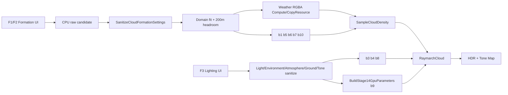

# 구름·빛 튜닝 가이드

이 문서는 실행 중 F1~F4와 코드 값을 이용해 구름 종류, 밀도, 태양광, 그림자, 대기를 의도적으로 설정하는 실전 참조다. 기본 상태는 `Urban Fair Weather + High`이며 High 품질 수치는 UI에서 바뀌지 않는다.

## 가장 먼저 지킬 조절 순서

한 번에 모든 값을 움직이면 원인을 잃기 쉽다. 다음 순서로 한 묶음씩 확정한다.

1. F1 `Domain bottom/thickness`와 타입별 물리 두께
2. Weather support(`threshold/softness`, R 채널)와 global `Coverage`
3. `Density`와 `Extinction / m`
4. `Detail erosion`, Base/Detail world size, 타입별 shape
5. 태양 azimuth/elevation과 phase
6. Deep Cache 그림자와 sky/ground/interior fill
7. 대기 계수와 exposure/white balance

각 단계에서 `0` Composite와 관련 숫자/F4 진단을 번갈아 본다. Density만 보고 미학을 판단하거나 Composite만 보고 밀도 문제를 조명으로 고치지 않는다.

## 값이 적용되는 경로

텍스트 흐름: `UI → CPU sanitize/검증 → cbuffer/texture → HLSL density·lighting → HDR/Tone`

F1/F2 편집은 현재 runtime 값에 임시로 쓴 뒤 raw 후보를 캡처하고, 이전 정상값을 복구한 상태에서 sanitize된 후보를 **원자 적용**한다. 반면 Custom JSON load는 범위 밖 값을 clamp해서 받아들이지 않고 strict validation 단계에서 파일 전체를 거부한다.

## F1 — Cloud Formation

### 프리셋·상태 조작

| UI | CPU 동작 | GPU/HLSL 결과 | 저장/비용 | 검증 |
|---|---|---|---|---|
| Stratus/Cumulus/Mixed | `ApplyCloudType(TypeFormationTarget)` | formation만 b1/b5/b6/b7/b10+Weather에 적용 | 조명/대기와 세션 Motion 유지, generator key가 바뀔 때만 Weather 생성 | F5/F6, `2` Weather, `3` Base, `5` Final |
| Custom | `LoadCustomFormation` | schema 2 formation 전체 복원 | schema 1 type 이관·legacy wind 무시, 실패 시 기존 상태 유지 | 저장 전후 F3/Motion 유지 |
| Save Custom | `SaveCustomFormation` | GPU 변경 없음 | `captures/noise-lab/custom-cloud.json` 원자 교체 | 다른 concept 뒤 Custom load |
| VSync | `m_vsyncEnabled` | cbuffer 없음, `Present` 인수만 변경 | Custom 저장 안 함 | Performance 창, F1 상태 문구 |
| Preview field/XY·XZ·YZ | `NoiseLabParameters.outputMode/sliceAxis` | b2 `NoiseLabCB`, preview PS만 | 최종 구름/Custom 영향 없음 | 세 slice와 최종 숫자 view 비교 |

### Formation slider 연결표

| UI 이름 | CPU → GPU/HLSL | 단위 | UI 범위 → canonical | 값을 올리면 | 재생성·성능 / Custom | 추천 진단 |
|---|---|---:|---|---|---|---|
| Coverage | `CloudFormationSettings.coverage` → b1 `coverage` → `RemapCoverage` | 0~1 | `0~1 → 0~1` | 더 많은 Base noise가 통과해 면적·연결성이 증가 | Weather upload와 다음 cache 반영; 저장 O | `2`,`3`,`5` |
| Density | `densityMultiplier` → b1 → Base density | 배율 | `0~4 → 0~5` | 구름 물질량과 산란/흡광이 함께 증가 | Weather upload; ray당 샘플 수는 같지만 조기 종료가 빨라질 수 있음; O | `5`,`6`,`8` |
| Extinction / m | `extinctionPerMeter` → b1 `extinctionCoefficient` | 1/m | `5e-5~1e-3 → 1e-6~1e-2` | 같은 밀도에서 더 불투명하고 그림자 진해짐 | Weather upload; 적분 수식 변화; O | `6`,`8`,`9` |
| Detail erosion | `detailErosion` → b1 | 0~1 | `0~1 → 0~1` | 외곽이 더 깎여 복잡하고 작은 틈이 증가 | Texture3D 재생성 없음, Detail fetch는 이미 High 전 거리 사용; O | `4`,`5` |
| Weather threshold | `weather.generator.coverageThreshold` → GPU Weather R | 0~1 | `0~1 → 0~1` | R support 영역이 줄어 구름 분포가 성김 | 256² Weather compute 1회; O | F2 RGBA, `2` |
| Weather softness | `weather.generator.coverageSoftness` → GPU Weather R | 0~1 | `0.001~0.5 → 0.02~0.8` | support 경계가 넓고 부드러워짐 | **0.02 미만 UI 입력은 0.02로 clamp**; Weather compute; O | F2 RGBA, `2` |
| Stratus min thickness | b10 `stratusMinimumThicknessMeters` | m | `200~6000 → 1~6000` | 약한 층운 column의 최소 두께 증가 | Weather texture 재생성 없음; O | F7, Cloud Depth |
| Stratus max thickness | b10 `stratusMaximumThicknessMeters` | m | `200~6000 → [stratusMin,6000]` | 강한 층운 column의 최대 두께 증가 | min보다 낮으면 min으로 clamp; O | F7, Cloud Depth |
| Cumulus min thickness | b10 | m | `200~7000 → [stratusMin,6000]` | 적운의 최소 세로 부피 증가 | texture 재생성 없음, domain-fit 가능; O | F5/F7 |
| Cumulus max thickness | b10 | m | `200~7000 → [max(stratusMax,cumulusMin),6000]` | 강한 column의 상부가 높아짐 | **6000 초과 clamp**, 200m headroom 필요; O | F5/F7 |
| Base lift | b10 `maximumBaseLiftMeters` | m | `0~1000 → 0~2000` | 약한 column 기저가 상승 | texture 재생성 없음, domain-fit 가능; O | Local Base Offset |
| Footprint influence | b7 `footprintCoverageInfluence` | 0~1 | `0~1 → 0~1` | 높이에 따른 수평 footprint 변화가 coverage에 더 반영 | Weather upload; O | `2`,`3`,`5` |
| Domain bottom | b5 `cloudBottomAltitude` | m | `0~10000 → -100000~100000` | 구름층 전체 고도 상승 | layer 교차/대기 입사/Deep Cache 기준 변경; O | F6/F7, Cloud Depth |
| Domain thickness | b5 `cloudLayerThickness` | m | `500~10000 → 1~100000` + fit | 가능한 수직 공간 증가, 실제 local thickness가 같으면 모양 자체는 그대로 | 200m top headroom 검사; O | F7/F8, Cloud Depth |
| Cloud movement speed | F1 세션 Motion → b1 `windSpeed` | m/s | `0~400 → 0~1000` | Weather/Base/Detail과 그림자가 더 빨리 함께 이동 | noise/Weather 재생성·Custom 저장 없음, cache는 매 frame 갱신 | 0, 100, 400 비교 |

`Density`와 `Extinction`은 모두 불투명도를 높이지만 의미가 다르다. Density는 실제 구름 물질량 및 여러 조명 항에 들어가고, extinction은 meter당 광학 상호작용 강도를 바꾼다. 먼저 Density로 형태를 잡고 Extinction으로 광학 두께를 맞춘다.

## F2 — Weather Map과 Texture3D

### Texture3D와 바람

| UI 이름 | CPU → GPU/HLSL | 단위 | 범위 | 값을 올리면 | 재생성·저장 | 진단 |
|---|---|---:|---|---|---|---|
| Regenerate Base and Detail | `Renderer::RegenerateNoiseVolumes` | - | 버튼 | 현재 seed/frequency shader로 128³/32³ 내용을 다시 생성 | GPU compute·hash 갱신, Custom 값 아님 | F2 hash, `1`,`3`,`4` |
| Base world size | `NoiseVolumeParameters.baseWorldSizeMeters` → b6 | m/cycle | `1000~64000 → 1~200000` | 덩어리가 월드에서 더 커지고 반복 주기가 길어짐 | Texture3D 내용 재생성 없음; Custom O | `1`,`3` |
| Base vertical size | `baseVerticalWorldSizeMeters` → b6 | m/cycle | `1000~64000 → 1~200000` | Y 방향 noise 변화가 느려져 큰 수직 질량 | 재생성 없음; O | F1 slice, F7 |
| Detail world size | `detailWorldSizeMeters` → b6 | m/cycle | `250~8000 → 1~100000` | 침식 무늬가 커지고 거칠게 보임 | 재생성 없음; O | `4`,`5` |
| Wind direction XYZ | F1 세션 Motion → b1 `windDirection` | 방향 | 각 `-1~1`; sanitize 후 XZ 정규화·Y=0 | 속도는 그대로, 이동 방향만 회전 | Weather/noise 재생성·Custom 저장 없음 | speed 100m/s, F2 RGBA와 그림자 |

### Weather RGBA 생성 채널

Coverage, Cloud type(G), Density, Thickness 네 channel tree에는 같은 여섯 컨트롤이 있다.

| UI 필드 | CPU 필드 | UI 범위 → 실제 sanitize | 변화 | 비용/저장 |
|---|---|---|---|---|
| Seed | `PeriodicChannelSettings.seed` | uint 전체 | 패턴을 완전히 바꿈 | Weather 256² 재생성, Custom O |
| Macro period | `macroPeriod` | `1~64 → 1~8` | 큰 덩어리 반복 수 증가 | **9 이상은 8로 clamp** |
| Detail period | `detailPeriod` | `1~128 → 2~16` | 작은 Weather 변화 빈도 증가 | **1은 2, 17 이상은 16** |
| Detail weight | `detailWeight` | `0~1 → 0~1` | 작은 스케일이 channel에 더 강하게 섞임 | Weather 재생성 |
| Bias | `bias` | `-1~1 → -0.5~0.5` | channel 전체를 어둡게/밝게 이동 | **UI 양끝은 ±0.5로 clamp** |
| Contrast | `contrast` | `0.1~4 → 0.25~3` | 0.5 주변 분리 증가, 중간값 감소 | **UI 바깥 canonical은 clamp** |

추가 연결값:

| UI | CPU/HLSL 의미 | 범위 | 올리면 |
|---|---|---|---|
| Density coverage link | `densityCoverageInfluence` | 0~1 | Weather R이 B density를 더 강하게 보정 |
| Thickness coverage link | `thicknessCoverageInfluence` | 0~1 | Weather R이 A local thickness를 더 강하게 보정 |

Cloud type channel(G)은 모든 타입에서 지역별 원본을 생성하고 UI도 항상 활성이다. F1 Fixed
타입에서는 b10이 G를 샘플링하지 않고 0/0.5/1을 선택하며, RegionalBlend에서만 G가 유효
타입이 된다. F2 `Stored Regional Type G`와 F1/F4 `Effective Cloud Type`을 구분한다.

## F3 — Lighting, Atmosphere, Tone

### 태양과 구름 조명

| UI 이름 | CPU → 최종 GPU/HLSL | 단위/범위 | 올리거나 바꾸면 | LUT/cache·저장 | 진단 |
|---|---|---|---|---|---|
| Sun azimuth | `Atmosphere.sunAzimuthDegrees` → b3 direction + b9 sun direction | deg `-180~180` | 태양이 수평으로 회전, 밝은 면/지면 그림자 방향 변화 | Sky View+Aerial LUT 갱신, cache 매 frame; Custom X | `7`,`9`, Near/Far Cache·Surface Transmittance |
| Sun altitude | 내부 `sunElevationDegrees` 호환 경로 | deg UI `0~90`, atmosphere canonical `-6~90`, direction 생성은 `0~90` | 높을수록 짧은 대기 경로와 위쪽 조명 | Sky/Aerial LUT 갱신; 3° 미만은 cache fallback 조건 | Atmosphere view·Surface Transmittance |
| Sun intensity | `Light.sunIntensity` → b9 `.solar...w` | `0~8`, sanitize 상한 없음 | 직접 태양과 물리 incident radiance 증가 | LUT hash에는 없음; b9 직접 효과, cache optical depth 불변; Custom X | `7`, HDR Before Tone |
| Sun color | `Light.sunColor` → b9 sun tint | nonnegative linear RGB | 구름/지면 태양광 tint 변경 | LUT 재생성 없음; Custom X | `7`, HDR Before Tone |
| Forward scattering | b3 `forwardScatteringG` → HG | `0~0.95` | 태양 근처 lobe가 더 좁고 강해짐 | cache/LUT 재생성 없음; Custom X | `9`, F4 Composite |
| Phase intensity | b3 | `0~1` | 등방성 1에서 dual-lobe 결과로 더 이동 | 재생성 없음; X | `7`,`9` |
| Edge influence | b3 | `0~1` | phase boost가 태양 노출 외곽에 집중 | 재생성 없음; X | F4 Composite, 코드 진단 Silver Lining 57 |

### 환경광·대기·지면·톤

| UI 이름 | CPU → GPU/HLSL | 범위 | 올리면 | LUT/cache·저장 | 진단 |
|---|---|---|---|---|---|
| Sky fill | Environment b4 `physicalSkyFillScale` | 0~2 | 구름 상부/전반의 Physical sky fill 증가 | LUT 재생성 없음; Custom X | F4 Composite, 코드 진단 Sky 53 |
| Ground fill | b4 `physicalGroundFillScale` | 0~2 | 구름 하부의 ground incident 증가 | LUT 재생성 없음; X | 코드 진단 Ground 54 |
| Interior scattering | b4 `multipleScatteringInteriorBlend` | 0~1 | 다중 산란을 태양 노출 면보다 내부에 배치 | LUT 재생성 없음; X | 코드 진단 Multiple 55 |
| Turbidity | Atmosphere → b9 | 0.25~4 | Mie 성분/연무가 강해지고 원경이 뿌옇게 됨 | Transmittance부터 모든 LUT 갱신; X | F4 LUT, F6 |
| Rayleigh scale | Atmosphere → b9 | 0.25~4 | 분자 산란과 푸른 하늘/원경 영향 증가 | 모든 LUT 갱신; X | Transmittance/Sky View |
| Ozone scale | Atmosphere → b9 | 0~4 | 오존 흡수 색 균형 변화 | 모든 LUT 갱신; X | Transmittance/Sky View |
| Ground albedo | Ground → b9 | RGB 0~1 | 지면 자체와 구름 하부 반사색 변화 | Multi부터 sky/aerial LUT 갱신; X | F5/F7, Ground component |
| Ground bounce | Ground → b9 `.sunTint...w` | 0~2 | 지면 irradiance가 구름 하부에 더 강하게 반사 | LUT 재생성 없음; X | F7, Ground component |
| Surface shadow | b8 `surfaceShadowStrength` | 0~1 | 지면/건물 구름 그림자 대비 증가 | cache는 매 frame 생성; X | Surface Transmittance |
| Ambient floor | b8 `surfaceAmbientFloor` | 0~1 | 깊은 지표 그림자도 더 밝게 유지 | cache optical depth는 동일; X | Surface Transmittance+Composite |
| Exposure EV | Tone → b9 `toneAndTime.x` | -8~8 | 1 EV마다 표시 전 HDR 배율 2배 | LUT/cache 없음; X | HDR Before Tone과 Composite 비교 |
| White balance | Tone → b9 `.y` | 3500~10000K | 낮으면 따뜻하게, 높으면 차갑게 보정 | LUT/cache 없음; X | HDR Before Tone과 Composite 비교 |

F3의 어떤 값도 Custom formation에 저장되지 않는다. 콘셉트 버튼은 F3 값을 다시 덮어쓰므로 수동 조명 튜닝은 원하는 F4 concept를 먼저 선택한 뒤 시작한다.

## F4, 숫자 키, 카메라

### F4 조작

| UI | 연결 | 용도/영향 |
|---|---|---|
| Urban/Meadow/Snow | `ApplySceneConcept` | formation+조명+대기+지면+surface shadow를 한 번에 적용 |
| Cloud view | b1 `debugMode` | Composite, Density, Transmittance, Optical/Cloud Depth, Near/Far Cache, Cache Cascade, Surface Transmittance |
| Atmosphere view | b9 `renderFlags.z` | LUT/air/HDR 진단. 렌더 설정 자체는 바꾸지 않음 |
| LUT previews | t8~t13 SRV | 실제 여섯 LUT의 thumbnail |
| Move speed | CPU camera speed | 1~5000m/s logarithmic. 구름 파라미터가 아님 |
| UI zoom | `developer-ui.json` schema 1 | 개발 UI 배율만 원자 저장 |
| Shader generation/report | Shader Manifest runtime | hot reload 성공/실패와 영향 프로그램 확인 |
| Export schema 40 snapshot | 현재 상태 export | Custom schema 2와 다른 진단 snapshot이며 preset load 대상이 아님 |

### 숫자 키 0~9

| 키 | CloudDebugMode | 정상 판정 |
|---:|---|---|
| 0 | Composite | 최종 장면 |
| 1 | Raw Noise | 반복 경계 없이 연속인 Base 조합 |
| 2 | Weather Coverage | 큰 분포가 F2 R preview와 일치 |
| 3 | Base Density | Detail 전 큰 덩어리와 local profile |
| 4 | Detail Noise | 고주파 Texture3D 패턴 |
| 5 | Final Density | Base에서 경계가 침식된 최종 형태 |
| 6 | View Optical Depth | 두꺼운 경로가 밝고 빈 공간이 검음 |
| 7 | Accumulated Direct | 태양 노출 면의 직접광 |
| 8 | Transmittance | 빈 하늘 1(흰색), 두꺼운 구름 0 쪽 |
| 9 | Light Transmittance | 태양까지 차폐가 강한 곳이 어두움 |

F4 combo는 추가로 Cloud Depth, Near/Far Cache, Cache Cascade, Surface Transmittance를 제공한다. 코드에 더 많은 진단 enum이 있지만 일반 튜닝 UI에는 핵심 항목만 노출한다.

### F5~F8

| 키 | 카메라 | 무엇을 검증하는가 |
|---:|---|---|
| F5 | Hero/Depth | 기본 구도, 구름-건물 depth, silver lining |
| F6 | Ground Horizon | 50km fade, aerial perspective, cache cascade |
| F7 | Inside Layer | local profile, 내부 fill, 과도한 extinction |
| F8 | Above Layer | Weather footprint, 반복/seam, cloud type 분포 |

## 내장 타입 기본값

`src/CloudFormationPresetStore.cpp::ResolveBuiltInCloudFormation(CloudFormationType)`의 핵심 값이다.

| 타입 | Coverage / Density / Extinction | Erosion | Weather G | 물리 두께 | Lift / Footprint | Domain |
|---|---|---:|---|---|---|---|
| Stratus | 0.40 / 1.20 / 0.00042 | 0.12 | 고정 Stratus | 1500~2300m | 0m / 0.20 | 1500~4000m |
| Cumulus | 0.45 / 1.25 / 0.00038 | 0.18 | 고정 Cumulus | 2000~3200m | 300m / 0.50 | 1800~5500m |
| Mixed | 0.68 / 1.15 / 0.00035 | 0.18 | 생성 Weather Map | Stratus 1500~2500m, Cumulus 3000~4600m | 200m / 0.40 | 1500~6500m |

세 타입 모두 Weather world 64km, Base 12km×12km, Detail 2km, wind `(0.9701425,0,0.2425356)`, speed 12m/s, View 50km/fade 40km, Light 20km를 공통 시작값으로 사용한다.

## 내장 장면 콘셉트 기본값과 적용 범위

| 콘셉트 | Formation 핵심 | 태양/phase | Environment | Ground / shadow |
|---|---|---|---|---|
| Urban Fair Weather | Cumulus source, coverage 0.38, density 1.10, extinction 0.00036, erosion 0.24, thickness 2000~3200m | az -60°, el 18°, intensity 1.0, forward g .75, edge .85, edge depth 2.0, shadow exp 1.35 | sky/ground .85, interior .55 | Concrete, bounce 1.0, surface .55 |
| Meadow Broken Clouds | Weather G, coverage .64, density 1.20, extinction .00039, erosion .20, domain 1500~6500m | intensity .95, forward .75, edge .70, edge depth 1.8, shadow exp 1.30 | sky/ground .95, interior .60 | Grass, bounce 1.0, surface .65 |
| Snow Overcast | Stratus source, coverage .90, density 1.25, extinction .00046, erosion .10, thickness 1500~2300m | intensity .75, forward .75, edge .35, edge depth 1.4, shadow exp 1.15 | sky/ground 1.10, interior .80 | Snow, bounce 1.5, surface .40 |

공통으로 Earth Clear atmosphere, SilverLining phase의 backward g `-0.15`, blend `0.90`, phase intensity `0.20`, single-scattering albedo `1.0`, surface ambient floor `0.35`에서 시작한다. Scene concept는 tone mapping 값을 바꾸지 않는다.

## UI에 없는 코드 전용 조절값

| CPU 필드 | canonical | 화면 영향 | 권장 수정 위치/주의 |
|---|---:|---|---|
| `LightParameters::singleScatteringAlbedo` | 0~1 | 낮추면 흡수 비중이 늘고 모든 구름 산란이 어두워짐 | `Stage15Parameters.h` descriptor 또는 초기값. 에너지 기준값이라 신중히 변경 |
| `backwardScatteringG` | -0.95~0 | 태양 반대 방향 후방 lobe 폭/강도 | phase preset에서 조절 |
| `phaseBlend` | 0~1 | 전방 대 후방 lobe 비율 | Silver lining은 0.90 |
| `edgeOpticalDepthScale` | 0.25~8 | 외곽광 폭, 높을수록 좁은 노출 영역 | concept별 현재 1.4~2.0 |
| `shadowExponent` | 0.5~4 | 직접 태양 T 대비 | 값을 과도하게 올리면 내부가 급격히 검어짐 |
| `ambientOcclusionStrength` | 0~16 | local density 기반 fill 차폐 | `EnvironmentParameters`/preset |
| `ambientShadowCoupling` | 0~1 | 태양 차폐를 ambient에도 연결 | PortfolioHero 0.55 |
| `ambientShadowExponent` | 0.1~8 | ambient 차폐 곡선 | PortfolioHero 0.50 |
| multiple-scattering octave/attenuation/extinction/phase | 0~4 / 0~1 | 내부 에너지 근사와 비용 | b4, 현재 UI는 interior blend만 노출 |
| View/Light 최대 거리, Weather world size | formation canonical | 원경 fade, light 범위, 큰 분포 반복 | `CloudFormationSettings`/preset, Custom 저장 O |
| profile fade/upper mass | 0~1 | 바닥·상단 부드러움, Cumulus 상부 질량 | `CloudShapeParameters`와 built-in resolver |

High step, 최대 512회, empty skip, distance step, cone 8-tap은 코드 전용 **튜닝값**이 아니라 고정 품질 계약이다. [CBUFFER_REFERENCE.md](CBUFFER_REFERENCE.md)의 High 항목을 참고한다.

## 증상별 레시피

### 구름이 안 보인다

1. `5` Final Density가 검은지 확인한다.
2. F2 Weather R와 `2`가 검으면 threshold를 내리거나 softness/coverage channel bias를 올린다.
3. Weather는 있는데 Base가 없으면 global Coverage를 올리고 Base world size를 확인한다.
4. Base는 있는데 Final만 없으면 Detail erosion을 0으로 내려 본다.
5. Density가 있는데 Composite만 없으면 Extinction, Sun intensity, Sky fill을 확인한다.
6. F6/F7에서 domain bottom/thickness와 카메라 위치가 맞는지 확인한다.

### 구름이 판처럼 보인다

1. Stratus가 아닌데도 판이면 Cumulus thickness와 Base lift를 올린다.
2. `3` Base에서 이미 평평하면 타입 profile/footprint 문제다. Detail로 고치지 않는다.
3. Weather softness가 너무 크고 threshold가 너무 낮아 전체 support가 연결됐는지 본다.
4. Base vertical size가 지나치게 커서 Y 변화가 사라졌는지 확인한다.
5. Domain top 자체가 잘린다면 local max thickness+lift+200m fit을 다시 맞춘다.

### 너무 불투명하다

1. `8` Transmittance와 `6` Optical Depth로 확인한다.
2. Extinction을 먼저 조금 낮춘다.
3. 형태 자체가 과밀하면 Density, 그 다음 Coverage를 낮춘다.
4. `T<=0.01` early exit가 넓게 발생할 정도의 값은 내부 디테일도 가린다.

### 내부가 검다

1. Sky fill과 Ground fill을 올리고 F7에서 비교한다.
2. Interior scattering을 올린다.
3. Surface shadow는 지면용이므로 구름 내부를 고치는 값이 아니다.
4. 코드에서 `ambientShadowCoupling`, `shadowExponent`, albedo가 과한지 확인한다.
5. Extinction/Density가 지나치면 fill을 올리기 전에 광학 두께를 정상화한다.

### 은빛 테두리가 약하다

1. 태양을 화면 가까이에 두도록 azimuth/elevation 또는 F5 시점을 맞춘다.
2. Forward scattering을 올리고 `9` Light T에서 노출 외곽이 있는지 본다.
3. Phase intensity와 Edge influence를 소폭 올린다.
4. 코드 전용 `edgeOpticalDepthScale`은 높을수록 더 좁은 테두리를 만든다.
5. Sun intensity/Exposure로 전체를 태우지 말고 HDR Before Tone에서 테두리 기여를 먼저 확인한다.

### 그림자가 뭉개지거나 seam이 보인다

1. F4 Near Cache, Far Cache, Cache Cascade, Surface Transmittance 순으로 본다.
2. 태양 elevation이 3° 미만인지 확인한다. 이때 cone fallback은 정상이다.
3. 카메라 이동 때 Near/Far center snap과 24km/128km 범위를 확인한다.
4. Surface shadow strength는 대비만 바꾸며 cache 해상도나 seam을 고치지 않는다.
5. Weather/Base는 움직이는데 그림자만 정지하면 effective time/b0 전달을 확인한다.

### 장면이 과노출된다

1. F4 HDR Before Tone과 Composite를 비교한다.
2. HDR부터 과하면 Sun intensity, sky/ground fill, ground bounce를 낮춘다.
3. HDR은 정상인데 출력만 밝으면 Exposure EV를 낮춘다.
4. White balance는 밝기 해결용이 아니라 색온도용이다.
5. ACES가 highlight를 압축해도 입력 에너지 오류를 숨기도록 사용하지 않는다.

## Custom에 저장되는 것과 저장되지 않는 것

| 저장됨 — formation schema 2 | 저장되지 않음 |
|---|---|
| coverage, density, extinction, detail erosion | High 품질·step·cache 규격 |
| Weather 4개 channel과 threshold/softness/link, 타입 선택 | 태양, phase, 환경광 |
| 타입별 thickness/lift와 profile/upper mass/footprint | 대기, 지면, surface shadow |
| Planar bottom/thickness, View/Light 거리 | exposure, white balance |
| Weather/Base/Detail world size | 카메라, move speed, VSync |
| Base/Detail noise 제작 파라미터 | motion 방향/속도, debug view, LUT preview, shader report |

Custom load가 실패하면 status 문구를 확인한다. 범위 밖 값, 잘못된 enum, 0-length wind, 필드 누락, schema 불일치, domain headroom 실패는 일부 clamp 적용이 아니라 전체 거부가 정상이다.

## 한 장면을 직접 만드는 최소 절차

1. F4에서 가장 가까운 concept를 선택한다.
2. F1에서 Stratus/Cumulus/Mixed 중 출발 type을 고른다.
3. F8과 `2`,`3`,`5`로 coverage와 큰 형태를 맞춘다.
4. F7에서 thickness/lift/profile 절단과 내부 밀도를 맞춘다.
5. F5/F6에서 extinction과 50km fade를 맞춘다.
6. F3에서 태양 방향, phase, fill, surface shadow를 맞춘다.
7. HDR Before Tone을 기준으로 대기와 에너지를 맞춘 뒤 exposure/WB를 마지막에 조절한다.
8. F1 `Save Custom`으로 formation만 저장하고, 원하는 F3 값은 `Stage15Parameters.h`의 새/기존 scene descriptor 코드로 명시한다.

전체 패스의 위치는 [RENDERING_PIPELINE_GUIDE.md](RENDERING_PIPELINE_GUIDE.md), 버퍼별 필드는 [CBUFFER_REFERENCE.md](CBUFFER_REFERENCE.md)를 참고한다.
