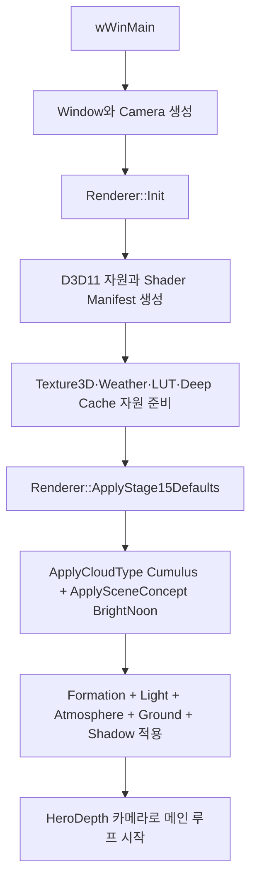
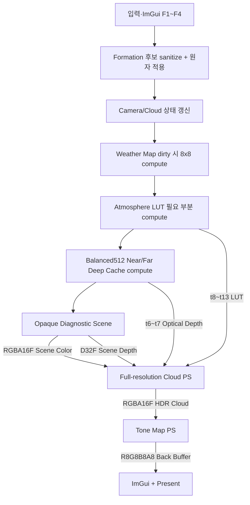
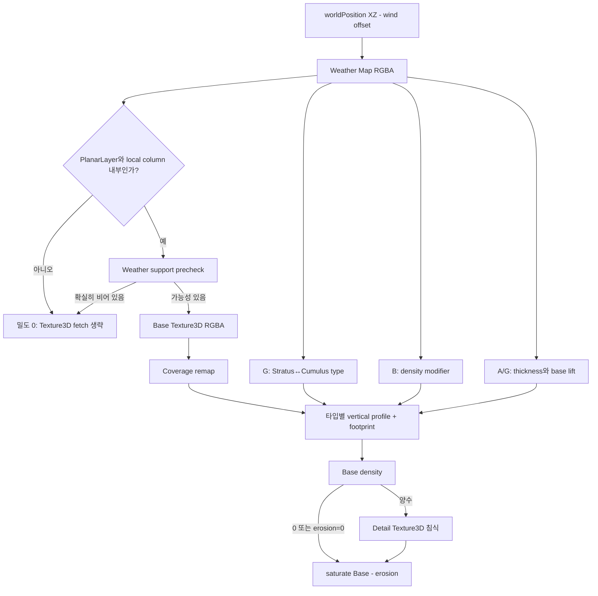
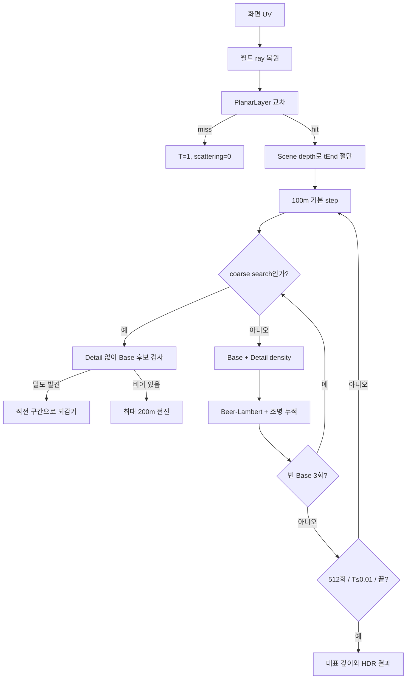
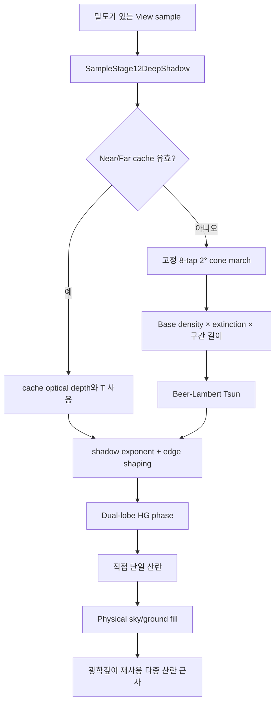
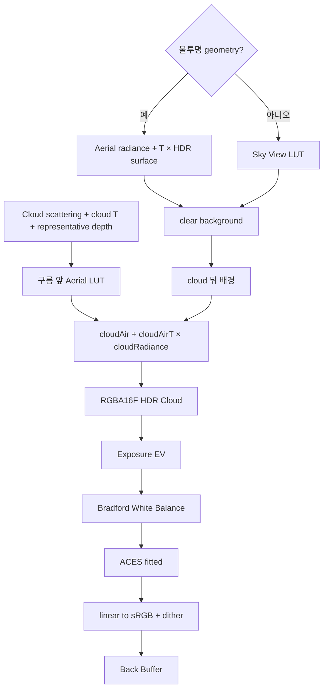

# 볼륨 클라우드 렌더링 파이프라인 가이드

## 2026-09-18 독립 프리셋 소유권

일반 시작은 Cumulus+F4 3이다. F1/F2 형상과 F3/F4 조명·환경은 독립 슬롯이며 양쪽 Save Preset으로 선택 슬롯 JSON에 저장한다. LightingPresetSettings/LightingPresetStore가 조명 물리 값과 Tone을 소유하고 CloudFormationPresetStore는 세 타입+Custom을 저장한다. 기존 0~2 scene descriptor는 역사적 진단 전용이다. F4 적용은 formation/Weather/편집 상태를 보존한다. CB ABI와 Deep Cache512·80/79는 유지하고 기존 dirty 의존성으로 LUT/cache를 갱신한다. snapshot44, formation4, lighting1이다. 파일·실패·Custom 일회 초기화 계약은 [슬롯 변경 기록](changes/stage15-cloud-quality-followups.md)을 따른다.


이 문서는 `feature/stage15-final-quality`의 활성 런타임, 즉 **Full-resolution High + PlanarLayer** 경로만 설명한다. 처음 프로젝트에 들어온 개발자가 한 픽셀이 만들어지는 순서를 따라가며 구름 형성, 조명, 대기 합성의 코드 위치를 찾는 것이 목적이다. 과거 AABB, 저해상도 복원, Temporal, Cirrus 경로는 런타임 선택지가 아니다.

코드 블록은 설명을 위해 원본에서 짧게 복사한 발췌본이다. 수정할 때는 블록 위에 표시한 파일과 심볼을 다시 확인한다.

## 먼저 알아야 할 좌표와 용어

| 용어 | 이 프로젝트에서의 의미 |
|---|---|
| 월드 좌표 | 오른손/왼손 명칭보다 실제 계약이 중요하다. `+Y`가 위이고 위치·거리·두께는 meter다. |
| PlanarLayer | XZ로 무한히 반복되지만 Y는 `bottom ~ bottom + thickness`인 단일 평면 구름층이다. 실제 추적 거리는 유한하다. |
| Weather Map | 월드 XZ의 큰 배치 정보를 담는 256² RGBA8 반복 텍스처다. R=coverage, G=예약, B=density, A=local thickness/lift 입력이다. |
| optical depth, `τ` | 빛이 지나며 누적한 감쇠량. `density × extinction(1/m) × distance(m)`의 합이라 무차원이다. |
| transmittance, `T` | 뒤의 빛이 살아남는 비율. Beer-Lambert 법칙 `T = exp(-τ)`를 사용한다. 1은 투명, 0은 불투명이다. |
| radiance/scattering | 구름과 대기가 카메라 방향으로 새로 더하는 HDR linear RGB 빛이다. |
| representative depth | 구름 불투명도 기여로 가중 평균한 대표 거리(m). 구름 앞쪽 대기 합성에 사용한다. |
| LUT | 비싼 대기 적분을 미리 계산한 lookup texture. 현재 2D 네 장과 3D 두 장을 사용한다. |

## 1. 초기화와 기본 상태



텍스트 흐름: `wWinMain → Renderer::Init → ApplyStage15Defaults → Cumulus + BrightNoon → LoadUserPresetDefaults → Render loop`

`src/main.cpp::wWinMain`의 실제 시작 순서는 다음과 같다.

```cpp
Camera camera;
ApplyCameraPreset(camera, Stage13CameraPresetId::HeroDepth);

Renderer renderer;
if (!renderer.Init(window.GetHandle(), window.GetWidth(),
                   window.GetHeight(), needsNoiseVolumes, !automated))
    return 1;
if (!renderer.ApplyStage15Defaults())
    return 1;
```

`Renderer::Init`은 장치·swap chain·크기 의존 렌더 타깃·상수버퍼·셰이더 프로그램·noise volume 자원을 만든다. 그 다음 `ApplyStage15Defaults`가 최종 품질 수치를 선택하는 것이 아니라, 유일한 High 경로 위에 Urban 장면 상태를 올린다.

상태 적용의 우선순위는 다음과 같다.

- `ApplySceneConcept`: 일반 F4 1~4는 조명·환경만 적용한다. 아래 기존 0~2 scene 코드 발췌는 역사적 테스트 경로다.
- `ApplyCloudType`: Stratus/Cumulus/Mixed의 formation만 바꾼다. 기존 조명·대기·지면·톤 매핑은 유지한다.
- `Custom`: 마지막으로 저장한 formation만 복원한다. 조명·대기·지면·카메라는 저장하거나 복원하지 않는다.
- F1/F2 수동 편집: 현재 formation을 sanitize한 뒤 Weather 업로드까지 원자적으로 적용하고 상태를 `Unsaved`로 만든다.

`src/Renderer.cpp::ApplySceneConcept`에서 소유 범위를 확인할 수 있다.

```cpp
const Stage15SceneDescriptor descriptor =
    stage15::ResolveSceneConcept(preset);
if (!ApplyCloudFormationPresetTarget(
        ConceptFormationTarget(stage15::FormationConcept(preset)), false))
    return false;
m_lightParameters = stage6light::Sanitize(descriptor.light);
m_environmentParameters = descriptor.environment;
m_atmosphereParameters = descriptor.atmosphere;
m_groundLightingParameters = descriptor.ground;
m_shadowParameters.surfaceShadowStrength =
    descriptor.surfaceShadowStrength;
```

## 2. 한 프레임의 렌더링



텍스트 흐름: `UI/상태 → Weather Map → Atmosphere LUT → Deep Cache → HDR Opaque+Depth → Full-resolution Cloud → Tone Map → Present`

권위 있는 프레임 순서는 `src/Renderer.cpp::Renderer::Render`다.

```cpp
m_frameProfiler.MarkWeatherMapEnd(m_context.Get());
EnsureAtmosphereLuts(camera);
m_frameProfiler.MarkAtmosphereLutEnd(m_context.Get());
RenderDeepShadowCaches(camera, effectiveTime);
m_frameProfiler.MarkShadowCacheEnd(m_context.Get());
RenderDiagnosticScene(camera);
m_frameProfiler.MarkOpaqueSceneEnd(m_context.Get());
RenderCloudPass();
m_frameProfiler.MarkCloudEnd(m_context.Get());
RenderToneMapPass();
m_frameProfiler.MarkToneMapEnd(m_context.Get());
m_swapChain->Present(present.syncInterval, present.flags);
```

### 패스별 입력과 출력

| 패스 | 주요 입력 | 출력 | 깊이 | 다시 계산되는 조건 |
|---|---|---|---|---|
| Atmosphere LUT compute | b0 camera, b9 Stage14 | 2D LUT 4장 + 3D LUT 2장, 모두 RGBA16F | 없음 | 대기 계수 변경 시 전부, ground albedo 시 multi 이후, 태양/카메라 높이 시 sky/aerial, 카메라 투영·회전·far 시 aerial. 변화가 없으면 재사용 |
| Deep Cache compute | b0,b1,b5,b6,b7,b8,b10, Weather/Base/Detail | Near 512²×80 + Far 512²×40 R32F optical depth | 없음 | cache 사용 가능할 때 매 frame 재생성. 카메라 중심, 태양 basis, formation, motion time을 즉시 반영 |
| Opaque Scene | scene geometry, b0=`SceneCB`, b8,b9, cache/LUT | 창 크기 RGBA16F Scene Color + D32F Depth | 쓰기/테스트 | 매 frame |
| Cloud PS | b0,b1,b3~b10, Scene Color/Depth, Weather/Base/Detail, cache, LUT | 창 크기 RGBA16F HDR Cloud | D32F를 SRV로 읽기만 함 | 매 frame, fullscreen triangle 1회 |
| Tone Map PS | HDR Cloud, b9 | R8G8B8A8 back buffer | 없음 | 매 frame |

Weather Map은 8×8 Compute Shader가 임시 UAV에 만든 뒤 성공한 결과만 `CopyResource`로
공개 texture에 반영한다. 공개 texture/SRV identity와 실패 전 마지막 정상 결과를 보존한다.
CPU `BuildWeatherMap`은 GPU byte 검증 기준으로만 남는다. Base/Detail Texture3D의 **내용**은
F2 `Regenerate Base and Detail` 또는 관련 shader hot reload 때만 다시 생성한다.

`src/Renderer.cpp::RenderCloudPass`는 실제 슬롯 계약과 자원을 한곳에서 보여 준다.

```cpp
ID3D11Buffer* constantBuffers[2] = { m_cameraCb.Get(), m_cloudCb.Get() };
m_context->PSSetConstantBuffers(0, 2, constantBuffers);
ID3D11Buffer* lightBuffer = m_lightCb.Get();
m_context->PSSetConstantBuffers(3, 1, &lightBuffer);
ID3D11Buffer* environmentBuffer = m_environmentCb.Get();
m_context->PSSetConstantBuffers(4, 1, &environmentBuffer);
ID3D11Buffer* domainBuffer = m_cloudDomainCb.Get();
m_context->PSSetConstantBuffers(5, 1, &domainBuffer);
ID3D11Buffer* noiseVolumeBuffer = m_noiseVolumeCb.Get();
m_context->PSSetConstantBuffers(6, 1, &noiseVolumeBuffer);
ID3D11Buffer* cloudShapeBuffer = m_cloudShapeCb.Get();
m_context->PSSetConstantBuffers(7, 1, &cloudShapeBuffer);
ID3D11Buffer* shadowBuffer = m_shadowCb.Get();
m_context->PSSetConstantBuffers(8, 1, &shadowBuffer);
BindAtmosphereResources();
m_context->Draw(3, 0);
```

## 3. Weather에서 최종 밀도까지



텍스트 흐름: `Weather RGBA → local column/support → Base Texture3D → coverage/type/profile → Detail erosion → finalDensity`

Weather 채널은 서로 역할이 다르다.

| 채널 | HLSL 의미 | 화면 영향 |
|---|---|---|
| R | `weather.coverage` | 구름이 생길 수 있는 큰 영역과 support |
| G | 예약0.5 | 타입 생성/조회 없음 |
| B | `densityModifier` | 최종 Base 밀도의 지역별 0.5~1.5 배율 |
| A | `localThicknessPotential` | 지역별 물리 두께와 base lift 변동 입력 |

타입은 b10 fixedType=0/.5/1을 사용한다. Weather A가 공통 min/max 두께를 보간하고, 그 지역 바닥/두께로 높이비율을 만든 뒤 공통 Vertical Profile을 적용한다. 타입별 footprint/lift 특성은 유지한다. G 생성기와 Regional Blend는 제거했다.

`shaders/Noise.hlsli::EvaluateBaseCloudDensity`의 support precheck는 비싼 Texture3D 조회 전에 확실히 빈 위치를 버린다.

```hlsl
WeatherSample weather = SampleWeatherMap(worldPosition, timeSeconds);
PhysicalColumnGeometry geometry = EvaluatePhysicalColumnGeometry(
    worldPosition.y, weather);
float verticalProfile = EvaluateCommonVerticalProfile(geometry.localHeightFraction);
float weatherSupport = smoothstep(0.02, 0.20, weather.coverage);
bool definitelyEmpty = geometry.localHeightFraction < 0.0 ||
    geometry.localHeightFraction > 1.0 || verticalProfile <= 0.0 ||
    weatherSupport <= 0.0 || coverage <= 0.0 || densityMultiplier <= 0.0;
```

`shaders/Noise.hlsli::SampleCloudDensity`에서 Detail은 Base가 실제로 있을 때만 샘플한다.

```hlsl
CloudDensitySample sample = EvaluateBaseCloudDensity(
    worldPosition, timeSeconds);
bool shouldApplyDetail = sampleDetail && sample.baseDensity > 0.0 &&
                         detailErosionStrength > 0.0;
if (shouldApplyDetail)
{
    NoiseFieldSample detail = SampleDetailErosionNoise(
        worldPosition, timeSeconds);
    float boundary = 1.0 - smoothstep(0.45, 0.90, sample.baseDensity);
    sample.erosion = detail.value * detailErosionStrength * boundary;
    sample.finalDensity = saturate(sample.baseDensity - sample.erosion);
}
```

## 4. 뷰 레이마칭



텍스트 흐름: `UV → world ray → Planar interval ∩ scene depth → adaptive High march → early exit → scattering/T/depth`

고정 High 계약은 `src/HighCloudQuality.h`와 `shaders/HighCloudQuality.hlsli` 양쪽에 같은 값으로 있다.

- 기본 100m, 최대 512 step
- 24~50km에서 1.0×→1.25× 거리 step
- Base density가 `0.0001` 이하인 표본 3개 뒤 2× coarse, 최대 200m
- coarse가 밀도를 찾으면 직전 구간으로 되감아 정상 step으로 재진입
- 누적 transmittance가 `0.01` 이하이면 조기 종료

`shaders/VolumetricClouds.hlsl::RaymarchCloud`의 핵심 적분은 다음과 같다.

```hlsl
float sampledDensity = densitySample.finalDensity;
float stepTransmittance = exp(
    -sampledDensity * extinction * marchLength);
result.scattering += lighting.direct + lighting.skyAmbient +
    lighting.groundBounce + lighting.multipleScattering;
float opacity = result.transmittance * (1.0 - stepTransmittance);
opacityDepthMoment += sampleDistance * opacity;
opacityWeight += opacity;
result.transmittance *= stepTransmittance;
if (result.transmittance <= kHighTransmittanceThreshold)
    break;
```

대표 깊이는 `Σ(distance × opacityContribution) / Σ(opacityContribution)`이다. 단순 layer 중앙이 아니므로 aerial perspective가 구름의 실제 보이는 앞면에 더 가깝게 적용된다.

## 5. 태양광과 그림자



텍스트 흐름: `View sample → Near/Far Deep Cache, 실패 시 8-tap cone → Tsun → dual HG → direct + ambient + multiple`

Deep Cache는 태양 공간의 누적 optical depth를 Near/Far cascade에 저장한다. 태양 고도가 3°보다 낮거나 자원이 준비되지 않아 `cacheReady=0`이면 cache 조회가 실패하고 cone fallback이 사용된다. fallback도 Detail이 아닌 Base density만 적분한다.

05-B 저고도 수정 후보: 태양 평면 right 폭은 기존 W(24/128km), up 폭은
`W*sin(고도)+층두께*cos(고도)`다. CPU center snap → CS texel 위치 → PS UV 조회에
동일한 폭을 사용한다. 예전 정사각 평면의 Far 250m texel은 고도5도/월드Y 고정 시
수평 약2.87km 간격으로 벌어졌다. 필요한 수평 범위와 층 두께의 투영만 담아 이 낭비를 줄인다.
높이 저장은80/40장 그대로이며, 각 높이 구간의 실제 태양 광선 길이가250m를 넘으면
중점 적분 구간 수만 늘린다. XY bilinear·높이 tau 보간·Near/Far T 혼합·경계 fade 식은 유지한다.
이 수정은 화면 검증 중이며, 일반 View High step/8-tap cone/명암 기본값을 변경하지 않는다.

`shaders/CloudLighting.hlsli::ComputeLightTransmittance`의 선택은 명확하다.

```hlsl
LightMarchResult result = { 1.0, 0.0 };
Stage12ShadowSample cached = SampleStage12DeepShadow(samplePosition);
if (cached.valid > 0.5)
{
    result.transmittance = cached.transmittance;
    result.opticalDepth = cached.opticalDepth;
}
else
{
    result = ComputeLightTransmittanceCone(
        samplePosition, lightDirection);
}
```

Phase는 카메라 ray와 태양 방향 각도에 따라 밝기를 재배치할 뿐 optical depth나 transmittance를 바꾸지 않는다. `forwardScatteringG`가 커질수록 태양을 바라보는 각도에서 좁고 강한 lobe가 생긴다. `edgeInfluence`, `edgeOpticalDepthScale`, `shadowExponent`가 이 효과를 노출 면과 그림자 대비에 맞게 제한한다.

## 6. 대기·HDR 합성·출력



텍스트 흐름: `HDR scene/sky + aerial → cloud radiance/T at representative depth → exposure → WB → ACES → sRGB`

`shaders/Stage14Atmosphere.hlsli::ComposeStage14Atmosphere`가 불투명 장면과 하늘을 먼저 clear background로 만든 뒤 구름을 넣는다.

```hlsl
float safeCloudDepth = max(cloudRepresentativeDepth, 0.0);
float3 cloudAir = SampleAtmosphereAerialRadiance(uv, safeCloudDepth);
float3 cloudAirT = SampleAtmosphereAerialTransmittance(
    uv, safeCloudDepth);
float safeCloudT = saturate(cloudTransmittance);
return cloudAir + cloudAirT * max(cloudScattering, 0.0.xxx) +
       safeCloudT * (clearBackground - cloudAir);
```

합성 결과는 아직 HDR linear RGB다. `shaders/Stage14ToneMap.hlsl`에서 `2^ExposureEV`를 곱하고, white balance, ACES fitted, linear-to-sRGB, dither 순서로 8-bit swap-chain 출력에 맞춘다. Exposure와 white balance는 대기 LUT를 재생성하지 않으며 마지막 Tone Map 결과만 바꾼다.

## 빠른 코드 추적 순서

처음 디버깅할 때는 다음 순서가 가장 짧다.

1. `src/Renderer.cpp::Render`에서 어느 패스까지 실행되는지 본다.
2. `RenderCloudPass`에서 b0~b9와 t0~t13 바인딩을 확인한다.
3. `shaders/VolumetricClouds.hlsl::main`에서 depth/ray/교차를 확인한다.
4. `RaymarchCloud`에서 step, early exit, 대표 깊이를 확인한다.
5. `shaders/Noise.hlsli::SampleCloudDensity`에서 모양 문제를 분리한다.
6. `shaders/CloudLighting.hlsli::ComputeLightTransmittance`와 `CloudEnvironment.hlsli`에서 조명 문제를 분리한다.
7. `ComposeStage14Atmosphere`와 `Stage14ToneMap.hlsl`에서 합성/노출 문제를 분리한다.

상수버퍼의 정확한 필드 소유권은 [CBUFFER_REFERENCE.md](CBUFFER_REFERENCE.md), 실제 조절 절차는 [CLOUD_LIGHTING_TUNING_GUIDE.md](CLOUD_LIGHTING_TUNING_GUIDE.md), 수식 중심 설명은 [RAYMARCHING.md](RAYMARCHING.md)를 함께 본다.
| Weather Map compute | preset + RGBA generator key | 임시 256² RGBA8 UAV → 안정된 공개 texture | 없음 | generator key 변경 또는 shader reload. motion/type selection/두께 해석 변경은 제외 |

## Stage 15 방향광 02 — 밀도 곡선의 위치

기존 Weather/support/profile/Base → 기존 Detail 침식 → 공통 `F(q,s)` → 거리 fade → View 적분 순서다.
Light는 기존 Base 조립 → 같은 F → Near/Far optical-depth 적분 또는 cone fallback이다.
F는 `lerp(q,smoothstep(0,0.4,q),s)`, s=0이면 q 그대로다. q는 무차원이며 Base는 1을 넘을 수 있다.
단조이므로 raw Detail≤Base이면 F(Detail)≤F(Base)이고 F(0)=0이라 빈 support를 채우지 않는다.
기존 1e-4 이하 밀도는 커지지 않으므로 기존 tiny-support 생략이 새 밀도를 놓치지 않는다.
성긴 경계에서는 값이 감소할 수 있다. 따라서 화면 실루엣의 완전한 불변을 보장하는 함수는 아니다.

## 방향광 03 — Base 중간 옥타브 실험

02 사용자 승인: Urban 및 Stratus/Cumulus/Mixed 내장 Density shaping=.70. Meadow/Snow=0 유지.
03은 밀도 .70을 고정하고 Base R의 2/3번째 옥타브 진폭만 k=1/1.25/1.50배로 바꾼다.
[.5,.25*k,.125*k,.0625]를 합으로 정규화한다. 첫/넷째 진폭, seed, 주파수, 타일,
Base GBA Worley, Detail, Weather/profile과 High step/skip/cone 상수는 유지한다.

| CPU / HLSL 필드 | 슬롯·크기·offset | 범위·소유권 | 반영 |
|---|---|---|---|
| `NoiseVolumeParameters::baseMidOctaveExtra` / `baseMidOctaveExtra` | b6 총96B, offset28, float4B | extra=0/.25/.5; F2 세션 실험 | 생성 시 k=1+extra |

기존 padding0를 사용하며 offset12의 uint padding은 유지한다. CPU sanitize는 비정상 입력을0으로,
나머지는 후보에 양자화한다. CPU offsetof/HLSL reflection으로 packing을 검사한다.
`F2 → Base mid octaves (03 test)` 선택 시 기존 Base/Detail 재생성 경로로 새 텍스처를 만들고
성공할 때 교체한다. 실패하면 이전 extra와 텍스처를 유지한다. 재생성 직후 첫 프레임은 성능 표본에서 제외한다.
Type/Concept 선택은 세션 후보를 유지한다. Custom에는 저장하지 않고 snapshot42의 noiseVolumes에
baseMidOctaveExtra를 기록한다. 현재 사용자 승인 기본1.50배이며06에서 일반 후보 선택을 읽기 전용 표시로 정리했다. 과거1/1.25 비교는 테스트 실행기에서만 한다.

`--base-octave-test`/CTest BaseOctaves는 72조건(세 후보×Urban/세 Type×세 고도×Detail Off/On)의
HDR finite/진단 범위를 검사한다. 생성 RGBA8 R은 CPU 기준과 1/255+1e-5 이내 비교한다.
GBA와 Detail의 비트 동일성, Weather 해시 유지, 1.00배로 복원 시 원래 Base 해시를 검사한다.
`--high-performance-test --base-octaves-125` 또는 `--base-octaves-150`은 기존 12 case를 직렬 측정한다.
밀도 인자가 없으면 승인된 Concept 기본값(Urban .70, Meadow/Snow 0)을 사용한다.
00 baseline 검증은 실행기에서 강도0을 명시적으로 복원하며 원본을 다시 촬영하지 않는다.

### 04 — 폐기된 Near Detail 그림자

06-A에서 사용자 요청으로 UI·설정·거리 가중치·Detail 조회·전용 테스트를 제거했다. Near/Far/cone는 모두 Base 그림자 밀도를 사용한다. 실험 원인·결과는 [06 림 변경 기록](changes/stage15-cloud-rim-lighting.md)에 보존한다. ShadowCB 160B의 offset152/156은 uint padding이며 0으로 초기화한다. 미사용 surfaceShadowEnabled도 offset8의 uint padding으로 바꿨다. 실제 지면 그림자 strength/floor는 유지한다.

## 05 직접광·간접광·림 비교 — 2026-09-15

F3에 기존 필드 Shadow exponent(b3 offset60), Edge optical depth scale(b3 offset56),
Multiple attenuation(b4 offset16)을 노출했다. 기존 CPU/HLSL sanitize 범위는 각각 .5~4, .25~8,0~1이다.
06 현재 ABI는 LightCB80B/EnvironmentCB48B이며 ShadowCB160B다. 기존 Phase intensity/Sky fill/Ground fill을 함께 비교한다.
Reset approved Urban lighting은 위 여섯 명암 값과 Rim intensity/depth를 Urban 기준으로 복원한다. Type과 태양각·형상·노출·화이트밸런스는 유지한다.
단, 기존 F3 편집 처리와 동일하게 UI preset 표시는 Custom이 된다. Concept 재선택은 전체 장면 조명을 복원한다.
snapshot42 lighting 객체는 shadowExponent/edgeOpticalDepthScale/phaseIntensity/phaseCap/multipleAttenuation을 추가 기록한다.
Custom Formation schema3은 조명을 저장하지 않는다.

일반 Phase 상한은2.5다. `VCLOUD_TEST_PHASE_CAP`은05 검사에서만4/8을 컴파일하는 상수 override이며
UI 옵션이나 승인된 런타임 기본값이 아니다. 기존 shader manifest/include closure는 해당 소스 변경을 감지한다.
01 진단/밀도 불변 회귀를 유지하고05는 고정 물리 입력에서 성분/최종HDR 평균·대비를 보고한다.
`ctest --test-dir build -C Release -R LightingTuning --output-on-failure`로 실행한다.
4 Formation×3고도×3방위각×11독립후보=396조건. 방위각 -108.5/-18.5/71.5도, 시간71초, F5, Base 그림자/Base1.50/밀도.70.
가시 구름은 View 불투명도>.1인 픽셀을4픽셀 간격으로 집계한다. Phase diagnostic의2.5 색을 세어
실제 가시 표본 포화를 발견한 조건에만 Phase.40/상한4,8을 추가 비교한다. HDR finite·D3D오류 검사는 필수다.
수치 대비 상승이 미학적 개선이나 림 품질 승인을 뜻하지는 않는다.

05 진단의 VCLOUD_TEST_* 매크로는 SolarOcclusion/SolarBanding 실행기가 지정한다.
LEGACY_SHADOW는 수정 전 정사각 투영/1회 적분을 재현하고, SOLAR_REFERENCE_FULL은
전체 화면의 태양 차폐만 직접 적분한다. 일반 shader manifest는 매크로를 지정하지 않아
위의05-B 수정 후보를 사용한다. 참조·Near/Far 강제 조회는 일반 UI 옵션이 아니다.

### 05-C 태양 고도 전환 후보 (80/40 유지)

기존 cacheReady/valid는sin(3도)에서켜진다. 자원생성조건/최소고도는유지하고사용비율을별도로계산한다.
`w=smoothstep(sin(3도),sin(5도),sunY)`.
CloudLighting은cache가유효하고w<1일때만기존cone을함께읽어
`tau=lerp(coneTau,cacheTau,w)`, `T=exp(-tau)`로반환한다.
이전의3도즉시분기를연속으로연결하며View밀도/High cone8tap 상수는변경하지않는다.
3도미만cone/5도이상cache 경로는기존과같다. Near/Far공간혼합은기존T혼합이다.
지면은3도미만의중립T=1에서cache T로같은w로fade한다. 구름하부명암과지면그림자는별개다.

Stage12ShadowParameters.hlsli의helper는추가CB필드없이기존b8 sunY/minimumSunY를쓴다.
b8=160B,offset/schema/512²/80·40 유지. snapshot42 deepCache에sunTransitionDegrees[3,5]와
cloudTransitionBlend=optical-depth를추가기록한다. F3의Deep Cache 아래전환구간을읽기전용으로표시한다.
수치/화면확인중인후보이며전환구간의추가GPU비용과잔여탁함을검증해야한다.

## 06 — 직접광의 기본 부분과 림 분리

시선 기여 W=Tview×albedo×(1−Tstep), 태양 입사광 Lsun, 원본 태양 투과율 T를 재사용한다. C=W×Lsun×T^shadowExponent. S0=lerp(1,T^edgeOpticalDepthScale,edgeInfluence), Srim=lerp(1,T^(edgeOpticalDepthScale×rimDepthScale),edgeInfluence).

```text
base = C × (1 + min(P0−1,0) × S0)
rim  = C × rimIntensity × max(Prim−1,0) × Srim
Direct = base + rim
Composite cloud scattering = Direct + Sky + Ground + Multiple
```

P0는 기존2.5 상한의 phase이고 Prim만 림 상한을 사용한다. Multiple은 P0를 계속 사용한다. Silver Lining 진단은 rim만 보여주며 Composite에 다시 더하지 않는다. Rim1/1/상한2.5에서 기존 식과 대수적으로 같다. 추가 밀도·법선·빛 레이·Bloom은 없다. 밀도와 Tsun은 림 설정의 소비자가 아니다.

CPU F3/Concept → LightParameters sanitize → b3 → PhaseFunction의 P0/Prim → CloudLighting의 base/rim → CloudEnvironment의 Direct 및 Silver 진단 → VolumetricClouds 적분 → 기존 Tone Map 순서다. F4 성분은 L/(1+L) 표시이므로 진단의 HDR 버퍼 값 자체를 물리 입사광으로 오해하면 안 된다. 림 테스트는 이 표시를 역변환한 HDR 근사와 실제 Composite HDR/sRGB를 구분한다.

06 화면 승인 후07에서 전체 Concept/F5~F8 회귀·12case 성능·Custom·최종 비교 촬영을 한다. 기존06-final은 림 이전 승인 자료이고 최종 산출물은07-final이다. 하부 평탄화 분석은 보류한다.

2026-09-16 하늘광 차폐 분리: EnvironmentCB48B/모든 offset은 유지한다. ambientShadowCoupling/ambientShadowExponent는 이제 구름의 지면 반사광 가시성에만 사용하며 하늘광에는 적용하지 않는다. Sky는 기존 LUT RGB×fill×height×local AO다. Direct/Rim/Multiple·LUT 생성은 그대로다. F4 Ground Ambient Visibility가 남은 지면 가시성 의미를 표시한다. 실제 변경과 수식은 stage15-cloud-rim-lighting 변경 기록 참조.


### 2026-09-16 카메라 구도 갱신

F5: 지상 눈높이1.7m, (0,1.7,180)→(0,60,-200). F6: 기존 GroundHorizon 유지. F7: CloudOverview, (40,7800,0)→(40,3000,-3000). F8: 기존 AboveLayer 유지. 수직FOV60도,near0.1m/far60km. 이전 F5/F7 좌표의 캡처와 새 프리셋 결과는 동일 조건 비교가 아니다.


### 2026-09-17 씬/카메라 현행 계약

건물20×30×20m(10층),정점 생성은 stage13scene 치수 상수 사용. F5=(12,1.7,60)→(0,42,-40). F7은 현재 태양 방향 쪽에서(0,3000,-1200)을 보는20km 조감이며 키 입력 시 갱신한다. 저고도에서는 방향Y최소.25(고도약14.5도),천정Y최대.9999로 안전한 상공 시점을 유지한다. F6/F8과 수직FOV60도/near.1m/far60km는 유지. 과거 좌표/건물치수 기록은 역사 자료다.

2026-09-17 추가 조정: F5=(0,1.7,60)→(0,42,-40) 건물 정면 정렬. F8=(40,7800,0)→(40,7800,-1800) 상공 수평선(pitch0). F6/F7은 유지한다.

2026-09-17 F8 최종 조정: (40,7800,0)→(40,7417.4,-1800),pitch 약-12도. 상공에서 완만하게 내려다보며 하늘보다 아래 방향을 넓게 보는 구도.

2026-09-17 F6 갱신: F5와 같은(0,1.7,60)에서(0,42,160)을 본다. F5의-Z 방위를+Z로 반전하며 상향각은 유지한다.

## 2026-09-18 프리셋 경로 갱신
현재 활성 JSON은 저장소 presets/의 형상4개·조명4개다. 개발 실행은 원본을 읽고 Save Preset으로 수정한다. 소스 루트가 없는 배포에서는 exe 옆 presets/를 사용한다. CMake 빌드마다8개를 copy_if_different로 배치하며 JSON만 수정해도 복사한다. 일반 시작의 Snow 자동 교체는 제거했다. 이전 captures/noise-lab 저장/초기화 설명은 역사적 동작이다. snapshot 출력과 UI 설정은 captures에 유지한다. schema/CB/승인 기본값은 변경하지 않는다. 상세: [문제와 해결 기록](changes/stage15-cloud-quality-followups.md).
