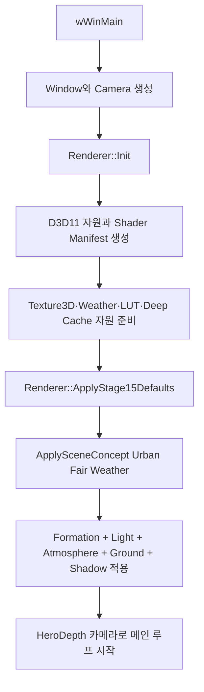
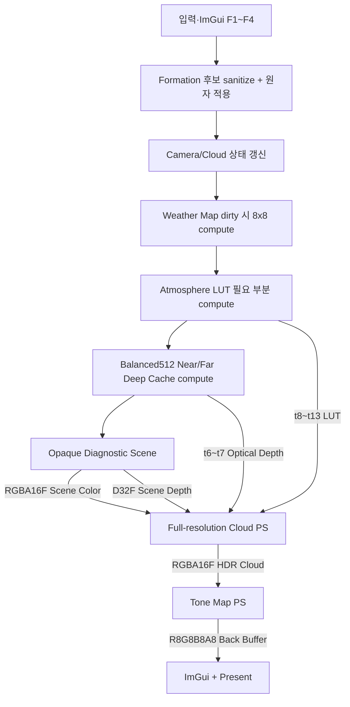
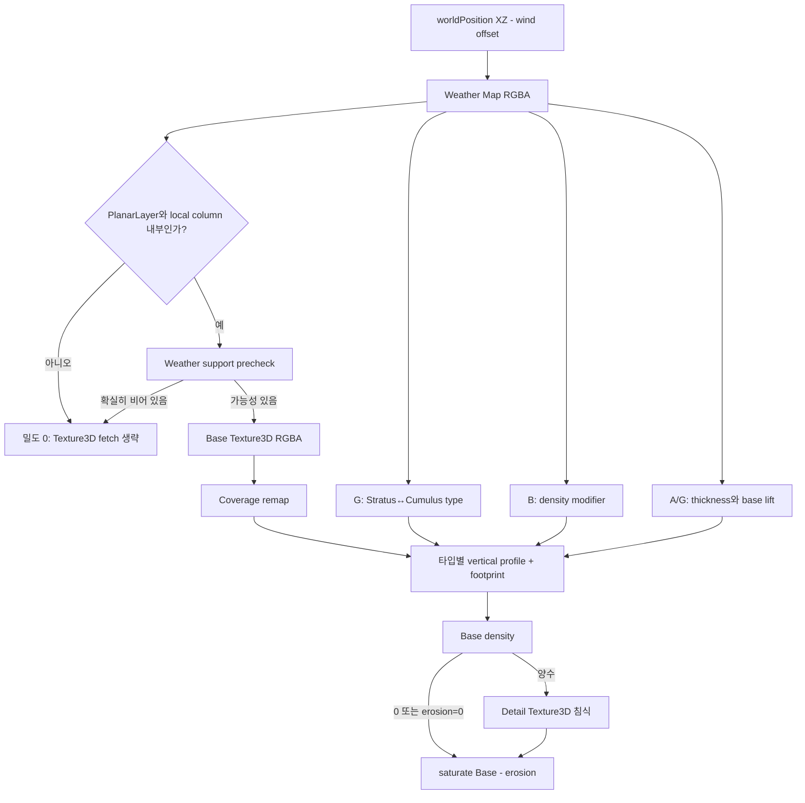
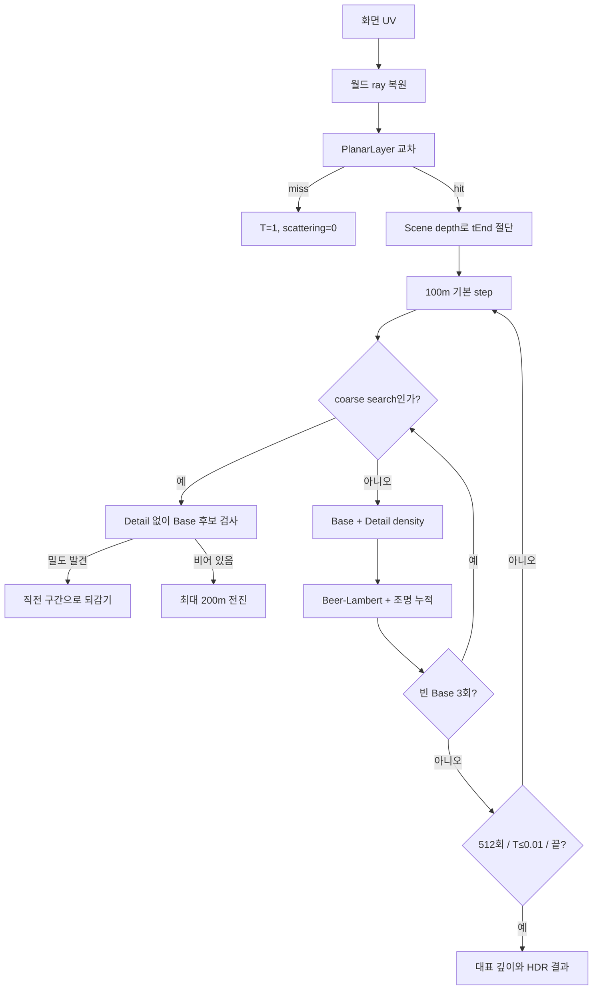
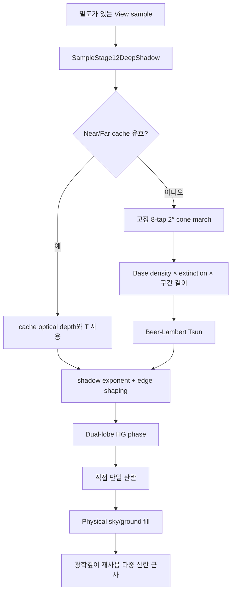
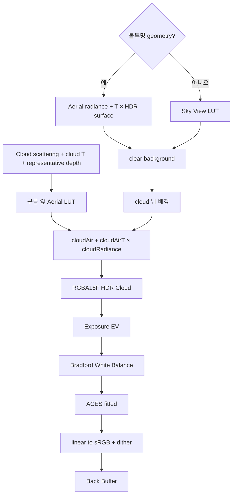

# 볼륨 클라우드 렌더링 파이프라인 가이드

이 문서는 `feature/stage15-final-quality`의 활성 런타임, 즉 **Full-resolution High + PlanarLayer** 경로만 설명한다. 처음 프로젝트에 들어온 개발자가 한 픽셀이 만들어지는 순서를 따라가며 구름 형성, 조명, 대기 합성의 코드 위치를 찾는 것이 목적이다. 과거 AABB, 저해상도 복원, Temporal, Cirrus 경로는 런타임 선택지가 아니다.

코드 블록은 설명을 위해 원본에서 짧게 복사한 발췌본이다. 수정할 때는 블록 위에 표시한 파일과 심볼을 다시 확인한다.

## 먼저 알아야 할 좌표와 용어

| 용어 | 이 프로젝트에서의 의미 |
|---|---|
| 월드 좌표 | 오른손/왼손 명칭보다 실제 계약이 중요하다. `+Y`가 위이고 위치·거리·두께는 meter다. |
| PlanarLayer | XZ로 무한히 반복되지만 Y는 `bottom ~ bottom + thickness`인 단일 평면 구름층이다. 실제 추적 거리는 유한하다. |
| Weather Map | 월드 XZ의 큰 배치 정보를 담는 256² RGBA8 반복 텍스처다. R=coverage, G=type, B=density, A=local thickness/lift 입력이다. |
| optical depth, `τ` | 빛이 지나며 누적한 감쇠량. `density × extinction(1/m) × distance(m)`의 합이라 무차원이다. |
| transmittance, `T` | 뒤의 빛이 살아남는 비율. Beer-Lambert 법칙 `T = exp(-τ)`를 사용한다. 1은 투명, 0은 불투명이다. |
| radiance/scattering | 구름과 대기가 카메라 방향으로 새로 더하는 HDR linear RGB 빛이다. |
| representative depth | 구름 불투명도 기여로 가중 평균한 대표 거리(m). 구름 앞쪽 대기 합성에 사용한다. |
| LUT | 비싼 대기 적분을 미리 계산한 lookup texture. 현재 2D 네 장과 3D 두 장을 사용한다. |

## 1. 초기화와 기본 상태



텍스트 흐름: `wWinMain → Renderer::Init → ApplyStage15Defaults → ApplySceneConcept(UrbanFairWeather) → Render loop`

`src/main.cpp::wWinMain`의 실제 시작 순서는 다음과 같다.

```cpp
Camera camera;
ApplyCameraPreset(camera, Stage13CameraPresetId::HeroDepth);

Renderer renderer;
if (!renderer.Init(window.GetHandle(), window.GetWidth(),
                   window.GetHeight(), needsNoiseVolumes, !automated))
    return 1;
if (!renderer.ApplyStage15Defaults())
    return 1;
```

`Renderer::Init`은 장치·swap chain·크기 의존 렌더 타깃·상수버퍼·셰이더 프로그램·noise volume 자원을 만든다. 그 다음 `ApplyStage15Defaults`가 최종 품질 수치를 선택하는 것이 아니라, 유일한 High 경로 위에 Urban 장면 상태를 올린다.

상태 적용의 우선순위는 다음과 같다.

- `ApplySceneConcept`: formation, 태양/phase, 환경광, 물리 대기, 지면 재질, 표면 그림자를 모두 한 장면으로 적용한다.
- `ApplyCloudType`: Stratus/Cumulus/Mixed의 formation만 바꾼다. 기존 조명·대기·지면·톤 매핑은 유지한다.
- `Custom`: 마지막으로 저장한 formation만 복원한다. 조명·대기·지면·카메라는 저장하거나 복원하지 않는다.
- F1/F2 수동 편집: 현재 formation을 sanitize한 뒤 Weather 업로드까지 원자적으로 적용하고 상태를 `Unsaved`로 만든다.

`src/Renderer.cpp::ApplySceneConcept`에서 소유 범위를 확인할 수 있다.

```cpp
const Stage15SceneDescriptor descriptor =
    stage15::ResolveSceneConcept(preset);
if (!ApplyCloudFormationPresetTarget(
        ConceptFormationTarget(stage15::FormationConcept(preset)), false))
    return false;
m_lightParameters = stage6light::Sanitize(descriptor.light);
m_environmentParameters = descriptor.environment;
m_atmosphereParameters = descriptor.atmosphere;
m_groundLightingParameters = descriptor.ground;
m_shadowParameters.surfaceShadowStrength =
    descriptor.surfaceShadowStrength;
```

## 2. 한 프레임의 렌더링



텍스트 흐름: `UI/상태 → Weather Map → Atmosphere LUT → Deep Cache → HDR Opaque+Depth → Full-resolution Cloud → Tone Map → Present`

권위 있는 프레임 순서는 `src/Renderer.cpp::Renderer::Render`다.

```cpp
m_frameProfiler.MarkWeatherMapEnd(m_context.Get());
EnsureAtmosphereLuts(camera);
m_frameProfiler.MarkAtmosphereLutEnd(m_context.Get());
RenderDeepShadowCaches(camera, effectiveTime);
m_frameProfiler.MarkShadowCacheEnd(m_context.Get());
RenderDiagnosticScene(camera);
m_frameProfiler.MarkOpaqueSceneEnd(m_context.Get());
RenderCloudPass();
m_frameProfiler.MarkCloudEnd(m_context.Get());
RenderToneMapPass();
m_frameProfiler.MarkToneMapEnd(m_context.Get());
m_swapChain->Present(present.syncInterval, present.flags);
```

### 패스별 입력과 출력

| 패스 | 주요 입력 | 출력 | 깊이 | 다시 계산되는 조건 |
|---|---|---|---|---|
| Atmosphere LUT compute | b0 camera, b9 Stage14 | 2D LUT 4장 + 3D LUT 2장, 모두 RGBA16F | 없음 | 대기 계수 변경 시 전부, ground albedo 시 multi 이후, 태양/카메라 높이 시 sky/aerial, 카메라 투영·회전·far 시 aerial. 변화가 없으면 재사용 |
| Deep Cache compute | b0,b1,b5,b6,b7,b8,b10, Weather/Base/Detail | Near 512²×80 + Far 512²×40 R32F optical depth | 없음 | cache 사용 가능할 때 매 frame 재생성. 카메라 중심, 태양 basis, formation, motion time을 즉시 반영 |
| Opaque Scene | scene geometry, b0=`SceneCB`, b8,b9, cache/LUT | 창 크기 RGBA16F Scene Color + D32F Depth | 쓰기/테스트 | 매 frame |
| Cloud PS | b0,b1,b3~b10, Scene Color/Depth, Weather/Base/Detail, cache, LUT | 창 크기 RGBA16F HDR Cloud | D32F를 SRV로 읽기만 함 | 매 frame, fullscreen triangle 1회 |
| Tone Map PS | HDR Cloud, b9 | R8G8B8A8 back buffer | 없음 | 매 frame |

Weather Map은 8×8 Compute Shader가 임시 UAV에 만든 뒤 성공한 결과만 `CopyResource`로
공개 texture에 반영한다. 공개 texture/SRV identity와 실패 전 마지막 정상 결과를 보존한다.
CPU `BuildWeatherMap`은 GPU byte 검증 기준으로만 남는다. Base/Detail Texture3D의 **내용**은
F2 `Regenerate Base and Detail` 또는 관련 shader hot reload 때만 다시 생성한다.

`src/Renderer.cpp::RenderCloudPass`는 실제 슬롯 계약과 자원을 한곳에서 보여 준다.

```cpp
ID3D11Buffer* constantBuffers[2] = { m_cameraCb.Get(), m_cloudCb.Get() };
m_context->PSSetConstantBuffers(0, 2, constantBuffers);
ID3D11Buffer* lightBuffer = m_lightCb.Get();
m_context->PSSetConstantBuffers(3, 1, &lightBuffer);
ID3D11Buffer* environmentBuffer = m_environmentCb.Get();
m_context->PSSetConstantBuffers(4, 1, &environmentBuffer);
ID3D11Buffer* domainBuffer = m_cloudDomainCb.Get();
m_context->PSSetConstantBuffers(5, 1, &domainBuffer);
ID3D11Buffer* noiseVolumeBuffer = m_noiseVolumeCb.Get();
m_context->PSSetConstantBuffers(6, 1, &noiseVolumeBuffer);
ID3D11Buffer* cloudShapeBuffer = m_cloudShapeCb.Get();
m_context->PSSetConstantBuffers(7, 1, &cloudShapeBuffer);
ID3D11Buffer* shadowBuffer = m_shadowCb.Get();
m_context->PSSetConstantBuffers(8, 1, &shadowBuffer);
BindAtmosphereResources();
m_context->Draw(3, 0);
```

## 3. Weather에서 최종 밀도까지



텍스트 흐름: `Weather RGBA → local column/support → Base Texture3D → coverage/type/profile → Detail erosion → finalDensity`

Weather 채널은 서로 역할이 다르다.

| 채널 | HLSL 의미 | 화면 영향 |
|---|---|---|
| R | `weather.coverage` | 구름이 생길 수 있는 큰 영역과 support |
| G | `weather.cloudType` | 0=Stratus, 1=Cumulus, 중간값=혼합 profile/두께 |
| B | `densityModifier` | 최종 Base 밀도의 지역별 0.5~1.5 배율 |
| A | `localThicknessPotential` | 지역별 물리 두께와 base lift 변동 입력 |

G에는 모든 타입에서 지역별 원본이 저장된다. Fixed Stratus/Mixed/Cumulus는 b10에서
유효 타입을 0/0.5/1로 선택하고, RegionalBlend만 저장된 G를 사용한다. 따라서 F2 G
generator와 `Stored Regional Type G` preview는 Fixed 타입에서도 계속 활성이다.

`shaders/Noise.hlsli::EvaluateBaseCloudDensity`의 support precheck는 비싼 Texture3D 조회 전에 확실히 빈 위치를 버린다.

```hlsl
WeatherSample weather = SampleWeatherMap(worldPosition, timeSeconds);
PhysicalColumnGeometry geometry = EvaluatePhysicalColumnGeometry(
    worldPosition.y, weather);
float verticalProfile = EvaluatePhysicalTypedVerticalProfile(
    geometry.localHeightFraction, weather.cloudType);
float weatherSupport = smoothstep(0.02, 0.20, weather.coverage);
bool definitelyEmpty = geometry.localHeightFraction < 0.0 ||
    geometry.localHeightFraction > 1.0 || verticalProfile <= 0.0 ||
    weatherSupport <= 0.0 || coverage <= 0.0 || densityMultiplier <= 0.0;
```

`shaders/Noise.hlsli::SampleCloudDensity`에서 Detail은 Base가 실제로 있을 때만 샘플한다.

```hlsl
CloudDensitySample sample = EvaluateBaseCloudDensity(
    worldPosition, timeSeconds);
bool shouldApplyDetail = sampleDetail && sample.baseDensity > 0.0 &&
                         detailErosionStrength > 0.0;
if (shouldApplyDetail)
{
    NoiseFieldSample detail = SampleDetailErosionNoise(
        worldPosition, timeSeconds);
    float boundary = 1.0 - smoothstep(0.45, 0.90, sample.baseDensity);
    sample.erosion = detail.value * detailErosionStrength * boundary;
    sample.finalDensity = saturate(sample.baseDensity - sample.erosion);
}
```

## 4. 뷰 레이마칭



텍스트 흐름: `UV → world ray → Planar interval ∩ scene depth → adaptive High march → early exit → scattering/T/depth`

고정 High 계약은 `src/HighCloudQuality.h`와 `shaders/HighCloudQuality.hlsli` 양쪽에 같은 값으로 있다.

- 기본 100m, 최대 512 step
- 24~50km에서 1.0×→1.25× 거리 step
- Base density가 `0.0001` 이하인 표본 3개 뒤 2× coarse, 최대 200m
- coarse가 밀도를 찾으면 직전 구간으로 되감아 정상 step으로 재진입
- 누적 transmittance가 `0.01` 이하이면 조기 종료

`shaders/VolumetricClouds.hlsl::RaymarchCloud`의 핵심 적분은 다음과 같다.

```hlsl
float sampledDensity = densitySample.finalDensity;
float stepTransmittance = exp(
    -sampledDensity * extinction * marchLength);
result.scattering += lighting.direct + lighting.skyAmbient +
    lighting.groundBounce + lighting.multipleScattering;
float opacity = result.transmittance * (1.0 - stepTransmittance);
opacityDepthMoment += sampleDistance * opacity;
opacityWeight += opacity;
result.transmittance *= stepTransmittance;
if (result.transmittance <= kHighTransmittanceThreshold)
    break;
```

대표 깊이는 `Σ(distance × opacityContribution) / Σ(opacityContribution)`이다. 단순 layer 중앙이 아니므로 aerial perspective가 구름의 실제 보이는 앞면에 더 가깝게 적용된다.

## 5. 태양광과 그림자



텍스트 흐름: `View sample → Near/Far Deep Cache, 실패 시 8-tap cone → Tsun → dual HG → direct + ambient + multiple`

Deep Cache는 태양 공간의 누적 optical depth를 Near/Far cascade에 저장한다. 태양 고도가 3°보다 낮거나 자원이 준비되지 않아 `cacheReady=0`이면 cache 조회가 실패하고 cone fallback이 사용된다. fallback도 Detail이 아닌 Base density만 적분한다.

`shaders/CloudLighting.hlsli::ComputeLightTransmittance`의 선택은 명확하다.

```hlsl
LightMarchResult result = { 1.0, 0.0 };
Stage12ShadowSample cached = SampleStage12DeepShadow(samplePosition);
if (cached.valid > 0.5)
{
    result.transmittance = cached.transmittance;
    result.opticalDepth = cached.opticalDepth;
}
else
{
    result = ComputeLightTransmittanceCone(
        samplePosition, lightDirection);
}
```

Phase는 카메라 ray와 태양 방향 각도에 따라 밝기를 재배치할 뿐 optical depth나 transmittance를 바꾸지 않는다. `forwardScatteringG`가 커질수록 태양을 바라보는 각도에서 좁고 강한 lobe가 생긴다. `edgeInfluence`, `edgeOpticalDepthScale`, `shadowExponent`가 이 효과를 노출 면과 그림자 대비에 맞게 제한한다.

## 6. 대기·HDR 합성·출력



텍스트 흐름: `HDR scene/sky + aerial → cloud radiance/T at representative depth → exposure → WB → ACES → sRGB`

`shaders/Stage14Atmosphere.hlsli::ComposeStage14Atmosphere`가 불투명 장면과 하늘을 먼저 clear background로 만든 뒤 구름을 넣는다.

```hlsl
float safeCloudDepth = max(cloudRepresentativeDepth, 0.0);
float3 cloudAir = SampleAtmosphereAerialRadiance(uv, safeCloudDepth);
float3 cloudAirT = SampleAtmosphereAerialTransmittance(
    uv, safeCloudDepth);
float safeCloudT = saturate(cloudTransmittance);
return cloudAir + cloudAirT * max(cloudScattering, 0.0.xxx) +
       safeCloudT * (clearBackground - cloudAir);
```

합성 결과는 아직 HDR linear RGB다. `shaders/Stage14ToneMap.hlsl`에서 `2^ExposureEV`를 곱하고, white balance, ACES fitted, linear-to-sRGB, dither 순서로 8-bit swap-chain 출력에 맞춘다. Exposure와 white balance는 대기 LUT를 재생성하지 않으며 마지막 Tone Map 결과만 바꾼다.

## 빠른 코드 추적 순서

처음 디버깅할 때는 다음 순서가 가장 짧다.

1. `src/Renderer.cpp::Render`에서 어느 패스까지 실행되는지 본다.
2. `RenderCloudPass`에서 b0~b9와 t0~t13 바인딩을 확인한다.
3. `shaders/VolumetricClouds.hlsl::main`에서 depth/ray/교차를 확인한다.
4. `RaymarchCloud`에서 step, early exit, 대표 깊이를 확인한다.
5. `shaders/Noise.hlsli::SampleCloudDensity`에서 모양 문제를 분리한다.
6. `shaders/CloudLighting.hlsli::ComputeLightTransmittance`와 `CloudEnvironment.hlsli`에서 조명 문제를 분리한다.
7. `ComposeStage14Atmosphere`와 `Stage14ToneMap.hlsl`에서 합성/노출 문제를 분리한다.

상수버퍼의 정확한 필드 소유권은 [CBUFFER_REFERENCE.md](CBUFFER_REFERENCE.md), 실제 조절 절차는 [CLOUD_LIGHTING_TUNING_GUIDE.md](CLOUD_LIGHTING_TUNING_GUIDE.md), 수식 중심 설명은 [RAYMARCHING.md](RAYMARCHING.md)를 함께 본다.
| Weather Map compute | preset + RGBA generator key | 임시 256² RGBA8 UAV → 안정된 공개 texture | 없음 | generator key 변경 또는 shader reload. motion/type selection/두께 해석 변경은 제외 |
